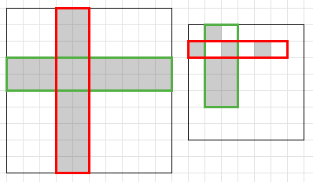

<h1 style='text-align: center;'> E. Rectangle Painting 2</h1>

<h5 style='text-align: center;'>time limit per test: 1 second</h5>
<h5 style='text-align: center;'>memory limit per test: 256 megabytes</h5>

There is a square grid of size $n \times n$. Some cells are colored in black, all others are colored in white. In one operation you can select some rectangle and color all its cells in white. It costs $\min(h, w)$ to color a rectangle of size $h \times w$. You are to make all cells white for minimum total cost.

The square is large, so we give it to you in a compressed way. The set of black cells is the union of $m$ rectangles.

#### Input

The first line contains two integers $n$ and $m$ ($1 \le n \le 10^{9}$, $0 \le m \le 50$) — the size of the square grid and the number of black rectangles.

Each of the next $m$ lines contains 4 integers $x_{i1}$ $y_{i1}$ $x_{i2}$ $y_{i2}$ ($1 \le x_{i1} \le x_{i2} \le n$, $1 \le y_{i1} \le y_{i2} \le n$) — the coordinates of the bottom-left and the top-right corner cells of the $i$-th black rectangle.

The rectangles may intersect.

#### Output

Print a single integer — the minimum total cost of painting the whole square in white.

## Examples

#### Input


```text
10 2
4 1 5 10
1 4 10 5
```
#### Output


```text
4
```
#### Input


```text
7 6
2 1 2 1
4 2 4 3
2 5 2 5
2 3 5 3
1 2 1 2
3 2 5 3
```
#### Output


```text
3
```
## Note

The examples and some of optimal solutions are shown on the pictures below.

  

#### Tags 

#2500 #NOT OK #flows #graph_matchings #graphs 

## Blogs
- [All Contest Problems](../Codeforces_Round_576_(Div._1).md)
- [Announcement (en)](../blogs/Announcement_(en).md)
- [E (en)](../blogs/E_(en).md)
