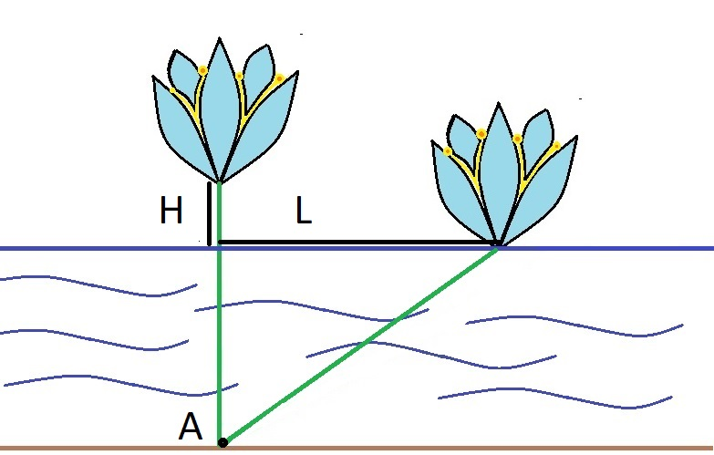

<h1 style='text-align: center;'> B. Water Lily</h1>

<h5 style='text-align: center;'>time limit per test: 1 second</h5>
<h5 style='text-align: center;'>memory limit per test: 256 megabytes</h5>

While sailing on a boat, Inessa noticed a beautiful water lily flower above the lake's surface. She came closer and it turned out that the lily was exactly $H$ centimeters above the water surface. Inessa grabbed the flower and sailed the distance of $L$ centimeters. Exactly at this point the flower touched the water surface.

  Suppose that the lily grows at some point $A$ on the lake bottom, and its stem is always a straight segment with one endpoint at point $A$. Also suppose that initially the flower was exactly above the point $A$, i.e. its stem was vertical. Can you determine the depth of the lake at point $A$?

#### Input

The only line contains two integers $H$ and $L$ ($1 \le H < L \le 10^{6}$).

#### Output

Print a single number — the depth of the lake at point $A$. The absolute or relative error should not exceed $10^{-6}$.

Formally, let your answer be $A$, and the jury's answer be $B$. Your answer is accepted if and only if $\frac{|A - B|}{\max{(1, |B|)}} \le 10^{-6}$.

## Examples

#### Input


```text
1 2
```
#### Output


```text
1.5000000000000
```
#### Input


```text
3 5
```
#### Output


```text
2.6666666666667
```


#### Tags 

#1000 #NOT OK #geometry #math 

## Blogs
- [All Contest Problems](../Codeforces_Round_576_(Div._2).md)
- [Announcement (en)](../blogs/Announcement_(en).md)
- [E (en)](../blogs/E_(en).md)
