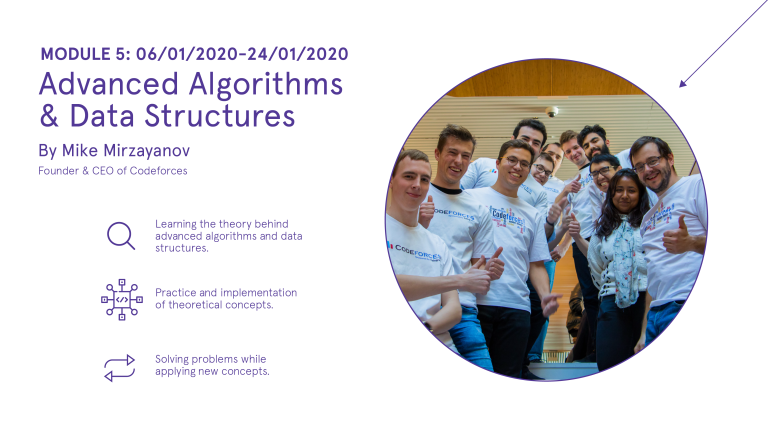

# Announcement

Hello Codeforces!

On [Wednesday, August 7, 2019 at 20:35UTC+6](https://codeforces.com/https://www.timeanddate.com/worldclock/fixedtime.html?day=7&month=8&year=2019&hour=17&min=35&sec=0&p1=166) [Educational Codeforces Round 70 (Rated for Div. 2)](https://codeforces.com/contest/1202 "Educational Codeforces Round 70 (Rated for Div. 2)") will start.

Series of Educational Rounds continue being held as [Harbour.Space University](https://codeforces.com/https://harbour.space/) initiative! You can read the details about the cooperation between [Harbour.Space University](https://codeforces.com/https://harbour.space/) and Codeforces in the [blog post](//codeforces.com/blog/entry/51208).

This round will be **rated for the participants with rating lower than 2100**. It will be held on extended ICPC rules. The penalty for each incorrect submission until the submission with a full solution is 10 minutes. After the end of the contest you will have 12 hours to hack any solution you want. You will have access to copy any solution and test it locally.

You will be given **6 problems** and **2 hours** to solve them.

The problems were invented and prepared by Roman [Roms](https://codeforces.com/profile/Roms "Master Roms") Glazov, Adilbek [adedalic](https://codeforces.com/profile/adedalic "International Master adedalic") Dalabaev, Vladimir [vovuh](https://codeforces.com/profile/vovuh "Candidate Master vovuh") Petrov, Ivan [BledDest](https://codeforces.com/profile/BledDest "Grandmaster BledDest") Androsov, Maksim [Neon](https://codeforces.com/profile/Neon "Candidate Master Neon") Mescheryakov and me. Also huge thanks to Mike [MikeMirzayanov](https://codeforces.com/profile/MikeMirzayanov "Headquarters, MikeMirzayanov") Mirzayanov for great systems Polygon and Codeforces.

Good luck to all participants!

**UPD:** Our friends at Harbour.Space also have a message for you:

*Hello Codeforces!* 

*Ready to get deep?* 

*Take a minute and ask yourselves — what skills are I missing, that I would love to have? What are those key qualities that would take me from being a decent developer to an extraordinary one?* *Am I where I want to be, in terms of personal progress?* 

*At **Harbour.Space**, we focus on **the key technical and social requirements of the jobs** of the future. Our three-week courses are designed for students to acquire and develop specific skills through seminars, workshops, projects, and case studies in a very short amount of time.*

***Mike Mirzayanov’s course, Advanced Algorithms and Data Structures**, is a great example of this:* 

*This, in combination with our unique academic environment, extensive professional network, and our seaside campus in the beautiful city of Barcelona, provides for **a truly unique learning experience**.* 

*Interested?* 

*Fill out the form below, get more information, and see how you can come attend Mike’s course to see what all the fuss is about!*

  [APPLY HERE→](https://codeforces.com/https://harbourspace.typeform.com/to/PKsD5n) *See you soon!*

*Harbour.Space*

Congratulations to the winners: 

| Rank | Competitor | Problems Solved | Penalty |
| --- | --- | --- | --- |
| 1 | [CSWhisky](https://codeforces.com/profile/CSWhisky "Candidate Master CSWhisky") | 6 | 258 |
| 2 | [tfg](https://codeforces.com/profile/tfg "Grandmaster tfg") | 6 | 302 |
| 3 | [Sugar_fan](https://codeforces.com/profile/Sugar_fan "Grandmaster Sugar_fan") | 6 | 310 |
| 4 | [jiangly](https://codeforces.com/profile/jiangly "International Master jiangly") | 6 | 338 |
| 5 | [Geothermal](https://codeforces.com/profile/Geothermal "Grandmaster Geothermal") | 5 | 195 |

109 successful hacks and 290 unsuccessful hacks were made in total!

And finally people who were the first to solve each problem: 

| Problem | Competitor | Penalty |
| --- | --- | --- |
| A | [nantf](https://codeforces.com/profile/nantf "Candidate Master nantf") | 0:03 |
| B | [Denverjin](https://codeforces.com/profile/Denverjin "Candidate Master Denverjin") | 0:11 |
| C | [Geothermal](https://codeforces.com/profile/Geothermal "Grandmaster Geothermal") | 0:20 |
| D | [dhxh](https://codeforces.com/profile/dhxh "Master dhxh") | 0:10 |
| E | [lqs2015](https://codeforces.com/profile/lqs2015 "Grandmaster lqs2015") | 0:19 |
| F | [duxing201606](https://codeforces.com/profile/duxing201606 "Master duxing201606") | 0:59 |

**UPD:** [Editorial is out](Tutorial_(en).md)

