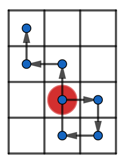

<h1 style='text-align: center;'> C. You Are Given a WASD-string...</h1>

<h5 style='text-align: center;'>time limit per test: 2 seconds</h5>
<h5 style='text-align: center;'>memory limit per test: 256 megabytes</h5>

You have a string $s$ — a sequence of commands for your toy robot. The robot is placed in some cell of a rectangular grid. He can perform four commands:

* 'W' — move one cell up;
* 'S' — move one cell down;
* 'A' — move one cell left;
* 'D' — move one cell right.

Let $Grid(s)$ be the grid of minimum possible area such that there is a position in the grid where you can place the robot in such a way that it will not fall from the grid while running the sequence of commands $s$. For example, if $s = \text{DSAWWAW}$ then $Grid(s)$ is the $4 \times 3$ grid:

1. you can place the robot in the cell $(3, 2)$;
2. the robot performs the command 'D' and moves to $(3, 3)$;
3. the robot performs the command 'S' and moves to $(4, 3)$;
4. the robot performs the command 'A' and moves to $(4, 2)$;
5. the robot performs the command 'W' and moves to $(3, 2)$;
6. the robot performs the command 'W' and moves to $(2, 2)$;
7. the robot performs the command 'A' and moves to $(2, 1)$;
8. the robot performs the command 'W' and moves to $(1, 1)$.

  You have $4$ extra letters: one 'W', one 'A', one 'S', one 'D'. You'd like to insert at most one of these letters in any position of sequence $s$ to minimize the area of $Grid(s)$.

What is the minimum area of $Grid(s)$ you can achieve?

### Input

The first line contains one integer $T$ ($1 \le T \le 1000$) — the number of queries.

Next $T$ lines contain queries: one per line. This line contains single string $s$ ($1 \le |s| \le 2 \cdot 10^5$, $s_i \in \{\text{W}, \text{A}, \text{S}, \text{D}\}$) — the sequence of commands.

It's guaranteed that the total length of $s$ over all queries doesn't exceed $2 \cdot 10^5$.

### Output

Print $T$ integers: one per query. For each query print the minimum area of $Grid(s)$ you can achieve.

## Example

### Input


```text
3
DSAWWAW
D
WA
```
### Output


```text
8
2
4
```
## Note

In the first query you have to get string $\text{DSAWW}\underline{D}\text{AW}$.

In second and third queries you can not decrease the area of $Grid(s)$.


#### Tags 

#2100 #NOT OK #brute_force #data_structures #dp #greedy #implementation #math #strings 

## Blogs
- [All Contest Problems](../Educational_Codeforces_Round_70_(Rated_for_Div._2).md)
- [Announcement](../blogs/Announcement.md)
- [Tutorial (en)](../blogs/Tutorial_(en).md)
