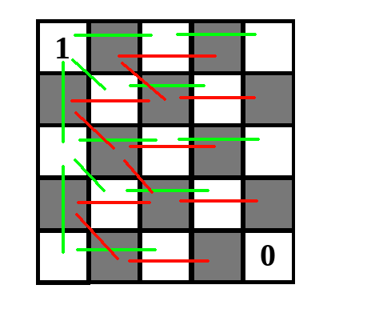

# Tutorial_(en)

### [1206A - Choose Two Numbers](https://codeforces.com/contest/1206/problem/A "Codeforces Round 580 (Div. 2)")

Let aa be the largest number in the array AA, bb be the largest number in the array BB. Then the number a+ba+b isn't present neither in the array AA nor in the array BB. Indeed, a+b>aa+b>a, and aa is the largest number in the array AA, so a+ba+b is not included in AA. Similarly, a+ba+b is not included in BB. Thus, you can select aa from AA, bb from BB.

The asymptotics is O(m logm+n logn)O(m logm+n logn) if you find the largest element by sorting (which many did), or O(m+n)O(m+n) if you find it linearly.

 
### [1206B - Make Product Equal One](https://codeforces.com/contest/1206/problem/B "Codeforces Round 580 (Div. 2)")

The product of several integers is equal to one if and only if each of these numbers is 11 or −1−1, and there must be an even number of −1−1.

Then: we will have to reduce every positive aiai at least to one, and we have to spend at least ai−1ai−1 coin on this. Similarly, we will have to increase every negative aiai at least to −1−1, for this we will spend at least −1−ai−1−ai coins.

Now we have all the numbers equal to −1−1, 00, or 11. Let kk be the number of 00 among them. Let's analyze two cases:

k>0k>0.

We need to replace every zero with either 11 or −1−1, so we will have to spend at least kk coins. It turns out that this is enough: change k−1k−1 zeros to 11 or −1−1 randomly, and change the last zero to 11 or −1−1 so that the product is equal to one.

k=0k=0.

If the product of all numbers is 11, we no longer need to spend coins. Otherwise, you have to change some 11 to −1−1 or some −1−1 to 11. This will take another 22 coins.

Asympotics O(n)O(n).

 
### [1205A - Almost Equal](../problems/A._Almost_Equal.md "Codeforces Round 580 (Div. 1)")

Consider a valid arrangement for some nn. We denote Si=ai+ai+1+ai+2+⋯+ai+n−1Si=ai+ai+1+ai+2+⋯+ai+n−1 for each ii from 11 to 2n2n, where at+2n=atat+2n=at. Then we have: Si+1−Si=(ai+1+ai+2+ai+3+⋯+ai+n)−(ai+ai+1+ai+2+⋯+ai+n−1)=ai+n−aiSi+1−Si=(ai+1+ai+2+ai+3+⋯+ai+n)−(ai+ai+1+ai+2+⋯+ai+n−1)=ai+n−ai. Hence |ai+n−ai|≤1|ai+n−ai|≤1. Since ai+nai+n and aiai are different, |ai+n−ai|=|ai+n−ai|= 1.

It is also clear from this that ai+n−aiai+n−ai and ai+n+1−ai+1ai+n+1−ai+1 have opposite signs: if they were both equal to 11, we would get Si+2−Si=(Si+2−Si+1)+(Si+1−Si)=(ai+n+1−ai+1)+(ai+n−ai)=Si+2−Si=(Si+2−Si+1)+(Si+1−Si)=(ai+n+1−ai+1)+(ai+n−ai)= 2, similarly with −1−1. Thus, the values ​​ai+n−aiai+n−ai for ii from 11 to 2n2n shoul be 11 and −1−1 alternating, and this is a sufficient condition.

Now, if nn is even, we get a contradiction, since ai+n−ai=−(a(i+n)+n−ai+n)ai+n−ai=−(a(i+n)+n−ai+n), but due to the alternating they must be equal.

If nn is odd, then it's now easy to build an example: for ii from 11 to nn ai=2i−1ai=2i−1, ai=2iai=2i, if ii is even, and ai=2iai=2i , ai=2i−1ai=2i−1 if ii is odd.

Asymptotics O(n)O(n).

Challenge:

For which pairs of (n,k)(n,k) (n>k≥1n>k≥1) is there an arrangement of numbers from 11 to nn on a circle such that the sums of each kk consecutive numbers differ by not more than 11 ?

 
### [1205B - Shortest Cycle](../problems/B._Shortest_Cycle.md "Codeforces Round 580 (Div. 1)")

The most important thing in this task is to notice that if any bit is contained at least 33 numbers, then they will form a cycle of length 33, and the answer is 33.

Suppose now that each bit is in no more than two numbers. It follows that each bit can be shared by at most one pair of numbers. From here we get that in the graph there are no more than 6060 edges. Then in it you can find the shortest cycle in O(m2)O(m2): for each edge between the vertices uu and vv we will try to remove it and find the shortest distance between the vertices uu, vv in the resulting graph. If each time uu and vv turned out to be in different components, then there is no cycle in the graph, otherwise its length is 11 + the minimal of the distances found.

Asymptotics O(n log1018+602)O(n log1018+602).

 
### [1205C - Palindromic Paths](../problems/C._Palindromic_Paths.md "Codeforces Round 580 (Div. 1)")

Denote ask((x1,y1),(x2,y2))=1ask((x1,y1),(x2,y2))=1 if there is a palindromic path between them, and 00 otherwise. We also denote by grid[i][j]grid[i][j] the number written in the cell (i,j)(i,j).

Firstly, make an observation: if the Manhattan distance is |x2−x1|+|y2−y1|=|x2−x1|+|y2−y1|= 2, then ask((x1,y1),(x2,y2))=1⟺board[x1][y1]=board[x2][y2]ask((x1,y1),(x2,y2))=1⟺board[x1][y1]=board[x2][y2]. In fact, the path between the cells (x1,y1)(x1,y1) and (x2,y2)(x2,y2) has a length of 33, and therefore it is palindromic if and only if board[x1][y1]=board[x2][y2]board[x1][y1]=board[x2][y2].

Consider a chessboard coloring such that the upper left unit is painted white. Then, using the observation described above, we can restore the numbers in all white cells. In a similar way, if we fix a certain number in a black cell, then all other numbers in black cells will be restored uniquely. Thus, we only have two options for arranging numbers on the board, which differ in the fact that in the second option, the numbers in the black cells are opposite to those in the first option. In the figure below, green pairs of white cells are connected, about which we can ask questions to find out all the values in them, and red - pairs of black cells.

  Now there are two approaches. First: for each option, calculate ask((x1,y1),(x2,y2))ask((x1,y1),(x2,y2)) for each pair of suitable cells, find where they differ, and ask a question about these two cells. This way we can uniquely identify the board option. It is possible to determine ask((x1,y1),(x2,y2)ask((x1,y1),(x2,y2) using dynamic programming: the answer is 11 only when grid[x1][y1]=grid[x2][y2]grid[x1][y1]=grid[x2][y2] and there is a path -palindrome between a pair of (x1+1,y1),(x1,y1+1)(x1+1,y1),(x1,y1+1) and (x2−1,y2),(x2,y2−1)(x2−1,y2),(x2,y2−1).

The second approach is a little more interesting, and it also shows why there is such a pair of cells for which the two options give different answers. Consider any path with a length of 44 cells, denote the numbers in its cells as c1,c2,c3,c4c1,c2,c3,c4. Then two of the cells of the path are black, and two are white. We know the relation between c1,c3c1,c3, as well as between c2,c4c2,c4 (by the relation we mean that we know are numbers in them same, or different). Suppose that the relation between c1,c3c1,c3 is the same as between c2,c4c2,c4. Then ask(c1,c4)ask(c1,c4) will make it possible to uniquely determine all the numbers! Indeed, if c1=c4c1=c4, then c2=c3c2=c3, and therefore the path will be palindromic. Otherwise, no path between c1c1 and c4c4 will be palindromic. Thus, we will be able to establish a relation between some white and some black cell, which will be enough to solve the problem.

Suppose that for any path of four cells c1,c2,c3,c4c1,c2,c3,c4, the relation between c1,c3c1,c3 is different from the relation between c2,c4c2,c4. This is equivalent to c1⊕c2⊕c3⊕c4=1c1⊕c2⊕c3⊕c4=1. Suppose that for any path of four cells ⊕⊕ of numbers in them is equal to 11. Then we consider any path from the cell (1,1)(1,1) to the cell (n,n)(n,n) of length 2n−12n−1. If the xor of each 44 of neighboring cells in it is 11, then the line is periodic with a period of 44, but the numbers in the first and last cell in it are different from the condition! Thus, the algorithm is as follows: choose any path between (1,1)(1,1) and (4,4)(4,4), find on it four cells with a xor of numbers equal to 00, and ask a question about it.

Asymptotics O(n2)O(n2).

 
### [1205D - Almost All](../problems/D._Almost_All.md "Codeforces Round 580 (Div. 1)")

First we prove the following lemma:

Suppose that there are nn vertices in the tree GG with the root vv. Let also 0<a1<a2⋯<an−10<a1<a2⋯<an−1 be any n−1n−1 different positive numbers. Then we can arrange non-negative integers on the edges of GG so that the distances from vv to the remaining vertices of the tree are a1,a2,…,an−1a1,a2,…,an−1 in some order.

Proof: for example, by induction. Let ss be some child of vv in whose subtree, including ss, there are mm vertices. Then we write on the edge between (v,s)(v,s) a1a1, and solve the problem for the subtree ss and the numbers a2−a1,a3−a1,…,am−a1a2−a1,a3−a1,…,am−a1. After that, we discard the subtree of ss from consideration and fill in the remaining edges for the numbers am+1,…,an−1am+1,…,an−1.

Thus, the lemma is proved.

Now let cc be the centroid of tree. Root the tree from cc and let s1,s2,…,sks1,s2,…,sk be the sizes of the subtrees of his childs (as we know, si≤n2si≤n2). Divide the subtrees of the childs into two groups so that size of each group is at least ⌈n−13⌉⌈n−13⌉. It is possible: while there are at least 44 subtrees, there are two for which there are no more than n2n2 vertices in total, then we unite them. When we have 33 subtrees left, we will unite two smaller ones into one group. It is easy to see that in each of the two groups there will be at least ⌈n−13⌉⌈n−13⌉ vertices.

Let the first group have aa vertices and the second bb. Then, using the lemma, we put the numbers on the edges in aa and between cc and aa so that the distances from cc to the vertices of the first group are 1,2,…,a1,2,…,a. Similarly, we make the distance from cc to the vertices of the second group equal to (a+1),2(a+1),…,b(a+1)(a+1),2(a+1),…,b(a+1). Then each number from 11 to (a+1)(b+1)−1(a+1)(b+1)−1 can be obtained as the distance between some vertex from the first group and some from the second. It is easy to show that (a+1)(b+1)−1(a+1)(b+1)−1 for a+b=n−1a+b=n−1 and a,b≥⌈n−13⌉a,b≥⌈n−13⌉ cannot be less than 2n292n29. (For example, we can say that this value is minimized at a=n−13a=n−13 and get (a+1)(b+1)−1≥(n+23)(2n+13)−1=2n2+5n+39−1≥2n29(a+1)(b+1)−1≥(n+23)(2n+13)−1=2n2+5n+39−1≥2n29 for n>1n>1 (the case of n=1n=1 is obvious)).

Asymptotics O(n)O(n) (but a checker takes O(n2)O(n2))

 
### [1205E - Expected Value Again](../problems/E._Expected_Value_Again.md "Codeforces Round 580 (Div. 1)")

Let fi(s)fi(s) be a function of the string ss equal to 11 if the prefix and suffix of length ii are equal, and equal to 00 otherwise. We need to calculate E((f1(s)+f2(s)+⋯+fn−1(s))2)=E((f1(s)+f2(s)+⋯+fn−1(s))2)= (using linearity of expectation) ∑n−1i=1E(fi(s)2)+∑1≤i,j≤n−1,i≠jE(fi(s)fj(s))∑i=1n−1E(fi(s)2)+∑1≤i,j≤n−1,i≠jE(fi(s)fj(s)).

We will call the number kk the period of the string ss if s[i]=s[i+k]s[i]=s[i+k] for all 1≤i≤len(s)+1−k1≤i≤len(s)+1−k. Moreover, the length of ss is not required to be divided by kk.

** Statement 1: ** fi(s)=1⟺fi(s)=1⟺ n−in−i is the period of the string is ss.

** Proof: ** that fi(s)=1fi(s)=1 is equivalent to s[1]s[2]…s[i]=s[n+1−i]s[n+2−i]…s[n]s[1]s[2]…s[i]=s[n+1−i]s[n+2−i]…s[n], which is equivalent to the fact that s[j]=s[j+n−i]s[j]=s[j+n−i] for jj from 11 to ii.

** Statement 2: ** E(fi(s))=k−iE(fi(s))=k−i.

** Proof: ** The probability that fi(s)=1fi(s)=1 is k−ik−i, since each of the last ii characters is uniquely determined from the previous ones.

** Statement 3: ** Let i1=n−i,j1=n−ji1=n−i,j1=n−j. Then E(fi(s)fj(s))=kmax(i1+j1−n,gcd(i1,j1))−nE(fi(s)fj(s))=kmax(i1+j1−n,gcd(i1,j1))−n.

** Proof: ** Assume that fi(s)=fj(s)=1fi(s)=fj(s)=1. We know that the string is i1i1 and j1j1-periodic. Consider a graph of nn string positions, and draw edges between positions at distances i1,j1i1,j1. Then the number of different strings satisfying fi(s)=fj(s)=1fi(s)=fj(s)=1 is kcompskcomps, where compscomps is the number of connected components of our graph. Then E(fi(s)fj(s))=kcomps−nE(fi(s)fj(s))=kcomps−n. Thus, we need to show that comps=max(i1+j1−n,gcd(i1,j1))comps=max(i1+j1−n,gcd(i1,j1)).

The case of i1+j1≤ni1+j1≤n is obvious: in this case, by subtracting and adding i1,j1i1,j1 we can show that the string has period gcd(i1,j1)gcd(i1,j1), in this case comps=gcd(i1,j1)comps=gcd(i1,j1). We now consider the case when i1+j1>ni1+j1>n.

Without loss of generality, i<j⟹i1>j1i<j⟹i1>j1. We write out in a circle numbers from 11 to i1i1. They denote the components of connectivity when we draw only the edges connecting the positions at a distance of i1i1. Now we need to add edges of the form (k,k+j1)(k,k+j1) for k=1,2,…,jk=1,2,…,j (here i1+1=1,…i1+1=1,…). Moreover, we know that j<i1j<i1.

We will add these edges one at a time and observe how the connected components change. If we connected two positions that were not connected yet, then we reduced the number of connected components by 11. Otherwise, we connected two already connected vertices and formed a cycle. When does a cycle form at all? If we consider all the edges of the form (k,k+j1)(k,k+j1), then our graph is divided into gcd(i1,j1)gcd(i1,j1) cycles - components, each of which contains all positions giving the same residues when divided by gcd(i1,j1)gcd(i1,j1). Thus, it is necessary to calculate how many of these cycles we form. If tt cycles are formed, then the number of components will be i1−j+t=i1+j1−n+ti1−j+t=i1+j1−n+t.

How many cycles will we create? Let's see if the cycle consisting of positions giving the remainder xx when divided by gcd(i1,j1)gcd(i1,j1) closes. It closes only if all its vertices are in [1,j][1,j]. This is equivalent to the fact that among the positions in [j+1,i1][j+1,i1], not a single number gives the remainder of xx when dividing by gcd(i1,j1)gcd(i1,j1). If i1−j=i1+j1−n≥gcd(i1,j1)i1−j=i1+j1−n≥gcd(i1,j1), then this cannot happen for any xx, t=0t=0, and comp=i1+j1−n=max(i1+j1−n,gcd(i1,j1)comp=i1+j1−n=max(i1+j1−n,gcd(i1,j1). Otherwise, there will be exactly gcd(i1,j1)−(i1+j1−n)gcd(i1,j1)−(i1+j1−n), where comp=i1+j1−n+gcd(i1,j1)−(i1+j1−n)=gcd(i1,j1)comp=i1+j1−n+gcd(i1,j1)−(i1+j1−n)=gcd(i1,j1). Thus, the statement is proved.

Further reasoning is standard. We have shown that E(fi(s)fj(s))E(fi(s)fj(s)) depends only on i1+j1i1+j1 and gcd(i1,j1)gcd(i1,j1). It remains for s,gcds,gcd to count the number of pairs i1,j1i1,j1 such that s=i1+j1s=i1+j1, gcd=gcd(i1,j1)gcd=gcd(i1,j1), 1≤i1,j1≤n−11≤i1,j1≤n−1. We will do it as follows: if s2=sgcds2=sgcd, i2=i1gcdi2=i1gcd, j2=j2gcdj2=j2gcd, then we rewrite it as s2=i2+j2s2=i2+j2, gcd(i2,j2)=1gcd(i2,j2)=1, 1≤i2,j2≤⌊n−1gcd⌋1≤i2,j2≤⌊n−1gcd⌋. Now we just need to find the number of numbers coprime to s2s2 on the segment [max(1,s−⌊n−1gcd⌋),min(s−1,⌊n−1gcd⌋)][max(1,s−⌊n−1gcd⌋),min(s−1,⌊n−1gcd⌋)]. This can be done for O(2primes)O(2primes), where primesprimes is the number of prime divisors of s2s2.

It can be shown that this gives the asymptotics of O(nlogn2)O(nlog⁡n2) (If you have a better one, please share in the comments!)

 
### [1205F - Beauty of a Permutation](../problems/F._Beauty_of_a_Permutation.md "Codeforces Round 580 (Div. 1)")

We will denote (a,b)(a,b) if there exists a permutation of length aa with beauty equal to bb. To begin with, it is obvious that the beauty of a permutation of length aa is at least a+1a+1 for a>1a>1: indeed, you can take each element individually and the entire permutation completely.

** Statement 1 **: if (a1,b1)(a1,b1) and (a2,b2)(a2,b2), then (a1+a2−1,b1+b2−1)(a1+a2−1,b1+b2−1).

Let p1,p2,…,pa1p1,p2,…,pa1 be a permutation of length a1a1, whose beauty is b1b1, and q1,q2,…,qa2q1,q2,…,qa2 be a permutation of length a2a2, whose beauty is equal to b2b2. Let us build from them a permutation of length a1+a2−1a1+a2−1, whose beauty is b1+b2−1b1+b2−1. We "expand" p1p1 in the permutation pp to p1+q1−1,p1+q2−1,…,p1+qa2−1p1+q1−1,p1+q2−1,…,p1+qa2−1, and to the rest of the elements pp, greater than p1p1 , add a2−1a2−1. We got a permutation of length a1+a2−1a1+a2−1. Denote it by tt. If t1t1 is not between ta2,ta2+1ta2,ta2+1, then we reverse the first a2a2 elements, and this will be done in a new permutation. Now let t1t1 be between ta2ta2, ta2+1ta2+1. Then what good pairs do we have in tt? There are b2b2 good pairs among the first a2a2 elements, there are b1b1 good pairs if you count the first a2a2 elements in one, and we counted the interval from the first a2a2 elements twice, so we counted b1+b2−1b1+b2−1 pairs At the same time, this is all pairs, because if some good segment contains ta2ta2 and ta2+1ta2+1, then it must contain t1t1 as well. Thus, this statement is proved.

** Statement 2 **: if (a,b)(a,b), then either b=a+1b=a+1, or b=a(a+1)2b=a(a+1)2, or exist (a1,b1)(a1,b1), (a2,b2)(a2,b2) such that 1<a1,a21<a1,a2, a1+a2−1=aa1+a2−1=a and b1+b2−1=bb1+b2−1=b.

Show it. We will call subsegments consisting of several consecutive numbers in some order good. Consider some kind of permutation of length aa of beauty bb. Suppose that b≠a+1b≠a+1.

We want to show that in the permutation there is some good [L,R][L,R] subsegment of length not equal to 11 or aa, with the following property: for any other good [L1,R1][L1,R1] subsegment if [L,R][L,R] and [L1,R1][L1,R1] intersect, then one of them contains the second. In this case, by analogy with the proof of Proposition 1, we can "squeeze" the segment [L,R][L,R] into one element, obtaining some kind of permutation qq. Then the number of good segments in the entire permutation will be equal to the number of good sub-segments on the segment [L,R]+[L,R]+ the number of good segments in qq −1−1 (since we counted the segment [L,R][L,R] twice). We will call such a segment very good. Thus, if in each permutation there is a very good segment, then the statement 22 is true.

Suppose that b≠a+1b≠a+1, then in the permutation there is a good segment [L,R][L,R] of length not equal to 11 or aa. Let's say he's not very good. Then there is another. We denote (a,b)(a,b) if there exists a permutation of length aa with beauty equal to bb. To begin with, it is obvious that the beauty of a permutation of length aa is at least a+1a+1 for a>1a>1: indeed, you can take each element individually and the entire permutation completely.

** Statement 1 **: if (a1,b1)(a1,b1) and (a2,b2)(a2,b2), then (a1+a2−1,b1+b2−1)(a1+a2−1,b1+b2−1).

Let p1,p2, dots,pa1p1,p2, dots,pa1 & mdash; a permutation of length a1a1, whose beauty is b1b1, and q1,q2, dots,qa2q1,q2, dots,qa2 & mdash; a permutation of length a2a2, whose beauty is equal to b2b2. Let us build from them a permutation of length a1+a2−1a1+a2−1, whose beauty is b1+b2−1b1+b2−1. We "expand" p1p1 in the permutation pp to p1+q1−1,p1+q2−1, dots,p1+qa2−1p1+q1−1,p1+q2−1, dots,p1+qa2−1, and to the rest of the elements pp, greater than p1p1 , add a2−1a2−1. We got a permutation of length a1+a2−1a1+a2−1. Denote it by tt. If t1t1 is not between ta2,ta2+1ta2,ta2+1, then we reverse the first a2a2 elements, and this will be done in a new permutation. Now let t1t1 be between ta2ta2, ta2+1ta2+1. Then what good pairs do we have in tt? There are b2b2 good pairs among the first a2a2 elements, there are b1b1 good pairs if you count the first a2a2 elements in one, and we counted the interval from the first a2a2 elements twice, so we counted b1+b2−1b1+b2−1 pairs At the same time, this is all pairs, because if some good segment contains ta2ta2 and ta2+1ta2+1, then it must contain t1t1 as well. Thus, this statement is proved.

** Statement 2 **: if (a,b)(a,b), then either b=a+1b=a+1, or b=a(a+1)2b=a(a+1)2, or (a1exists,b1)(a1exists,b1), (a2,b2)(a2,b2) such that 1<a1,a21<a1,a2, a1+a2−1=aa1+a2−1=a and b1+b2−1=bb1+b2−1=b.

Show it. We will call subsegments consisting of several consecutive numbers in some order good. Consider some kind of permutation of length aa of beauty bb. Suppose that b≠a+1b≠a+1.

We want to show that in the permutation there is some good [L,R][L,R] subsegment of length not equal to 11 or aa, with the following property: for any other good [L1,R1][L1,R1] subsegment if [L,R][L,R] and [L1,R1][L1,R1] intersect, then one of them contains the second. In this case, by analogy with the proof of Proposition 1, we can "squeeze" the segment [L,R][L,R] into one element, obtaining some kind of permutation qq. Then the number of good segments in the entire permutation will be equal to the number of good sub-segments on the segment [L,R]+[L,R]+ the number of good segments in qq −1−1 (since we counted the segment [L,R][L,R] twice). We will call such a segment very good. Thus, if in each permutation there is a very good segment, then the statement 22 is true.

Let [L,R][L,R] be a good segment that is not very good. Then there is a good segment [L1,R1][L1,R1], which intersects with [L,R][L,R], but does not contain and is not contained in it. The segments [L,R][L,R] and [L1,R1][L1,R1] form together 33 segmentы. It is easy to show that each of them is good, and the numbers in the segments go monotonously. Let us demonstrate this with an example: p=(2,1,3,5,4)p=(2,1,3,5,4), the first segment is [2,1,3][2,1,3], the second is [3,5,4][3,5,4]. Then together they will give the union of three segments: [2,1],[3],[5,4][2,1],[3],[5,4]. As we can see, each of these segments is good, and also all numbers in the second segment are larger than all numbers in the first, all numbers in the third segment are larger than all numbers in the second.

Let at the moment we have lined up a chain of good segments (going consecutively) s1,s2,…,sms1,s2,…,sm, where the union of any several consecutive ones is a good segment, as well as all the numbers in si+1si+1 more than all the numbers in sisi (or vice versa). As long as S=s1+s2+⋯+smS=s1+s2+⋯+sm is not equal to the whole segment, we will do this: since SS is very good, there is a segment [L,R][L,R] that intersects with it but is not contained in it does not contain. It is easy to see that, thanks to the segment [L,R][L,R], our chain of good segments is extended.

Now suppose that s1+s2+⋯+sms1+s2+⋯+sm is the whole segment. While there is a segment of length greater than 11 among the segments, we will do the same: if len(si)>1len(si)>1, then we will find the necessary [L,R][L,R] for it, then sisi will be split into two smaller good segments .

At the end of the process, we get aa good segments of length 11 each, and the numbers are sorted monotonously. Hence, the numbers in the permutation were initially sorted monotonously, whence the number of good segments is a(a+1)2a(a+1)2. The statement 22 is proved.

Now the left is easy: for each ii from 11 to 100100, we calculate what beauty values ​​can be in a permutation of length ii using statement 22, storing the corresponding values ​​(a1,b1),(a2,b2)(a1,b1),(a2,b2). After that, it is easy to answer the request by building a permutation of the desired beauty according to the algorithm with the approval of 11.

Asymptotics of O(n6)O(n6) (With an incredibly small constant, up to n=100n=100 on CodeforcesCodeforces this works for 300 ms).

Challenge: improve the asymptotics to O(n5)O(n5) (works in less than 30 ms).

