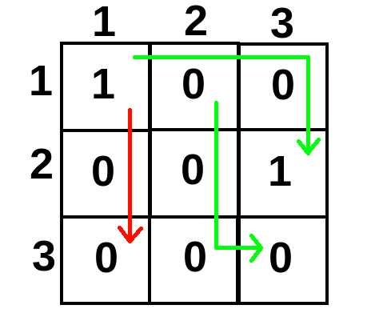

<h1 style='text-align: center;'> C. Palindromic Paths</h1>

<h5 style='text-align: center;'>time limit per test: 1 second</h5>
<h5 style='text-align: center;'>memory limit per test: 256 megabytes</h5>

This is an interactive problem

You are given a grid $n\times n$, where $n$ is odd. Rows are enumerated from $1$ to $n$ from up to down, columns are enumerated from $1$ to $n$ from left to right. Cell, standing on the intersection of row $x$ and column $y$, is denoted by $(x, y)$.

Every cell contains $0$ or $1$. It is known that the top-left cell contains $1$, and the bottom-right cell contains $0$.

We want to know numbers in all cells of the grid. To do so we can ask the following questions: 

"$?$ $x_1$ $y_1$ $x_2$ $y_2$", where $1 \le x_1 \le x_2 \le n$, $1 \le y_1 \le y_2 \le n$, and $x_1 + y_1 + 2 \le x_2 + y_2$. In other words, we output two different cells $(x_1, y_1)$, $(x_2, y_2)$ of the grid such that we can get from the first to the second by moving only to the right and down, and they aren't adjacent.

As a response to such question you will be told if there exists a path between $(x_1, y_1)$ and $(x_2, y_2)$, going only to the right or down, numbers in cells of which form a palindrome.

For example, paths, shown in green, are palindromic, so answer for "$?$ $1$ $1$ $2$ $3$" and "$?$ $1$ $2$ $3$ $3$" would be that there exists such path. However, there is no palindromic path between $(1, 1)$ and $(3, 1)$.

  Determine all cells of the grid by asking not more than $n^2$ questions. It can be shown that the answer always exists.

### Input

The first line contains odd integer ($3 \le n < 50$) — the side of the grid.

## Interaction

You begin the interaction by reading $n$.

To ask a question about cells $(x_1, y_1), (x_2, y_2)$, in a separate line output "$?$ $x_1$ $y_1$ $x_2$ $y_2$".

Numbers in the query have to satisfy $1 \le x_1 \le x_2 \le n$, $1 \le y_1 \le y_2 \le n$, and $x_1 + y_1 + 2 \le x_2 + y_2$. Don't forget to 'flush', to get the answer.

In response, you will receive $1$, if there exists a path going from $(x_1, y_1)$ to $(x_2, y_2)$ only to the right or down, numbers in cells of which form a palindrome, and $0$ otherwise.

In case your query is invalid or you asked more than $n^2$ queries, program will print $-1$ and will finish interaction. You will receive Wrong answer verdict. Make sure to exit immediately to avoid getting other verdicts.

When you determine numbers in all cells, output "!".

Then output $n$ lines, the $i$-th of which is a string of length $n$, corresponding to numbers in the $i$-th row of the grid.

After printing a query do not forget to output end of line and flush the output. Otherwise, you will get Idleness limit exceeded. To do this, use:

* fflush(stdout) or cout.flush() in C++;
* System.out.flush() in Java;
* flush(output) in Pascal;
* stdout.flush() in Python;
* see documentation for other languages.

Hack Format

To hack, use the following format.

The first line should contain a single odd integer $n$ (side of your grid).

The $i$-th of $n$ following lines should contain a string of length $n$ corresponding to the $i$-th row of the grid. Top left element of the grid has to be equal to $1$, bottom right has to be equal to $0$.

## Example

### Input


```text

3
0
1
0
1
1
1
1
```
#Output
```text

? 1 1 1 3
? 1 1 2 3
? 2 1 2 3
? 3 1 3 3
? 2 2 3 3
? 1 2 3 2
? 1 2 3 3
!
100
001
000
```


#### Tags 

#2400 #NOT OK #implementation #interactive 

## Blogs
- [All Contest Problems](../Codeforces_Round_580_(Div._1).md)
- [Codeforces Round #580](../blogs/Codeforces_Round_580.md)
- [Tutorial (en)](../blogs/Tutorial_(en).md)
