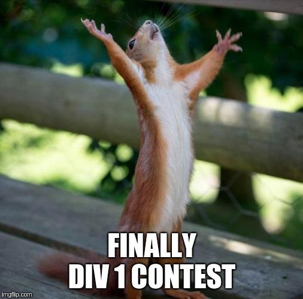

# Codeforces_Round_580

Hello again, Codeforces!

I am glad to invite you to [Codeforces Round 580](https://codeforces.com/contests/1205,1206), which will take place on [Sunday, August 18, 2019 at 19:45UTC+6](https://codeforces.com/https://www.timeanddate.com/worldclock/fixedtime.html?day=18&month=8&year=2019&hour=16&min=45&sec=0&p1=166). Round will be rated for both divisions.

All problems in this round were created and prepared by me, [antontrygubO_o](https://codeforces.com/profile/antontrygubO_o "Grandmaster antontrygubO_o"). I tried to make them interesting and hope that you will enjoy them!

A lot of thanks to [arsijo](https://codeforces.com/profile/arsijo "International Grandmaster arsijo") for the excellent coordination of the round, [244mhq](https://codeforces.com/profile/244mhq "Grandmaster 244mhq"), [gepardo](https://codeforces.com/profile/gepardo "International Grandmaster gepardo"), [danya.smelskiy](https://codeforces.com/profile/danya.smelskiy "International Master danya.smelskiy"), [reeWorld](https://codeforces.com/profile/reeWorld "Candidate Master reeWorld"), [Xellos](https://codeforces.com/profile/Xellos "International Grandmaster Xellos"), [Mediocrity](https://codeforces.com/profile/Mediocrity "Master Mediocrity"), [I_love_tigersugar](https://codeforces.com/profile/I_love_tigersugar "Grandmaster I_love_tigersugar"), [KAN](https://codeforces.com/profile/KAN "Grandmaster KAN") for the testing and valuable comments, and to Mike [MikeMirzayanov](https://codeforces.com/profile/MikeMirzayanov "Headquarters, MikeMirzayanov") Mirzayanov for the amazing platforms Codeforces и Polygon.

Participants in each division will be offered 6 problems and 2 hours 10 minutes to solve them. As usual, I **strongly** recommend reading statements of all problems!

I wish you good luck and high rating!

**UPD1**:

Scoring distribution of Div 22 round: **500 — 1000 — 1500 — 1750 — 2250 — 3000**

Scoring distribution of Div 11 round: **500 — 750 — 1250 — 2000 — 2500 — 3000**

**UPD2**:[Editorial](Tutorial.md)

**UPD3** Congrats to winners!

**Div 1**:

**1.** [TLE](https://codeforces.com/profile/TLE "International Grandmaster TLE")

**2.** [Um_nik](https://codeforces.com/profile/Um_nik "Legendary Grandmaster Um_nik")

**3.** [mnbvmar](https://codeforces.com/profile/mnbvmar "Legendary Grandmaster mnbvmar")

**4.** [Benq](https://codeforces.com/profile/Benq "Legendary Grandmaster Benq")

**5.** [Rewinding](https://codeforces.com/profile/Rewinding "Legendary Grandmaster Rewinding")

**Div 2**:

**1.** [kkkkk11](https://codeforces.com/profile/kkkkk11 "Unrated, kkkkk11")

**2.** [sucuk](https://codeforces.com/profile/sucuk "Unrated, sucuk")

**3.** [ujrepacul](https://codeforces.com/profile/ujrepacul "Expert ujrepacul")

**4.** [zzffxx](https://codeforces.com/profile/zzffxx "Expert zzffxx")

**5.** [VahitGuetta](https://codeforces.com/profile/VahitGuetta "Unrated, VahitGuetta")

