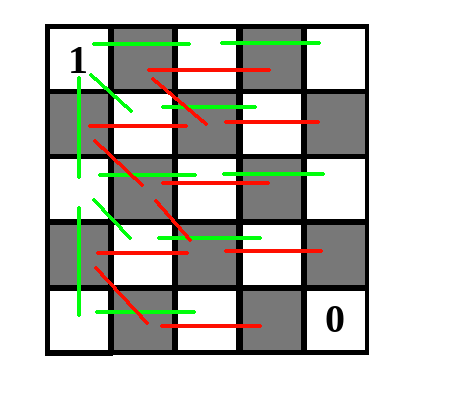

# Tutorial

### [1206A - Choose Two Numbers](../problems/A._Choose_Two_Numbers.md "Codeforces Round 580 (Div. 2)")

Let a be the largest number in the array A, b be the largest number in the array B. Then the number a+b isn't present neither in the array A nor in the array B. Indeed, a+b>a, and a is the largest number in the array A, so a+b is not included in A. Similarly, a+b is not included in B. Thus, you can select a from A, b from B.

The asymptotics is O(m logm+n logn) if you find the largest element by sorting (which many did), or O(m+n) if you find it linearly.

 
### [1206B - Make Product Equal One](../problems/B._Make_Product_Equal_One.md "Codeforces Round 580 (Div. 2)")

The product of several integers is equal to one if and only if each of these numbers is $ 1 $ or $ -1 $, and there must be an even number of $ -1 $.

Then: we will have to reduce every positive $ a_i $ at least to one, and we have to spend at least $ a_i - 1 $ coin on this. Similarly, we will have to increase every negative $ a_i $ at least to $ -1 $, for this we will spend at least $ -1 - a_i $ coins.

Now we have all the numbers equal to $ -1 $, $ 0 $, or $ 1 $. Let $ k $ be the number of $ 0 $ among them. Let's analyze two cases:

$ k> 0 $.

We need to replace every zero with either $ 1 $ or $ -1 $, so we will have to spend at least $ k $ coins. It turns out that this is enough: change $ k-1 $ zeros to $ 1 $ or $ -1 $ randomly, and change the last zero to $ 1 $ or $ -1 $ so that the product is equal to one.

$ k = 0 $.

If the product of all numbers is $ 1 $, we no longer need to spend coins. Otherwise, you have to change some $ 1 $ to $ -1 $ or some $ -1 $ to $ 1 $. This will take another $ 2 $ coins.

Asympotics $ O (n) $.

 Tutorial is loading... 
### [1205B - Shortest Cycle](https://codeforces.com/contest/1205/problem/B "Codeforces Round 580 (Div. 1)")

The most important thing in this task is to notice that if any bit is contained at least $ 3 $ numbers, then they will form a cycle of length $ 3 $, and the answer is $ 3 $.

Suppose now that each bit is in no more than two numbers. It follows that each bit can be shared by at most one pair of numbers. From here we get that in the graph there are no more than $ 60 $ edges. Then in it you can find the shortest cycle in $ O (m ^ 2) $: for each edge between the vertices $ u $ and $ v $ we will try to remove it and find the shortest distance between the vertices $ u $, $ v $ in the resulting graph. If each time $ u $ and $ v $ turned out to be in different components, then there is no cycle in the graph, otherwise its length is $ 1 $ + the minimal of the distances found.

Asymptotics $ O (n \ log {10 ^ {18}} + 60 ^ 2) $.

 
### [1205C - Palindromic Paths](https://codeforces.com/contest/1205/problem/C "Codeforces Round 580 (Div. 1)")

Denote $ ask ((x_1, y_1), (x_2, y_2)) = 1 $ if there is a palindromic path between them, and $ 0 $ otherwise. We also denote by $ grid [i] [j] $ the number written in the cell $ (i, j) $.

Firstly, make an observation: if the Manhattan distance is $ | x_2-x_1 | + | y_2-y_1 | = $ 2, then $ ask ((x_1, y_1), (x_2, y_2)) = 1 \iff board [x1] [y1] = board [x2] [y2] $. In fact, the path between the cells $ (x_1, y_1) $ and $ (x_2, y_2) $ has a length of $ 3 $, and therefore it is palindromic if and only if $ board [x1] [y1] = board [x2 ] [y2] $.

Consider a chessboard coloring such that the upper left unit is painted white. Then, using the observation described above, we can restore the numbers in all white cells. In a similar way, if we fix a certain number in a black cell, then all other numbers in black cells will be restored uniquely. Thus, we only have two options for arranging numbers on the board, which differ in the fact that in the second option, the numbers in the black cells are opposite to those in the first option. In the figure below, green pairs of white cells are connected, about which we can ask questions to find out all the values in them, and red - pairs of black cells.

  Now there are two approaches. First: for each option, calculate $ ask ((x_1, y_1), (x_2, y_2)) $ for each pair of suitable cells, find where they differ, and ask a question about these two cells. This way we can uniquely identify the board option. It is possible to determine $ ask ((x_1, y_1), (x_2, y_2) $ using dynamic programming: the answer is $ 1 $ only when $ grid [x_1] [y_1] = grid [x_2] [y_2] $ and there is a path -palindrome between a pair of $ (x_1 + 1, y_1), (x_1, y_1 + 1) $ and $ (x_2-1, y_2), (x_2, y_2-1) $.

The second approach is a little more interesting, and it also shows why there is such a pair of cells for which the two options give different answers. Consider any path with a length of $ 4 $ cells, denote the numbers in its cells as $ c_1, c_2, c_3, c_4 $. Then two of the cells of the path are black, and two are white. We know the relation between $ c_1, c_3 $, as well as between $ c_2, c_4 $ (by the relation we mean that we know are numbers in them same, or different). Suppose that the relation between $ c_1, c_3 $ is the same as between $ c_2, c_4 $. Then $ ask (c_1, c_4) $ will make it possible to uniquely determine all the numbers! Indeed, if $ c_1 = c_4 $, then $ c_2 = c_3 $, and therefore the path will be palindromic. Otherwise, no path between $ c_1 $ and $ c_4 $ will be palindromic. Thus, we will be able to establish a relation between some white and some black cell, which will be enough to solve the problem.

Suppose that for any path of four cells $ c_1, c_2, c_3, c_4 $, the relation between $ c_1, c_3 $ is different from the relation between $ c_2, c_4 $. This is equivalent to $ c_1 \oplus c_2 \oplus c_3 \oplus c_4 = 1 $. Suppose that for any path of four cells $ \oplus $ of numbers in them is equal to $ 1 $. Then we consider any path from the cell $ (1, 1) $ to the cell $ (n, n) $ of length $ 2n-1 $. If the xor of each $ 4 $ of neighboring cells in it is $ 1 $, then the line is periodic with a period of $ 4 $, but the numbers in the first and last cell in it are different from the condition! Thus, the algorithm is as follows: choose any path between $ (1, 1) $ and $ (4, 4) $, find on it four cells with a xor of numbers equal to $ 0 $, and ask a question about it.

Asymptotics $O (n ^ 2) $.

 
### [1205D - Almost All](https://codeforces.com/contest/1205/problem/D "Codeforces Round 580 (Div. 1)")

First we prove the following lemma:

Suppose that there are $ n $ vertices in the tree $ G $ with the root $ v $. Let also $ 0 <a_1 <a_2 \dots <a_ {n-1} $ be any $ n-1 $ different positive numbers. Then we can arrange non-negative integers on the edges of $ G $ so that the distances from $ v $ to the remaining vertices of the tree are $ a_1, a_2, \dots, a_{n-1} $ in some order.

Proof: for example, by induction. Let $ s $ be some child of $ v $ in whose subtree, including $ s $, there are $ m $ vertices. Then we write on the edge between $ (v, s) $ $ a_1 $, and solve the problem for the subtree $ s $ and the numbers $ a_2-a_1, a_3-a_1, \dots, a_m - a_1 $. After that, we discard the subtree of $ s $ from consideration and fill in the remaining edges for the numbers $ a_{m + 1}, \dots, a_{n-1} $.

Thus, the lemma is proved.

Now let $ c $ be the centroid of tree. Root the tree from $ c $ and let $ s_1, s_2, \dots, s_k $ be the sizes of the subtrees of his childs (as we know, $ s_i \le \frac{n}{2}$). Divide the subtrees of the childs into two groups so that size of each group is at least $ \lceil \frac{n-1}{3} \rceil $. It is possible: while there are at least $ 4 $ subtrees, there are two for which there are no more than $ \frac{n}{2} $ vertices in total, then we unite them. When we have $ 3 $ subtrees left, we will unite two smaller ones into one group. It is easy to see that in each of the two groups there will be at least $ \lceil \frac{n-1}{3} \rceil $ vertices.

Let the first group have $ a $ vertices and the second $ b $. Then, using the lemma, we put the numbers on the edges in $ a $ and between $ c $ and $ a $ so that the distances from $ c $ to the vertices of the first group are $ 1, 2, \dots, a $. Similarly, we make the distance from $ c $ to the vertices of the second group equal to $ (a + 1), 2 (a + 1), \dots, b (a + 1) $. Then each number from $ 1 $ to $ (a + 1) (b + 1) -1 $ can be obtained as the distance between some vertex from the first group and some from the second. It is easy to show that $ (a + 1) (b + 1) -1 $ for $ a + b = n-1 $ and $ a, b \ge \lceil \frac{n-1}{3} \rceil $ cannot be less than $ \frac {2n ^ 2} {9} $. (For example, we can say that this value is minimized at $ a = \frac{n-1}{3} $ and get $ (a + 1) (b + 1) -1 \ge (\frac{n + 2 }{3}) (\frac{2n + 1}{3}) - 1 = \frac{2n ^ 2 + 5n + 3}{9} - 1 \ge \frac{2n ^ 2}{9} $ for $ n> 1 $ (the case of $ n = 1 $ is obvious)).

Asymptotics $ O (n) $ (but a checker takes $ O (n ^ 2) $)

 
### [1205E - Expected Value Again](https://codeforces.com/contest/1205/problem/E "Codeforces Round 580 (Div. 1)")

Let $ f_i (s) $ be a function of the string $ s $ equal to $ 1 $ if the prefix and suffix of length $ i $ are equal, and equal to $ 0 $ otherwise. We need to calculate $ E ((f_1 (s) + f_2 (s) + \dots + f_{n-1}(s))^2) = $ (using linearity of expectation) $ \sum_{i = 1}^{n-1} E(f_i (s) ^ 2) + \sum_{1 \le i, j \le n-1, i \neq j} E (f_i (s) f_j (s)) $.

We will call the number $ k $ the period of the string $ s $ if $ s [i] = s [i + k] $ for all $ 1 \le i \le len (s) + 1-k $. Moreover, the length of $ s $ is not required to be divided by $ k $.

** Statement 1: ** $ f_i (s) = 1 \iff $ $ n-i $ is the period of the string is $ s $.

** Proof: ** that $ f_i (s) = 1 $ is equivalent to $ s[1]s[2] \dots s[i] = s[n + 1-i]s[n + 2 -i] \dots s[n] $, which is equivalent to the fact that $ s [j] = s [j + n - i] $ for $ j $ from $ 1 $ to $ i $.

** Statement 2: ** $ E (f_i (s)) = k ^ {- i} $.

** Proof: ** The probability that $ f_i (s) = 1 $ is $ k ^ {- i} $, since each of the last $ i $ characters is uniquely determined from the previous ones.

** Statement 3: ** Let $ i_1 = n-i, j_1 = n-j $. Then $ E (f_i (s) f_j (s)) = k ^ {max (i_1 + j_1 - n, gcd (i_1, j_1)) - n} $.

** Proof: ** Assume that $ f_i (s) = f_j (s) = 1 $. We know that the string is $ i_1 $ and $ j_1 $-periodic. Consider a graph of $ n $ string positions, and draw edges between positions at distances $ i_1, j_1 $. Then the number of different strings satisfying $ f_i (s) = f_j (s) = 1 $ is $ k ^ {comps} $, where $ comps $ is the number of connected components of our graph. Then $ E (f_i (s) f_j (s)) = k ^ {comps-n} $. Thus, we need to show that $ comps = max (i_1 + j_1 - n, gcd (i_1, j_1)) $.

The case of $ i_1 + j_1 \le n $ is obvious: in this case, by subtracting and adding $ i_1, j_1 $ we can show that the string has period $ gcd (i_1, j_1) $, in this case $ comps = gcd (i_1, j_1 ) $. We now consider the case when $ i_1 + j_1> n $.

Without loss of generality, $ i <j \implies i_1> j_1 $. We write out in a circle numbers from $ 1 $ to $ i_1 $. They denote the components of connectivity when we draw only the edges connecting the positions at a distance of $ i_1 $. Now we need to add edges of the form $ (k, k + j_1) $ for $ k = 1, 2, \dots, j $ (here $ i_1 + 1 = 1, \dots $). Moreover, we know that $ j <i_1 $.

We will add these edges one at a time and observe how the connected components change. If we connected two positions that were not connected yet, then we reduced the number of connected components by $ 1 $. Otherwise, we connected two already connected vertices and formed a cycle. When does a cycle form at all? If we consider all the edges of the form $ (k, k + j_1) $, then our graph is divided into $ gcd (i_1, j_1) $ cycles - components, each of which contains all positions giving the same residues when divided by $ gcd (i_1, j_1) $. Thus, it is necessary to calculate how many of these cycles we form. If $ t $ cycles are formed, then the number of components will be $ i_1 - j + t = i_1 + j_1 - n + t $.

How many cycles will we create? Let's see if the cycle consisting of positions giving the remainder $ x $ when divided by $ gcd (i_1, j_1) $ closes. It closes only if all its vertices are in $ [1, j] $. This is equivalent to the fact that among the positions in $ [j + 1, i_1] $, not a single number gives the remainder of $ x $ when dividing by $ gcd (i_1, j_1) $. If $ i_1-j = i_1 + j_1 - n \ge gcd (i_1, j_1) $, then this cannot happen for any $ x $, $ t = 0 $, and $ comp = i_1 + j_1 - n = max (i_1 + j_1 - n, gcd (i_1, j_1) $. Otherwise, there will be exactly $ gcd (i_1, j_1) - (i_1 + j_1-n) $, where $ comp = i_1 + j_1 - n + gcd (i_1, j_1) - (i_1 + j_1-n) = gcd (i_1, j_1) $. Thus, the statement is proved.

Further reasoning is standard. We have shown that $ E (f_i (s) f_j (s)) $ depends only on $ i_1 + j_1 $ and $ gcd (i_1, j_1) $. It remains for $ s, gcd $ to count the number of pairs $ i_1, j_1 $ such that $ s = i_1 + j_1 $, $ gcd = gcd (i1, j1) $, $ 1 \le i_1, j_1 \le n-1 $. We will do it as follows: if $ s_2 = \frac{s}{gcd} $, $ i_2 = \frac{i_1}{gcd} $, $ j_2 = \frac{j_2}{gcd} $, then we rewrite it as $ s_2 = i_2 + j_2 $, $ gcd (i_2, j_2) = 1 $, $ 1 \le i_2, j_2 \le \lfloor \frac{n-1}{gcd} \rfloor $. Now we just need to find the number of numbers coprime to $ s_2 $ on the segment $ [max (1, s - \lfloor \frac{n-1}{gcd} \rfloor), min (s-1, \lfloor \frac{n-1}{gcd} \rfloor)] $. This can be done for $ O (2 ^ {primes}) $, where $ primes $ is the number of prime divisors of $ s_2 $.

It can be shown that this gives the asymptotics of $ O (n\log {n} ^ 2) $ (If you have a better one, please share in the comments!)

 
### [1205F - Beauty of a Permutation](https://codeforces.com/contest/1205/problem/F "Codeforces Round 580 (Div. 1)")

We will denote $ (a, b) $ if there exists a permutation of length $ a $ with beauty equal to $ b $. To begin with, it is obvious that the beauty of a permutation of length $ a $ is at least $ a + 1 $ for $ a> 1 $: indeed, you can take each element individually and the entire permutation completely.

** Statement 1 **: if $ (a_1, b_1) $ and $ (a_2, b_2) $, then $ (a_1 + a_2 - 1, b_1 + b_2 - 1) $.

Let $ p_1, p_2, \dots, p_ {a_1} $ be a permutation of length $ a_1 $, whose beauty is $ b_1 $, and $ q_1, q_2, \dots, q_ {a_2} $ be a permutation of length $ a_2 $, whose beauty is equal to $ b_2 $. Let us build from them a permutation of length $ a_1 + a_2 - 1 $, whose beauty is $ b_1 + b_2 - 1 $. We "expand" $ p_1 $ in the permutation $ p $ to $ p_1 + q_1 - 1, p_1 + q_2 - 1, \dots, p_1 + q_ {a_2} - 1 $, and to the rest of the elements $ p $, greater than $ p_1 $ , add $ a_2-1 $. We got a permutation of length $ a_1 + a_2 - 1 $. Denote it by $ t $. If $ t_1 $ is not between $ t_ {a_2}, t_ {a_2 + 1} $, then we reverse the first $ a_2 $ elements, and this will be done in a new permutation. Now let $ t_1 $ be between $ t_ {a_2} $, $ t_ {a_2 + 1} $. Then what good pairs do we have in $ t $? There are $ b_2 $ good pairs among the first $ a_2 $ elements, there are $ b_1 $ good pairs if you count the first $ a_2 $ elements in one, and we counted the interval from the first $ a_2 $ elements twice, so we counted $ b_1 + b_2 - 1 $ pairs At the same time, this is all pairs, because if some good segment contains $ t_ {a_2} $ and $ t_ {a_2 + 1} $, then it must contain $ t_1 $ as well. Thus, this statement is proved.

** Statement 2 **: if $ (a, b) $, then either $ b = a + 1 $, or $ b = \frac{a (a + 1)}{2} $, or exist $ (a_1 , b_1) $, $ (a_2, b_2) $ such that $ 1 <a_1, a_2 $, $ a_1 + a_2 - 1 = a $ and $ b_1 + b_2 - 1 = b $.

Show it. We will call subsegments consisting of several consecutive numbers in some order good. Consider some kind of permutation of length $ a $ of beauty $ b $. Suppose that $ b \neq a + 1 $.

We want to show that in the permutation there is some good $ [L, R] $ subsegment of length not equal to $ 1 $ or $ a $, with the following property: for any other good $ [L1, R1] $ subsegment if $ [L , R] $ and $ [L1, R1] $ intersect, then one of them contains the second. In this case, by analogy with the proof of Proposition 1, we can "squeeze" the segment $ [L, R] $ into one element, obtaining some kind of permutation $ q $. Then the number of good segments in the entire permutation will be equal to the number of good sub-segments on the segment $ [L, R] + $ the number of good segments in $ q $ $ -1 $ (since we counted the segment $ [L, R] $ twice). We will call such a segment very good. Thus, if in each permutation there is a very good segment, then the statement $ 2 $ is true.

Suppose that $ b \neq a + 1 $, then in the permutation there is a good segment $ [L, R] $ of length not equal to $ 1 $ or $ a $. Let's say he's not very good. Then there is another. We denote $ (a, b) $ if there exists a permutation of length $ a $ with beauty equal to $ b $. To begin with, it is obvious that the beauty of a permutation of length $ a $ is at least $ a + 1 $ for $ a> 1 $: indeed, you can take each element individually and the entire permutation completely.

** Statement 1 **: if $ (a_1, b_1) $ and $ (a_2, b_2) $, then $ (a_1 + a_2 - 1, b_1 + b_2 - 1) $.

Let $ p_1, p_2, \ dots, p_ {a_1} $ & mdash; a permutation of length $ a_1 $, whose beauty is $ b_1 $, and $ q_1, q_2, \ dots, q_ {a_2} $ & mdash; a permutation of length $ a_2 $, whose beauty is equal to $ b_2 $. Let us build from them a permutation of length $ a_1 + a_2 - 1 $, whose beauty is $ b_1 + b_2 - 1 $. We "expand" $ p_1 $ in the permutation $ p $ to $ p_1 + q_1 - 1, p_1 + q_2 - 1, \ dots, p_1 + q_ {a_2} - 1 $, and to the rest of the elements $ p $, greater than $ p_1 $ , add $ a_2-1 $. We got a permutation of length $ a_1 + a_2 - 1 $. Denote it by $ t $. If $ t_1 $ is not between $ t_ {a_2}, t_ {a_2 + 1} $, then we reverse the first $ a_2 $ elements, and this will be done in a new permutation. Now let $ t_1 $ be between $ t_ {a_2} $, $ t_ {a_2 + 1} $. Then what good pairs do we have in $ t $? There are $ b_2 $ good pairs among the first $ a_2 $ elements, there are $ b_1 $ good pairs if you count the first $ a_2 $ elements in one, and we counted the interval from the first $ a_2 $ elements twice, so we counted $ b_1 + b_2 - 1 $ pairs At the same time, this is all pairs, because if some good segment contains $ t_ {a_2} $ and $ t_ {a_2 + 1} $, then it must contain $ t_1 $ as well. Thus, this statement is proved.

** Statement 2 **: if $ (a, b) $, then either $ b = a + 1 $, or $ b = \frac {a (a + 1)} {2} $, or $ (a_1 exists , b_1) $, $ (a_2, b_2) $ such that $ 1 <a_1, a_2 $, $ a_1 + a_2 - 1 = a $ and $ b_1 + b_2 - 1 = b $.

Show it. We will call subsegments consisting of several consecutive numbers in some order good. Consider some kind of permutation of length $ a $ of beauty $ b $. Suppose that $ b \neq a + 1 $.

We want to show that in the permutation there is some good $ [L, R] $ subsegment of length not equal to $ 1 $ or $ a $, with the following property: for any other good $ [L1, R1] $ subsegment if $ [L , R] $ and $ [L1, R1] $ intersect, then one of them contains the second. In this case, by analogy with the proof of Proposition 1, we can "squeeze" the segment $ [L, R] $ into one element, obtaining some kind of permutation $ q $. Then the number of good segments in the entire permutation will be equal to the number of good sub-segments on the segment $ [L, R] + $ the number of good segments in $ q $ $ -1 $ (since we counted the segment $ [L, R] $ twice). We will call such a segment very good. Thus, if in each permutation there is a very good segment, then the statement $ 2 $ is true.

Let $ [L, R] $ be a good segment that is not very good. Then there is a good segment $ [L_1, R_1] $, which intersects with $ [L, R] $, but does not contain and is not contained in it. The segments $ [L, R] $ and $ [L_1, R_1] $ form together $ 3 $ segmentы. It is easy to show that each of them is good, and the numbers in the segments go monotonously. Let us demonstrate this with an example: $ p = (2, 1, 3, 5, 4) $, the first segment is $ [2, 1, 3] $, the second is $ [3, 5, 4] $. Then together they will give the union of three segments: $ [2, 1], [3], [5, 4] $. As we can see, each of these segments is good, and also all numbers in the second segment are larger than all numbers in the first, all numbers in the third segment are larger than all numbers in the second.

Let at the moment we have lined up a chain of good segments (going consecutively) $ s_1, s_2, \dots, s_m $, where the union of any several consecutive ones is a good segment, as well as all the numbers in $ s_ {i + 1} $ more than all the numbers in $ s_i $ (or vice versa). As long as $ S = s_1 + s_2 + \dots + s_m $ is not equal to the whole segment, we will do this: since $ S $ is very good, there is a segment $ [L, R] $ that intersects with it but is not contained in it does not contain. It is easy to see that, thanks to the segment $ [L, R] $, our chain of good segments is extended.

Now suppose that $ s_1 + s_2 + \dots + s_m $ is the whole segment. While there is a segment of length greater than $ 1 $ among the segments, we will do the same: if $ len (s_i)> 1 $, then we will find the necessary $ [L, R] $ for it, then $ s_i $ will be split into two smaller good segments .

At the end of the process, we get $ a $ good segments of length $ 1 $ each, and the numbers are sorted monotonously. Hence, the numbers in the permutation were initially sorted monotonously, whence the number of good segments is $ \frac {a (a + 1)} {2} $. The statement $ 2 $ is proved.

Now the left is easy: for each $ i $ from $ 1 $ to $ 100 $, we calculate what beauty values ​​can be in a permutation of length $ i $ using statement $ 2 $, storing the corresponding values ​​$ (a_1, b_1), (a_2, b_2 ) $. After that, it is easy to answer the request by building a permutation of the desired beauty according to the algorithm with the approval of $ 1 $.

Asymptotics of $ O (n ^ 6) $ (With an incredibly small constant, up to $ n = 100 $ on $ Codeforces $ this works for 300 ms).

Challenge: improve the asymptotics to $ O (n ^ 5) $ (works in less than 30 ms).

