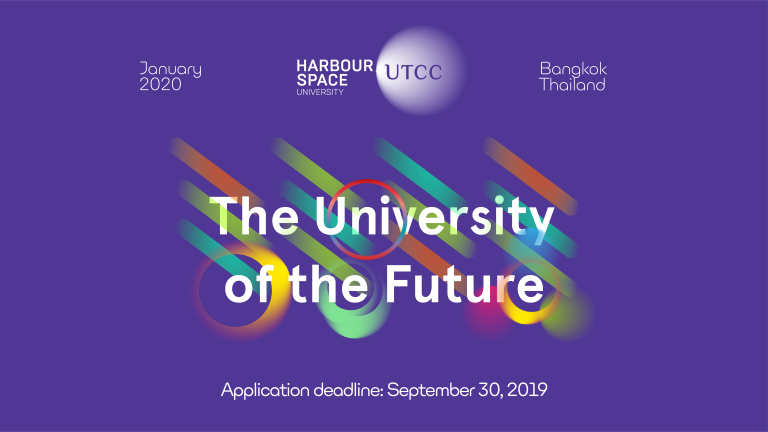

# Announcement

Hello Codeforces!

On [Thursday, August 22, 2019 at 20:35UTC+6](https://codeforces.com/https://www.timeanddate.com/worldclock/fixedtime.html?day=22&month=8&year=2019&hour=17&min=35&sec=0&p1=166) [Educational Codeforces Round 71 (Rated for Div. 2)](https://codeforces.com/contest/1207 "Educational Codeforces Round 71 (Rated for Div. 2)") will start.

Series of Educational Rounds continue being held as [Harbour.Space University](https://codeforces.com/https://harbour.space/) initiative! You can read the details about the cooperation between [Harbour.Space University](https://codeforces.com/https://harbour.space/) and Codeforces in the [blog post](//codeforces.com/blog/entry/51208).

This round will be **rated for the participants with rating lower than 2100**. It will be held on extended ICPC rules. The penalty for each incorrect submission until the submission with a full solution is 10 minutes. After the end of the contest you will have 12 hours to hack any solution you want. You will have access to copy any solution and test it locally.

You will be given **7 problems** and **2 hours** to solve them.

The problems were invented and prepared by Roman [Roms](https://codeforces.com/profile/Roms "Master Roms") Glazov, Adilbek [adedalic](https://codeforces.com/profile/adedalic "International Master adedalic") Dalabaev, Vladimir [vovuh](https://codeforces.com/profile/vovuh "Candidate Master vovuh") Petrov, Ivan [BledDest](https://codeforces.com/profile/BledDest "Grandmaster BledDest") Androsov, Maksim [Neon](https://codeforces.com/profile/Neon "Candidate Master Neon") Mescheryakov and me. Also huge thanks to Mike [MikeMirzayanov](https://codeforces.com/profile/MikeMirzayanov "Headquarters, MikeMirzayanov") Mirzayanov for great systems Polygon and Codeforces.

Good luck to all participants!

**UPD:** Our friends at Harbour.Space also have a message for you:

*Hello Codeforces,* 

***We are opening a new campus in Bangkok, Thailand!*** 

*We are delighted to introduce a strategic partnership between Harbour.Space University and the University of the Thai Chamber of Commerce – a collaborative effort powered by B.Grimm.*

*After 3 years of successfully disrupting education in Barcelona, with a unique educational model founded on active learning in entrepreneurship, technology, and design, as well as the most extraordinary academic and professional community on the planet to show for it, we are ready to bring the revolution to our new campus in Bangkok, Thailand.*

*Scholarships for our Bangkok campus are designed to completely eliminate the barrier between exceptional talents and sophisticated education: they cover the entire tuition fee as well as the cost of living expenses, and furthermore, they provide the student the valuable experience of both studying and working at Harbour.Space University.*

*Unique opportunities reserved for the most brilliant students from anywhere in the world, our scholarships are more than financial support – they are portals from your past to your future.*

*If you are graduating or have already completed a bachelor's degree, we are waiting for your applications for fully-funded Master's degree scholarships by the link below.*

  [APPLY HERE→](https://in.harbour.space/bangkok-scholarships/?utm_source=codeforces&utm_medium=partners&utm_campaign=ed_round_71) Congratulations to the winners: 

| Rank | Competitor | Problems Solved | Penalty |
| --- | --- | --- | --- |
| 1 | [hehezhou](https://codeforces.com/profile/hehezhou "Candidate Master hehezhou") | 7 | 235 |
| 2 | [pekempey](https://codeforces.com/profile/pekempey "Master pekempey") | 7 | 235 |
| 3 | [TadijaSebez](https://codeforces.com/profile/TadijaSebez "International Master TadijaSebez") | 7 | 238 |
| 4 | [Barichek](https://codeforces.com/profile/Barichek "International Master Barichek") | 7 | 241 |
| 5 | [FurryChina](https://codeforces.com/profile/FurryChina "Candidate Master FurryChina") | 7 | 247 |

467 successful hacks and 688 unsuccessful hacks were made in total!

And finally people who were the first to solve each problem: 

| Problem | Competitor | Penalty |
| --- | --- | --- |
| A | [vintage_Vlad_Makeev](https://codeforces.com/profile/vintage_Vlad_Makeev "Grandmaster vintage_Vlad_Makeev") | 0:01 |
| B | [Dalgerok](https://codeforces.com/profile/Dalgerok "Candidate Master Dalgerok") | 0:04 |
| C | [kmjp](https://codeforces.com/profile/kmjp "Grandmaster kmjp") | 0:12 |
| D | [KenMuse](https://codeforces.com/profile/KenMuse "Specialist KenMuse") | 0:13 |
| E | [AkshajK](https://codeforces.com/profile/AkshajK "Master AkshajK") | 0:10 |
| F | [AnotherRound](https://codeforces.com/profile/AnotherRound "Master AnotherRound") | 0:07 |
| G | [danya.smelskiy](https://codeforces.com/profile/danya.smelskiy "International Master danya.smelskiy") | 0:26 |

**UPD:** [Editorial is out](Tutorial.md)

