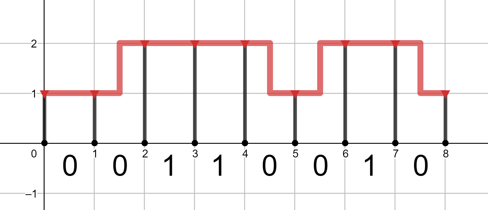
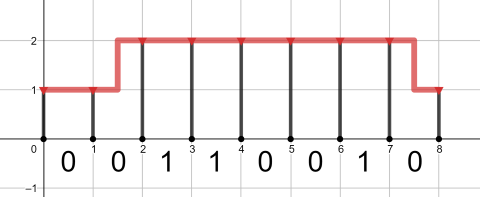
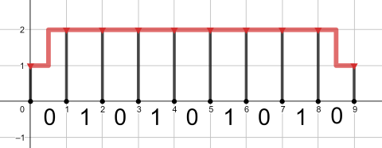
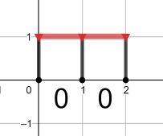

<h1 style='text-align: center;'> C. Gas Pipeline</h1>

<h5 style='text-align: center;'>time limit per test: 2 seconds</h5>
<h5 style='text-align: center;'>memory limit per test: 256 megabytes</h5>

You are responsible for installing a gas pipeline along a road. Let's consider the road (for simplicity) as a segment $[0, n]$ on $OX$ axis. The road can have several crossroads, but for simplicity, we'll denote each crossroad as an interval $(x, x + 1)$ with integer $x$. So we can represent the road as a binary string consisting of $n$ characters, where character 0 means that current interval doesn't contain a crossroad, and 1 means that there is a crossroad.

Usually, we can install the pipeline along the road on height of $1$ unit with supporting pillars in each integer point (so, if we are responsible for $[0, n]$ road, we must install $n + 1$ pillars). But on crossroads we should lift the pipeline up to the height $2$, so the pipeline won't obstruct the way for cars.

We can do so inserting several zig-zag-like lines. Each zig-zag can be represented as a segment $[x, x + 1]$ with integer $x$ consisting of three parts: $0.5$ units of horizontal pipe + $1$ unit of vertical pipe + $0.5$ of horizontal. 
## Note

 that if pipeline is currently on height $2$, the pillars that support it should also have length equal to $2$ units.

  Each unit of gas pipeline costs us $a$ bourles, and each unit of pillar — $b$ bourles. So, it's not always optimal to make the whole pipeline on the height $2$. Find the shape of the pipeline with minimum possible cost and calculate that cost.

## Note

 that you must start and finish the pipeline on height $1$ and, also, it's guaranteed that the first and last characters of the input string are equal to 0.

### Input

The fist line contains one integer $T$ ($1 \le T \le 100$) — the number of queries. Next $2 \cdot T$ lines contain independent queries — one query per two lines.

The first line contains three integers $n$, $a$, $b$ ($2 \le n \le 2 \cdot 10^5$, $1 \le a \le 10^8$, $1 \le b \le 10^8$) — the length of the road, the cost of one unit of the pipeline and the cost of one unit of the pillar, respectively.

The second line contains binary string $s$ ($|s| = n$, $s_i \in \{0, 1\}$, $s_1 = s_n = 0$) — the description of the road.

It's guaranteed that the total length of all strings $s$ doesn't exceed $2 \cdot 10^5$.

### Output

Print $T$ integers — one per query. For each query print the minimum possible cost of the constructed pipeline.

## Example

### Input


```text
4
8 2 5
00110010
8 1 1
00110010
9 100000000 100000000
010101010
2 5 1
00
```
### Output


```text
94
25
2900000000
13
```
## Note

The optimal pipeline for the first query is shown at the picture above.

The optimal pipeline for the second query is pictured below:

  The optimal (and the only possible) pipeline for the third query is shown below:

  The optimal pipeline for the fourth query is shown below:

  

#### Tags 

#1500 #NOT OK #dp #greedy 

## Blogs
- [All Contest Problems](../Educational_Codeforces_Round_71_(Rated_for_Div._2).md)
- [Announcement](../blogs/Announcement.md)
- [Tutorial](../blogs/Tutorial.md)
