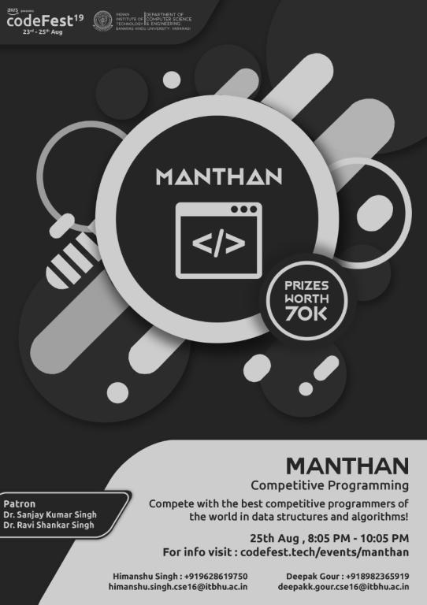

# Manthan_—_Codefest'19_(en)

Hello Codeforces!

I would like to invite you to [Manthan, Codefest'19](https://codeforces.com/contests/1208), which will take place on [Sunday, August 25, 2019 at 8:05 PM IST](https://codeforces.com/https://www.timeanddate.com/worldclock/fixedtime.html?msg=Manthan%2C+Codefest%2719&iso=20190825T1435&ah=2). This is a **combined Div. 1 + Div. 2** round and is **rated** for participants from both divisions.

The Department of Computer Science and Engineering, IIT (BHU) is conducting Codefest from 23rd August — 25th August. Manthan, the algorithmic programming contest under the banner of [Codefest](https://codeforces.com/https://codefest.tech/), is being held as a special Codeforces round. The round follows regular Codeforces rules.

All problems in this round were created and prepared by [drastogi21](https://codeforces.com/profile/drastogi21 "Master drastogi21"), [_shanky](https://codeforces.com/profile/_shanky "Master _shanky"), [Enigma27](https://codeforces.com/profile/Enigma27 "Candidate Master Enigma27"), [_hiccup](https://codeforces.com/profile/_hiccup "Expert _hiccup"), [KAN](https://codeforces.com/profile/KAN "Grandmaster KAN") and me ([hitman623](https://codeforces.com/profile/hitman623 "Master hitman623")).

A lot of thanks to [KAN](https://codeforces.com/profile/KAN "Grandmaster KAN"), [300iq](https://codeforces.com/profile/300iq "International Grandmaster 300iq"), [vintage_Vlad_Makeev](https://codeforces.com/profile/vintage_Vlad_Makeev "Grandmaster vintage_Vlad_Makeev"), [_overrated_](https://codeforces.com/profile/_overrated_ "Master _overrated_"), [Rox](https://codeforces.com/profile/Rox "Candidate Master Rox") for the testing and valuable comments, and to [MikeMirzayanov](https://codeforces.com/profile/MikeMirzayanov "Headquarters, MikeMirzayanov") for the awesome Codeforces and Polygon platforms!

#### **Prizes** -

 * 1st place — **INR 25,000**
* 2nd place — **INR 18,000**
* 3rd place — **INR 12,000**
* 1st place in India — **INR 6,000**
* 1st place in IIT(BHU) — **INR 3,000**
* 1st place among freshers (1st/2nd Year) of IIT(BHU) — **INR 1,000**
* **Codeforces T-shirts** to the participants who will be the first to solve each problem.

Participants will be offered **8** problems and **2 hours** to solve them. As usual, the scoring distribution will be announced later.

Hope you guys enjoy the contest! See you on the leaderboard!

**UPD:** The scoring is 500 — 1000 — 1500 — 2000 — 2250 — 2500 — 3000 — 3750 

**UPD:** The contest has ended. Congratulations to the winners.

**1.** [tourist](https://codeforces.com/profile/tourist "Legendary Grandmaster tourist")

**2.** [Um_nik](https://codeforces.com/profile/Um_nik "Legendary Grandmaster Um_nik")

**3.** [jqdai0815](https://codeforces.com/profile/jqdai0815 "Legendary Grandmaster jqdai0815")

**First place in India**: [cerberus97](https://codeforces.com/profile/cerberus97 "Grandmaster cerberus97")

Following are the participants who were the first to solve each problem and have won a Codeforces T-shirt. Congrats!

**A.** [IgorI](https://codeforces.com/profile/IgorI "Master IgorI")

**B.** [Geothermal](https://codeforces.com/profile/Geothermal "Grandmaster Geothermal")

**C.** [icecuber](https://codeforces.com/profile/icecuber "Grandmaster icecuber")

**D.** [ILoLy](https://codeforces.com/profile/ILoLy "Candidate Master ILoLy")

**E.** [nocriz](https://codeforces.com/profile/nocriz "International Master nocriz")

**F.** [GoGooLi](https://codeforces.com/profile/GoGooLi "Master GoGooLi")

**G.** [jqdai0815](https://codeforces.com/profile/jqdai0815 "Legendary Grandmaster jqdai0815")

**H.** [tourist](https://codeforces.com/profile/tourist "Legendary Grandmaster tourist")

**UPD:** We decided to give the 8th T-shirt to [IgorI](https://codeforces.com/profile/IgorI "Master IgorI") for problem A. Congrats! 

The [editorial](Tutorial_(en).md) has been published. 

Hope to see you next year!

