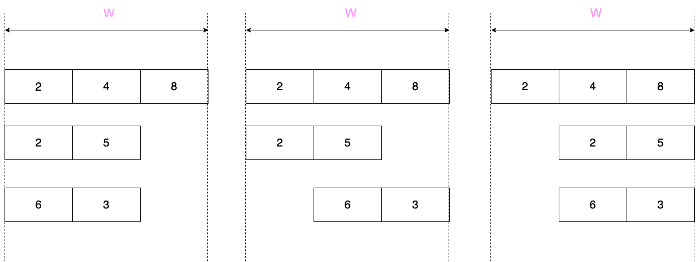

<h1 style='text-align: center;'> E. Let Them Slide</h1>

<h5 style='text-align: center;'>time limit per test: 4 seconds</h5>
<h5 style='text-align: center;'>memory limit per test: 256 megabytes</h5>

You are given $n$ arrays that can have different sizes. You also have a table with $w$ columns and $n$ rows. The $i$-th array is placed horizontally in the $i$-th row. You can slide each array within its row as long as it occupies several consecutive cells and lies completely inside the table.

You need to find the maximum sum of the integers in the $j$-th column for each $j$ from $1$ to $w$ independently.

  Optimal placements for columns $1$, $2$ and $3$ are shown on the pictures from left to right. 
## Note

 that you can exclude any array out of a column provided it remains in the window. In this case its value is considered to be zero.

#### Input

The first line contains two integers $n$ ($1 \le n \le 10^{6}$) and $w$ ($1 \le w \le 10^{6}$) — the number of arrays and the width of the table.

Each of the next $n$ lines consists of an integer $l_{i}$ ($1 \le l_{i} \le w$), the length of the $i$-th array, followed by $l_{i}$ integers $a_{i1}, a_{i2}, \ldots, a_{il_i}$ ($-10^{9} \le a_{ij} \le 10^{9}$) — the elements of the array.

The total length of the arrays does no exceed $10^{6}$.

#### Output

Print $w$ integers, the $i$-th of them should be the maximum sum for column $i$.

## Examples

#### Input


```text
3 3
3 2 4 8
2 2 5
2 6 3
```
#### Output


```text
10 15 16 
```
#### Input


```text
2 2
2 7 8
1 -8
```
#### Output


```text
7 8 
```
## Note

Illustration for the first example is in the statement.


#### Tags 

#2200 #NOT OK #data_structures #implementation 

## Blogs
- [All Contest Problems](../Manthan,_Codefest_19_(open_for_everyone,_rated,_Div._1_+_Div._2).md)
- [Manthan — Codefest'19 (en)](../blogs/Manthan_—_Codefest'19_(en).md)
- [Tutorial (en)](../blogs/Tutorial_(en).md)
