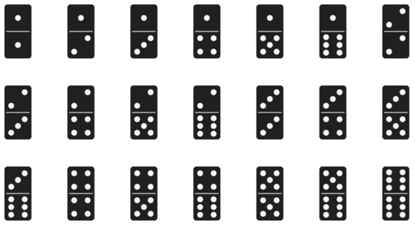
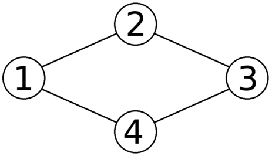
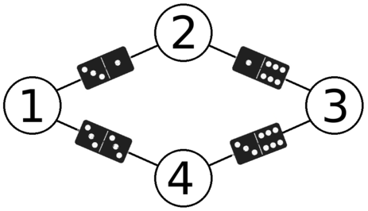

<h1 style='text-align: center;'> A. Anadi and Domino</h1>

<h5 style='text-align: center;'>time limit per test: 2 seconds</h5>
<h5 style='text-align: center;'>memory limit per test: 256 megabytes</h5>

Anadi has a set of dominoes. Every domino has two parts, and each part contains some dots. For every $a$ and $b$ such that $1 \leq a \leq b \leq 6$, there is exactly one domino with $a$ dots on one half and $b$ dots on the other half. The set contains exactly $21$ dominoes. Here is an exact illustration of his set:

  Also, Anadi has an undirected graph without self-loops and multiple edges. He wants to choose some dominoes and place them on the edges of this graph. He can use at most one domino of each type. Each edge can fit at most one domino. It's not necessary to place a domino on each edge of the graph.

When placing a domino on an edge, he also chooses its direction. In other words, one half of any placed domino must be directed toward one of the endpoints of the edge and the other half must be directed toward the other endpoint. There's a catch: if there are multiple halves of dominoes directed toward the same vertex, each of these halves must contain the same number of dots.

How many dominoes at most can Anadi place on the edges of his graph?

###### Input

The first line contains two integers $n$ and $m$ ($1 \leq n \leq 7$, $0 \leq m \leq \frac{n\cdot(n-1)}{2}$) — the number of vertices and the number of edges in the graph.

The next $m$ lines contain two integers each. Integers in the $i$-th line are $a_i$ and $b_i$ ($1 \leq a, b \leq n$, $a \neq b$) and denote that there is an edge which connects vertices $a_i$ and $b_i$.

The graph might be disconnected. It's however guaranteed that the graph doesn't contain any self-loops, and that there is at most one edge between any pair of vertices.

###### Output

###### Output

 one integer which denotes the maximum number of dominoes which Anadi can place on the edges of the graph.

## Examples

###### Input


```text
4 4
1 2
2 3
3 4
4 1
```
###### Output


```text
4
```
###### Input


```text
7 0
```
###### Output


```text
0
```
###### Input


```text
3 1
1 3
```
###### Output


```text
1
```
###### Input


```text
7 21
1 2
1 3
1 4
1 5
1 6
1 7
2 3
2 4
2 5
2 6
2 7
3 4
3 5
3 6
3 7
4 5
4 6
4 7
5 6
5 7
6 7
```
###### Output


```text
16
```
## Note

Here is an illustration of Anadi's graph from the first sample test:

  And here is one of the ways to place a domino on each of its edges:

  
## Note

 that each vertex is faced by the halves of dominoes with the same number of dots. For instance, all halves directed toward vertex $1$ have three dots.


#### Tags 

#1700 #NOT OK #brute_force #graphs 

## Blogs
- [All Contest Problems](../Dasha_Code_Championship_-_SPb_Finals_Round_(only_for_onsite-finalists).md)
- [Announcement (en)](../blogs/Announcement_(en).md)
- [Tutorial (en)](../blogs/Tutorial_(en).md)
