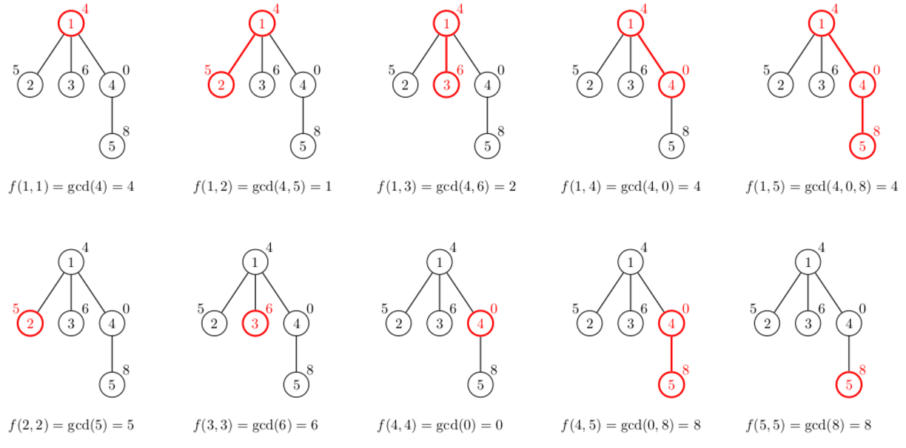

<h1 style='text-align: center;'> C. Kamil and Making a Stream</h1>

<h5 style='text-align: center;'>time limit per test: 4 seconds</h5>
<h5 style='text-align: center;'>memory limit per test: 768 megabytes</h5>

Kamil likes streaming the competitive programming videos. His MeTube channel has recently reached $100$ million subscribers. In order to celebrate this, he posted a video with an interesting problem he couldn't solve yet. Can you help him?

You're given a tree — a connected undirected graph consisting of $n$ vertices connected by $n - 1$ edges. The tree is rooted at vertex $1$. A vertex $u$ is called an ancestor of $v$ if it lies on the shortest path between the root and $v$. In particular, a vertex is an ancestor of itself.

Each vertex $v$ is assigned its beauty $x_v$ — a non-negative integer not larger than $10^{12}$. This allows us to define the beauty of a path. Let $u$ be an ancestor of $v$. Then we define the beauty $f(u, v)$ as the greatest common divisor of the beauties of all vertices on the shortest path between $u$ and $v$. Formally, if $u=t_1, t_2, t_3, \dots, t_k=v$ are the vertices on the shortest path between $u$ and $v$, then $f(u, v) = \gcd(x_{t_1}, x_{t_2}, \dots, x_{t_k})$. Here, $\gcd$ denotes the greatest common divisor of a set of numbers. In particular, $f(u, u) = \gcd(x_u) = x_u$.

Your task is to find the sum

$$ \sum_{u\text{ is an ancestor of }v} f(u, v). $$

As the result might be too large, please output it modulo $10^9 + 7$.

## Note

 that for each $y$, $\gcd(0, y) = \gcd(y, 0) = y$. In particular, $\gcd(0, 0) = 0$.

#### Input

The first line contains a single integer $n$ ($2 \le n \le 100\,000$) — the number of vertices in the tree.

The following line contains $n$ integers $x_1, x_2, \dots, x_n$ ($0 \le x_i \le 10^{12}$). The value $x_v$ denotes the beauty of vertex $v$.

The following $n - 1$ lines describe the edges of the tree. Each of them contains two integers $a, b$ ($1 \le a, b \le n$, $a \neq b$) — the vertices connected by a single edge.

#### Output

#### Output

 the sum of the beauties on all paths $(u, v)$ such that $u$ is ancestor of $v$. This sum should be printed modulo $10^9 + 7$.

## Examples

#### Input


```text
5
4 5 6 0 8
1 2
1 3
1 4
4 5
```
#### Output


```text
42
```
#### Input


```text
7
0 2 3 0 0 0 0
1 2
1 3
2 4
2 5
3 6
3 7
```
#### Output


```text
30
```
## Note

The following figure shows all $10$ possible paths for which one endpoint is an ancestor of another endpoint. The sum of beauties of all these paths is equal to $42$:

  

#### Tags 

#2000 #NOT OK #math #number_theory #trees 

## Blogs
- [All Contest Problems](../Dasha_Code_Championship_-_SPb_Finals_Round_(only_for_onsite-finalists).md)
- [Announcement (en)](../blogs/Announcement_(en).md)
- [Tutorial (en)](../blogs/Tutorial_(en).md)
