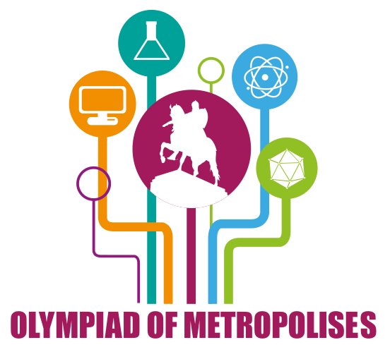

# Announcement

  Hi everybody!

These days Moscow is conducting the 4th International Olympiad of Metropolises that is an international competition for high school students from biggest cities and capitals all around the world. One of the disciplines of the competition is informatics. Rounds of the competition were prepared by the jury members invited from St. Petersburg, Minsk, Belgrade and Moscow olympiad scientific committee which you may know by Moscow team Olympiad, Open Olympiad in Informatics and Moscow Olympiad for young students (rounds [327](https://codeforces.com/blog/entry/21185), [342](https://codeforces.com/blog/entry/23309), [345](https://codeforces.com/blog/entry/43615), [376](https://codeforces.com/blog/entry/47769), [401](https://codeforces.com/blog/entry/50613), [433](https://codeforces.com/blog/entry/54350), [441](https://codeforces.com/blog/entry/55201), [466](https://codeforces.com/blog/entry/57981), [469](https://codeforces.com/blog/entry/58229), [507](https://codeforces.com/blog/entry/61638), [516](https://codeforces.com/blog/entry/62440), [541](https://codeforces.com/blog/entry/65433), [545](https://codeforces.com/blog/entry/65768), [567](https://codeforces.com/blog/entry/67703)).

Scientific Committee of the olympiad consists of: [Chmel_Tolstiy](https://codeforces.com/profile/Chmel_Tolstiy "International Grandmaster Chmel_Tolstiy"), Jelena Hadži-Purić, Elena Andreeva, [Zlobober](https://codeforces.com/profile/Zlobober "International Grandmaster Zlobober"), [GlebsHP](https://codeforces.com/profile/GlebsHP "International Grandmaster GlebsHP"), [andrewzta](https://codeforces.com/profile/andrewzta "Grandmaster andrewzta"), [meshanya](https://codeforces.com/profile/meshanya "Grandmaster meshanya"). 

The problems were developed by [isaf27](https://codeforces.com/profile/isaf27 "International Grandmaster isaf27"), [cdkrot](https://codeforces.com/profile/cdkrot "International Grandmaster cdkrot"), [manoprenko](https://codeforces.com/profile/manoprenko "Master manoprenko"), [GoToCoding](https://codeforces.com/profile/GoToCoding "Candidate Master GoToCoding"), [ch_egor](https://codeforces.com/profile/ch_egor "International Grandmaster ch_egor"), [vintage_Vlad_Makeev](https://codeforces.com/profile/vintage_Vlad_Makeev "Grandmaster vintage_Vlad_Makeev"), [voidmax](https://codeforces.com/profile/voidmax "International Grandmaster voidmax"), [grphil](https://codeforces.com/profile/grphil "Master grphil"), [malcolm](https://codeforces.com/profile/malcolm "Master malcolm") under the guidance of [GlebsHP](https://codeforces.com/profile/GlebsHP "International Grandmaster GlebsHP") and [Zlobober](https://codeforces.com/profile/Zlobober "International Grandmaster Zlobober").

Problems were adapted for codeforces by [vintage_Vlad_Makeev](https://codeforces.com/profile/vintage_Vlad_Makeev "Grandmaster vintage_Vlad_Makeev") and [cdkrot](https://codeforces.com/profile/cdkrot "International Grandmaster cdkrot"), also thanks for [MikeMirzayanov](https://codeforces.com/profile/MikeMirzayanov "Headquarters, MikeMirzayanov") for systems codeforces and polygon, which was used to prepare problems of this olympiad. Also, thanks [LHiC](https://codeforces.com/profile/LHiC "Legendary Grandmaster LHiC"), [voidmax](https://codeforces.com/profile/voidmax "International Grandmaster voidmax") and [wrg0ababd](https://codeforces.com/profile/wrg0ababd "Expert wrg0ababd") for testing!

Good luck and high ratings for everybody!

Round will happen on [Wednesday, September 4, 2019 at 15:05UTC+6](https://codeforces.com/https://www.timeanddate.com/worldclock/fixedtime.html?day=4&month=9&year=2019&hour=12&min=5&sec=0&p1=166) and will last for two and half hours. 

The round will consist of 8 problems and **will be combined** for both divisions. **The round is rated for all participants.**

**P.S.** We kindly ask everybody who knows problems of an onsite event not to participate in a round and not to discuss them in public, as this may be a subject for disqualification.

**UPD1:** Winners!

 1. [jqdai0815](https://codeforces.com/profile/jqdai0815 "Legendary Grandmaster jqdai0815")
2. [gina0605](https://codeforces.com/profile/gina0605 "Master gina0605")
3. [never_giveup](https://codeforces.com/profile/never_giveup "Grandmaster never_giveup")
4. [Radewoosh](https://codeforces.com/profile/Radewoosh "Legendary Grandmaster Radewoosh")
5. [244mhq](https://codeforces.com/profile/244mhq "International Grandmaster 244mhq")
6. [cz_yixuanxu](https://codeforces.com/profile/cz_yixuanxu "Grandmaster cz_yixuanxu")
7. [ko_osaga](https://codeforces.com/profile/ko_osaga "International Grandmaster ko_osaga")
8. [mango_lassi](https://codeforces.com/profile/mango_lassi "International Grandmaster mango_lassi")
9. [GoForIt](https://codeforces.com/profile/GoForIt "Grandmaster GoForIt")
10. [ksun48](https://codeforces.com/profile/ksun48 "International Grandmaster ksun48")

Editorial will be published soon.

**UPD2:** [Editorial](Tutorial_(en).md)

