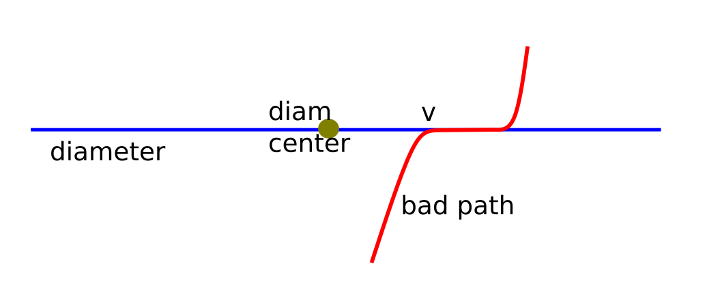

# Tutorial_(en)

Thanks for the participation!

[1214A - Optimal Currency Exchange](../problems/A._Optimal_Currency_Exchange.md) was authored and prepared by Helen Andreeva.

[1214B - Badges](../problems/B._Badges.md) was authored by jury and prepared by [Chmel_Tolstiy](https://codeforces.com/profile/Chmel_Tolstiy "International Grandmaster Chmel_Tolstiy").

[1214C - Bad Sequence](../problems/C._Bad_Sequence.md) was authored by [meshanya](https://codeforces.com/profile/meshanya "Grandmaster meshanya") and prepared by [GoToCoding](https://codeforces.com/profile/GoToCoding "Candidate Master GoToCoding").

[1214D - Treasure Island](../problems/D._Treasure_Island.md) was authored by [meshanya](https://codeforces.com/profile/meshanya "Grandmaster meshanya") and prepared by [malcolm](https://codeforces.com/profile/malcolm "Master malcolm").

[1214E - Petya and Construction Set](../problems/E._Petya_and_Construction_Set.md) was authored and prepared by [voidmax](https://codeforces.com/profile/voidmax "International Grandmaster voidmax").

[1214F - Employment](../problems/F._Employment.md) was authored and prepared by [grphil](https://codeforces.com/profile/grphil "Master grphil").

[1214G - Feeling Good](../problems/G._Feeling_Good.md) was authored and prepared by [isaf27](https://codeforces.com/profile/isaf27 "International Grandmaster isaf27").

[1214H - Tiles Placement](../problems/H._Tiles_Placement.md) was authored and prepared by [cdkrot](https://codeforces.com/profile/cdkrot "International Grandmaster cdkrot").

 
### [1214A - Optimal Currency Exchange](../problems/A._Optimal_Currency_Exchange.md "Codeforces Round 583 (Div. 1 + Div. 2, based on Olympiad of Metropolises)")

If we have bought dollar bills with value of two or more dollar bill, we can change it one-dollar bills. Same goes for euro, we can replace all euro bills with several $5$-euro bills.

Now we can simply try buying some number of five-euro bills and buying all the rest with one-dollar bills.


```cpp
    int ans = n;  
    for (int i = 0; i * 5 * e <= n; ++i) {  
        ans = min(ans, (n - i * 5 * e) % d);  
    }  

```
Complexity is $\mathcal{O}(n)$.

 
### [1214B - Badges](../problems/B._Badges.md "Codeforces Round 583 (Div. 1 + Div. 2, based on Olympiad of Metropolises)")

Vasya must take one deck for each possible combination $(participants_{girls}, participants_{boys})$ (where $0 \le participants_{girls} \le g$, $0 \le participants_{boys} \le b$ and $participants_{girls} + participants_{boys} = n$).

Let's determine how many girls can come for the game: 

* at least $n - min(b, n)$,
* at most $min(g, n)$.

All intermediate values are also possible, to the answer is just $min(g, n) - (n - min(b, n)) + 1$.

 
### [1214C - Bad Sequence](../problems/C._Bad_Sequence.md "Codeforces Round 583 (Div. 1 + Div. 2, based on Olympiad of Metropolises)")

Let's call a balance of bracket sequence a number of opening brackets minus the number of closing brackets. Correct bracket sequence is such a sequence that balance of any of its prefixes is at least $0$ and the balance of the entire sequence is equal to $0$. 

To solve the problem let's consider the shortest prefix with balance equal to $-1$. In this prefix last symbol is obviously equal to ")", so let's move this closing bracket to the end of the sequence. If the sequence is correct now, then the answer is "Yes", otherwise it is "No", because it means that in original sequence there exists some longer prefix with balance equal to $-2$. Let's show why we can't move some bracket so that the sequence becomes correct.

Consider the shortest prefix with balance equal to $-2$. If we move some opening bracket to the beginning of the sequence, balance of considered prefix becomes $-1$ and the sequence is not correct yet. Moving opening bracket from considered prefix to the beginning doesn't change anything. Even more, if we move the closing bracket from the end of the considered prefix to the end of the sequence, it still doesn't become correct, because balance of the prefix is $-1$.

This results in a following solution: if balance of all prefixes is not less than $-1$, answer is "Yes", otherwise it's "No".

 
### [1214D - Treasure Island](../problems/D._Treasure_Island.md "Codeforces Round 583 (Div. 1 + Div. 2, based on Olympiad of Metropolises)")

The answer is no more than two as we can block $(2, 1)$ and $(1, 2)$. If there is no way from $(1, 1)$ to $(n, m)$, the answer is zero. The only thing to do is to distinguish $k = 1$ and $k = 2$.

If answer is one, there must exist such cell $(x, y)$ that each path from $(1, 1)$ to $(n, m)$ goes through that cell. Also we can notice that in each path the cell $(x, y)$ goes on the $(x + y - 1)^th$ place.

Let's run $dfs$ to obtain the set of cells which are accessible from $(1, 1)$ and $dfs$ backwards to obtain the set on cells such that $(n, m)$ is accessible from them. Let's intersect these sets and group cells by the distance from $(1, 1)$. If some group has a single cell, that would be the cell to block and the answer is one. If each group has more than one cell, the answer is two.

 
### [1214E - Petya and Construction Set](../problems/E._Petya_and_Construction_Set.md "Codeforces Round 583 (Div. 1 + Div. 2, based on Olympiad of Metropolises)")

Assume without loss of generality that the array $d$ sorted in non-increasing order. 

Let's make a linear ("bamboo") graph from the vertices $1, 3, 5, \ldots, 2n - 1$ in this order. We will add nodes $2i$ one by one, we will also maintain the longest route during that. On the $i$-th step we are looking for the vertex at the distance $d_i - 1$ from $2i - 1$. That node is $(i + d_i - 1)$-th on the route. So we can connect to it vertex $2i$. If $2i$ was connected to the last vertex of the route we should add $2i$ to the end of it. 

$(i + d_i - 1)$-th node on the longest route always exists because of two limitations: 

* $d_1 \leq n$
* for all $i \geq 2$: $d_{i - 1} \geq d_i$.
 
### [1214F - Employment](../problems/F._Employment.md "Codeforces Round 583 (Div. 1 + Div. 2, based on Olympiad of Metropolises)")

First, let's notice that the optimal answer can be achieved without changing the relative order of candidates. That means that if we order candidates by circle clockwise, the second candidate will work at the next clockwise workplace from the first candidate's workplace, the third candidate will work at the next clockwise workplace from the second candidate's workplace and so on. Let's prove it. If in optimal answer the order has changed, then there should be 2 candidates, so that the first of them lives earlier clockwise then the second and works at workplace, which is further. If we swap their workplaces, the distance between home and workplace for each of them will either stay the same or decrease. So, doing this swaps, we can achieve the situation, when the relative order of candidates stay the same.

Now we can come up with simple $O(n^2)$ solution. Let's first sort all candidates and workplaces by their city number. Let's select some workplace for the first candidate. Because in the optimal answer the order of candidates will not change, for each candidate we know his workplace. Now in $O(n)$ time we can calculate the total distance. And because there are $n$ possible workplaces for the first candidate, the solution works in $O(n^2)$ time.

To solve problem faster, let's notice, that if some candidate lives in city with number $x$ and his workplace has number $y$, the the total distance from home to work for him will be: 

* $-x + y + m$ if $y < x - m / 2$
* $x - y$ if $x - m / 2 \le y < x$
* $-x + y$ if $x \le y < x + m / 2$
* $x - y + m$ if $x + m / 2 \le y$

 So for each candidate we have at most 4 intervals of workplaces positions, at which the sign before the candidate's home position in the distance formula stays the same. The same way for each workplace we have at most 4 intervals of candidates positions, where the sign before the workplace position in distance formula stays the same. Also, there are 4 intervals of candidates positions, where we need to add $m$ to the distance formula. Because the relative order of candidates stays the same, we can iterate over all possible workplaces for the first candidate and check the total distance in each variant. When we move first candidate workplace to the next, for some candidates and workplaces their distance formula can change, but for each of them it can change no more then 4 times. So we will totally do no more then $8n$ changes. All in all we will check all distances in $O(n \log n)$ time (we have additional logarithm because of sorting). 
### [1214G - Feeling Good](../problems/G._Feeling_Good.md "Codeforces Round 583 (Div. 1 + Div. 2, based on Olympiad of Metropolises)")

Let's define the set $A_i$ for each $1 \leq i \leq n$ as a set of columns $j$, such that the color of the cell $(i, j)$ is blue. If there exists two rows $1 \leq x_1 < x_2 \leq n$, such that $A_{x_1} \not\subset A_{x_2}$ and $A_{x_2} \not\subset A_{x_1}$ the good mood certificate exists. It's easy to see, because if $A_{x_1} \not\subset A_{x_2}$ there exists some $y_1$, such that $y_1 \in A_{x_1}$ and $y_1 \not\in A_{x_2}$ and if $A_{x_2} \not\subset A_{x_1}$ there exists some $y_2$, such that $y_2 \in A_{x_2}$ and $y_2 \not\in A_{x_1}$. Four cells $(x_1, y_1)$, $(x_1, y_2)$, $(x_2, y_1)$, $(x_2, y_2)$ will be the good mood certificate. Otherwise, if for any two rows $1 \leq x_1 < x_2 \leq n$ $A_{x_1} \subset A_{x_2}$ or $A_{x_2} \subset A_{x_1}$, there is no good mood certificate.

Let's use bitset $a_i$ for each row, such that $a_{{i}{j}} = 1$, if the color of the cell $(i, j)$ is blue. For two rows $1 \leq x_1 < x_2 \leq n$ it's easy to check that $A_{x_1} \subset A_{x_2}$ or $A_{x_2} \subset A_{x_1}$ and find any good mood certificate if it is false using simple operations with two bitsets $a_{x_1}$ and $a_{x_2}$ in time $O(\frac{m}{w})$. Let's sort rows by the size of $A_i$. If for every two adjacent rows in this order one of them was a subset of other it is true for every pair of rows. So, we can check only pairs of adjacent rows in the sorted order. Let's keep a set of rows, sorting them by the size of $A_i$. And let's keep set of any good mood certificate for every two adjacent rows in the first set, if it exists. Now, if some row $x$ changes, we can change bitset $a_x$ in time $O(\frac{m}{w})$ and make $O(1)$ changes with our two sets.

Time complexity: $O((\log{n} + \frac{m}{w})q)$, there $w=32$ or $w=64$.

 
### [1214H - Tiles Placement](../problems/H._Tiles_Placement.md "Codeforces Round 583 (Div. 1 + Div. 2, based on Olympiad of Metropolises)")

Suppose there exists a vertex with tree with a tree paths going from it, with longest paths of lengths $a$, $b$ and $c$ (in edges).

  Then if $a + b \ge k - 1$, $b + c \ge k - 1$, $a + c \ge k - 1$, then clearly the answer is Impossible.

We can check whether such vertex exists in $\mathcal{O}(n)$ using subtree dp and "uptree dp".

Good news: this is the only case when the answer is "No".

Bad news: providing the coloring is slightly more sophisticated.

In fact, we can prove that the following coloring works:

* Construct a tree's diameter.
* Color vertices on diameter with periodic colors: $1$, $2$, ..., $k$, $1$, $2$, ...
* By the way, if diameter has less than $k$ vertices, any coloring will be correct.
* Cut the diameter in half, the parts' lengths will differ by $1$ atmost.
* Color both halves of the tree with dfs: colors in the left part will decrease $i \to i - 1 \to \ldots$, while colors in the right part will increase $i \to i + 1 \to \ldots$.
* The result will look roughly as follows:

  The total complexity is $\mathcal{O}(n)$.

Let's give a sketch of the proof why this coloring works. Well, suppose there is some bad path of $k$ vertices. Let's analyze path's position with respect to the diameter.

Case 1. The bad path is not related to the diameter.

  It's easy to see that blue part of diameter is greater or equal than any half of the red path; so the vertex $v$ is a bad vertex to the our criterion.

Case 2. The bad path goes through a diameter, but lies in one half of it.

  The vertex $v$ makes a bad vertex for the criterion, just for the same reasons.

Case 3. The bad path goes through a diameter, and lies in both halves.

  If you recall how our coloring looks like, you will see that all paths of this form are well-colored.

