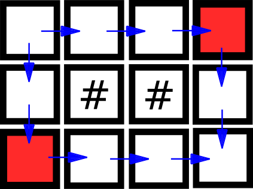

<h1 style='text-align: center;'> D. Treasure Island</h1>

<h5 style='text-align: center;'>time limit per test: 1 second</h5>
<h5 style='text-align: center;'>memory limit per test: 512 megabytes</h5>

All of us love treasures, right? That's why young Vasya is heading for a Treasure Island.

Treasure Island may be represented as a rectangular table $n \times m$ which is surrounded by the ocean. Let us number rows of the field with consecutive integers from $1$ to $n$ from top to bottom and columns with consecutive integers from $1$ to $m$ from left to right. Denote the cell in $r$-th row and $c$-th column as $(r, c)$. Some of the island cells contain impassable forests, and some cells are free and passable. Treasure is hidden in cell $(n, m)$.

Vasya got off the ship in cell $(1, 1)$. Now he wants to reach the treasure. He is hurrying up, so he can move only from cell to the cell in next row (downwards) or next column (rightwards), i.e. from cell $(x, y)$ he can move only to cells $(x+1, y)$ and $(x, y+1)$. Of course Vasya can't move through cells with impassable forests.

Evil Witch is aware of Vasya's journey and she is going to prevent him from reaching the treasure. Before Vasya's first move she is able to grow using her evil magic impassable forests in previously free cells. Witch is able to grow a forest in any number of any free cells except cells $(1, 1)$ where Vasya got off his ship and $(n, m)$ where the treasure is hidden.

Help Evil Witch by finding out the minimum number of cells she has to turn into impassable forests so that Vasya is no longer able to reach the treasure.

##### Input

First line of input contains two positive integers $n$, $m$ ($3 \le n \cdot m \le 1\,000\,000$), sizes of the island.

Following $n$ lines contains strings $s_i$ of length $m$ describing the island, $j$-th character of string $s_i$ equals "#" if cell $(i, j)$ contains an impassable forest and "." if the cell is free and passable. Let us remind you that Vasya gets of his ship at the cell $(1, 1)$, i.e. the first cell of the first row, and he wants to reach cell $(n, m)$, i.e. the last cell of the last row.

It's guaranteed, that cells $(1, 1)$ and $(n, m)$ are empty.

##### Output

Print the only integer $k$, which is the minimum number of cells Evil Witch has to turn into impassable forest in order to prevent Vasya from reaching the treasure.

## Examples

##### Input


```text
2 2
..
..
```
##### Output


```text
2
```
##### Input


```text
4 4
....
#.#.
....
.#..
```
##### Output


```text
1
```
##### Input


```text
3 4
....
.##.
....
```
##### Output


```text
2
```
## Note

The following picture illustrates the island in the third example. Blue arrows show possible paths Vasya may use to go from $(1, 1)$ to $(n, m)$. Red illustrates one possible set of cells for the Witch to turn into impassable forest to make Vasya's trip from $(1, 1)$ to $(n, m)$ impossible.

  

#### Tags 

#1900 #NOT OK #dfs_and_similar #dp #flows #hashing 

## Blogs
- [All Contest Problems](../Codeforces_Round_583_(Div._1_+_Div._2,_based_on_Olympiad_of_Metropolises).md)
- [Announcement](../blogs/Announcement.md)
- [Tutorial (en)](../blogs/Tutorial_(en).md)
