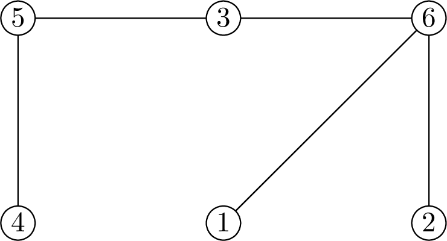
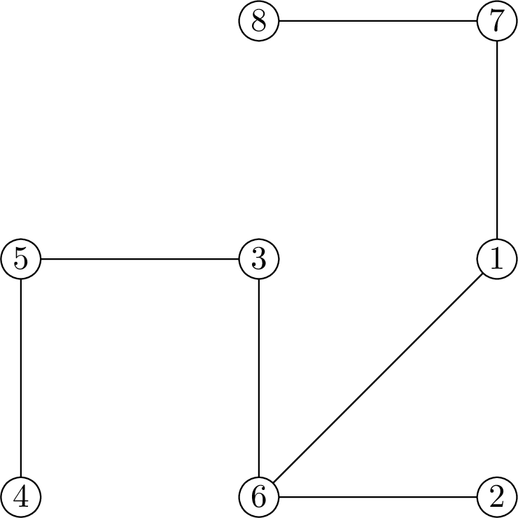

<h1 style='text-align: center;'> E. Petya and Construction Set</h1>

<h5 style='text-align: center;'>time limit per test: 1 second</h5>
<h5 style='text-align: center;'>memory limit per test: 512 megabytes</h5>

It's Petya's birthday party and his friends have presented him a brand new "Electrician-$n$" construction set, which they are sure he will enjoy as he always does with weird puzzles they give him.

Construction set "Electrician-$n$" consists of $2n - 1$ wires and $2n$ light bulbs. Each bulb has its own unique index that is an integer from $1$ to $2n$, while all wires look the same and are indistinguishable. In order to complete this construction set one has to use each of the wires to connect two distinct bulbs. We define a chain in a completed construction set as a sequence of distinct bulbs of length at least two, such that every two consecutive bulbs in this sequence are directly connected by a wire. Completed construction set configuration is said to be correct if a resulting network of bulbs and wires has a tree structure, i.e. any two distinct bulbs are the endpoints of some chain.

Petya was assembling different configurations for several days, and he noticed that sometimes some of the bulbs turn on. After a series of experiments he came up with a conclusion that bulbs indexed $2i$ and $2i - 1$ turn on if the chain connecting them consists of exactly $d_i$ wires. Moreover, the following important condition holds: the value of $d_i$ is never greater than $n$.

Petya did his best but was not able to find a configuration that makes all bulbs to turn on, so he seeks your assistance. Please, find out a configuration that makes all bulbs shine. It is guaranteed that such configuration always exists.

###### Input

The first line of the input contains a single integer $n$ ($1 \leq n \leq 100\,000$) — the parameter of a construction set that defines the number of bulbs and the number of wires.

Next line contains $n$ integers $d_1, d_2, \ldots, d_n$ ($1 \leq d_i \leq n$), where $d_i$ stands for the number of wires the chain between bulbs $2i$ and $2i - 1$ should consist of.

###### Output

Print $2n - 1$ lines. The $i$-th of them should contain two distinct integers $a_i$ and $b_i$ ($1 \leq a_i, b_i \leq 2n$, $a_i \ne b_i$) — indices of bulbs connected by a wire.

If there are several possible valid answer you can print any of them.

## Examples

###### Input


```text
3
2 2 2
```
###### Output


```text
1 6
2 6
3 5
3 6
4 5
```
###### Input


```text
4
2 2 2 1
```
###### Output


```text
1 6
1 7
2 6
3 5
3 6
4 5
7 8
```
###### Input


```text
6
2 2 2 2 2 2
```
###### Output


```text
1 3
2 3
3 5
4 5
5 7
6 7
7 12
8 12
9 11
9 12
10 11
```
###### Input


```text
2
1 1
```
###### Output


```text
1 2
1 4
3 4
```
## Note

    Answer for the first sample test.      Answer for the second sample test. 

#### Tags 

#2000 #NOT OK #constructive_algorithms #graphs #math #sortings #trees 

## Blogs
- [All Contest Problems](../Codeforces_Round_583_(Div._1_+_Div._2,_based_on_Olympiad_of_Metropolises).md)
- [Announcement](../blogs/Announcement.md)
- [Tutorial (en)](../blogs/Tutorial_(en).md)
