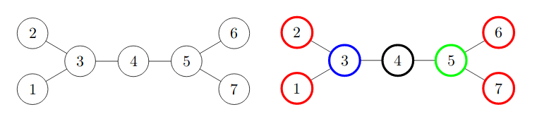

<h1 style='text-align: center;'> H. Tiles Placement</h1>

<h5 style='text-align: center;'>time limit per test: 3 seconds</h5>
<h5 style='text-align: center;'>memory limit per test: 512 megabytes</h5>

The new pedestrian zone in Moscow city center consists of $n$ squares connected with each other by $n - 1$ footpaths. We define a simple path as a sequence of squares such that no square appears in this sequence twice and any two adjacent squares in this sequence are directly connected with a footpath. The size of a simple path is the number of squares in it. The footpaths are designed in a such a way that there is exactly one simple path between any pair of different squares.

During preparations for Moscow City Day the city council decided to renew ground tiles on all $n$ squares. There are $k$ tile types of different colors, numbered from $1$ to $k$. For each square exactly one tile type must be selected and then used to cover this square surface. To make walking through the city center more fascinating, it was decided to select tiles types for each square in such a way that any possible simple path of size exactly $k$ contains squares with all $k$ possible tile colors.

You need to find out whether it is possible to place the tiles this way or not.

#### Input

The first line contains two integers $n$, $k$ ($2 \le k \le n \le 200\,000$) — the number of squares in the new pedestrian zone, the number of different tile colors.

Each of the following $n - 1$ lines contains two integers $v_i$ and $u_i$ ($1 \le v_i, u_i \le n$) — numbers of the squares connected by the corresponding road.

It's guaranteed, that it's possible to go from any square to any other square, moreover there is exactly one such simple path.

#### Output

Print "Yes" if it is possible to assign tile colors this way and "No" otherwise.

In case your answer is "Yes", print $n$ integers from $1$ to $k$ each, the color of the tile for every square.

## Examples

#### Input


```text
7 4
1 3
2 3
3 4
4 5
5 6
5 7
```
#### Output


```text
Yes
1 1 2 3 4 1 1
```
#### Input


```text
7 3
1 3
2 3
3 4
4 5
5 6
5 7
```
#### Output


```text
No
```
## Note

The following pictures illustrate the pedestrian zone in first and second examples. The second picture also shows one possible distribution of colors among the squares for $k = 4$.

  

#### Tags 

#2800 #NOT OK #constructive_algorithms #dfs_and_similar #trees 

## Blogs
- [All Contest Problems](../Codeforces_Round_583_(Div._1_+_Div._2,_based_on_Olympiad_of_Metropolises).md)
- [Announcement](../blogs/Announcement.md)
- [Tutorial (en)](../blogs/Tutorial_(en).md)
