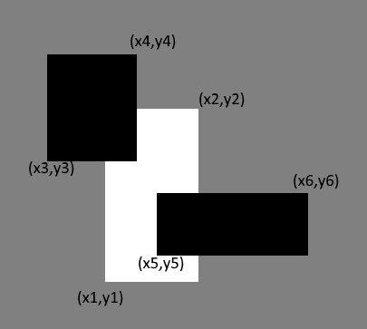

<h1 style='text-align: center;'> C. White Sheet</h1>

<h5 style='text-align: center;'>time limit per test: 1 second</h5>
<h5 style='text-align: center;'>memory limit per test: 256 megabytes</h5>

There is a white sheet of paper lying on a rectangle table. The sheet is a rectangle with its sides parallel to the sides of the table. If you will take a look from above and assume that the bottom left corner of the table has coordinates $(0, 0)$, and coordinate axes are left and bottom sides of the table, then the bottom left corner of the white sheet has coordinates $(x_1, y_1)$, and the top right — $(x_2, y_2)$.

After that two black sheets of paper are placed on the table. Sides of both black sheets are also parallel to the sides of the table. Coordinates of the bottom left corner of the first black sheet are $(x_3, y_3)$, and the top right — $(x_4, y_4)$. Coordinates of the bottom left corner of the second black sheet are $(x_5, y_5)$, and the top right — $(x_6, y_6)$. 

  Example of three rectangles. Determine if some part of the white sheet can be seen from the above after the two black sheets are placed. The part of the white sheet can be seen if there is at least one point lying not strictly inside the white sheet and strictly outside of both black sheets.

###### Input

The first line of the input contains four integers $x_1, y_1, x_2, y_2$ $(0 \le x_1 < x_2 \le 10^{6}, 0 \le y_1 < y_2 \le 10^{6})$ — coordinates of the bottom left and the top right corners of the white sheet.

The second line of the input contains four integers $x_3, y_3, x_4, y_4$ $(0 \le x_3 < x_4 \le 10^{6}, 0 \le y_3 < y_4 \le 10^{6})$ — coordinates of the bottom left and the top right corners of the first black sheet.

The third line of the input contains four integers $x_5, y_5, x_6, y_6$ $(0 \le x_5 < x_6 \le 10^{6}, 0 \le y_5 < y_6 \le 10^{6})$ — coordinates of the bottom left and the top right corners of the second black sheet.

The sides of each sheet of paper are parallel (perpendicular) to the coordinate axes.

###### Output

If some part of the white sheet can be seen from the above after the two black sheets are placed, print "YES" (without quotes). Otherwise print "NO".

## Examples

###### Input


```text
2 2 4 4
1 1 3 5
3 1 5 5
```
###### Output


```text
NO
```
###### Input


```text
3 3 7 5
0 0 4 6
0 0 7 4
```
###### Output


```text
YES
```
###### Input


```text
5 2 10 5
3 1 7 6
8 1 11 7
```
###### Output


```text
YES
```
###### Input


```text
0 0 1000000 1000000
0 0 499999 1000000
500000 0 1000000 1000000
```
###### Output


```text
YES
```
## Note

In the first example the white sheet is fully covered by black sheets.

In the second example the part of the white sheet can be seen after two black sheets are placed. For example, the point $(6.5, 4.5)$ lies not strictly inside the white sheet and lies strictly outside of both black sheets.


#### Tags 

#1700 #NOT OK #geometry #math 

## Blogs
- [All Contest Problems](../Codeforces_Round_587_(Div._3).md)
- [Announcement](../blogs/Announcement.md)
- [Tutorial](../blogs/Tutorial.md)
