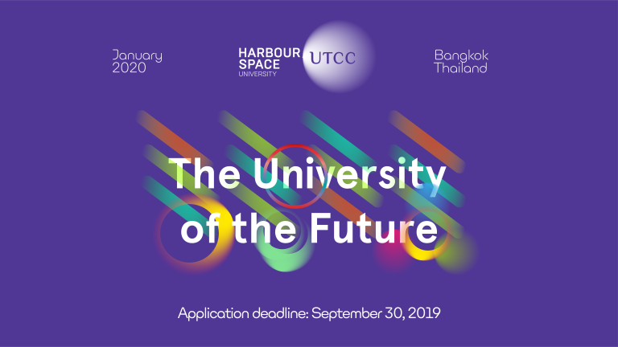

# Announcement

Hello Codeforces!

On [Thursday, September 5, 2019 at 20:35UTC+6](https://codeforces.com/https://www.timeanddate.com/worldclock/fixedtime.html?day=5&month=9&year=2019&hour=17&min=35&sec=0&p1=166) [Educational Codeforces Round 72 (Rated for Div. 2)](https://codeforces.com/contest/1217 "Educational Codeforces Round 72 (Rated for Div. 2)") will start.

Series of Educational Rounds continue being held as [Harbour.Space University](https://codeforces.com/https://harbour.space/) initiative! You can read the details about the cooperation between [Harbour.Space University](https://codeforces.com/https://harbour.space/) and Codeforces in the [blog post](//codeforces.com/blog/entry/51208).

This round will be **rated for the participants with rating lower than 2100**. It will be held on extended ICPC rules. The penalty for each incorrect submission until the submission with a full solution is 10 minutes. After the end of the contest you will have 12 hours to hack any solution you want. You will have access to copy any solution and test it locally.

You will be given **6 problems** and **2 hours** to solve them.

The problems were invented and prepared by Roman [Roms](https://codeforces.com/profile/Roms "Master Roms") Glazov, Adilbek [adedalic](https://codeforces.com/profile/adedalic "International Master adedalic") Dalabaev, Vladimir [vovuh](https://codeforces.com/profile/vovuh "Candidate Master vovuh") Petrov, Ivan [BledDest](https://codeforces.com/profile/BledDest "Grandmaster BledDest") Androsov, Maksim [Neon](https://codeforces.com/profile/Neon "Candidate Master Neon") Mescheryakov and me. Also huge thanks to Mike [MikeMirzayanov](https://codeforces.com/profile/MikeMirzayanov "Headquarters, MikeMirzayanov") Mirzayanov for great systems Polygon and Codeforces.

Good luck to all the participants!

Our friends at Harbour.Space also have a message for you:

*Hello Codeforces,*

*Harbour.Space University and UTCC are collaborating to offer graduate students from anywhere in the world a once in a lifetime opportunity: **fully funded scholarships** for our Masters programs in Bangkok.*

*These scholarships are designed to completely eliminate the barrier between exceptional talents and sophisticated education: **they cover the entire tuition fee as well as the cost of living expenses,** and furthermore, they provide the student the valuable experience of both studying and working at Harbour.Space University.*

*We’re looking for the people who are going to change the world.*

***If you or someone you know are interested in technology, entrepreneurship, or design, and believe you have what it takes, we want to hear from you!***

  [APPLY HERE→](https://in.harbour.space/bangkok-scholarships/?utm_source=codeforces&utm_medium=partners&utm_campaign=ed_round_71) Congratulations to the winners: 

| Rank | Competitor | Problems Solved | Penalty |
| --- | --- | --- | --- |
| 1 | [Tropical_maid](https://codeforces.com/profile/Tropical_maid "Master Tropical_maid") | 6 | 212 |
| 2 | [Return.Hao](https://codeforces.com/profile/Return.Hao "Expert Return.Hao") | 6 | 246 |
| 3 | [xyz100](https://codeforces.com/profile/xyz100 "Expert xyz100") | 6 | 272 |
| 4 | [YangDavid](https://codeforces.com/profile/YangDavid "Candidate Master YangDavid") | 6 | 280 |
| 5 | [Lawali](https://codeforces.com/profile/Lawali "International Master Lawali") | 6 | 300 |

Congratulations to the best hackers: 

| Rank | Competitor | Hack Count |
| --- | --- | --- |
| 1 | [VegetableP](https://codeforces.com/profile/VegetableP "Expert VegetableP") | **116****:-14** |
| 2 | [Princ_iple](https://codeforces.com/profile/Princ_iple "Candidate Master Princ_iple") | **49****:-1** |
| 3 | [racsosabe](https://codeforces.com/profile/racsosabe "Candidate Master racsosabe") | **42****:-1** |
| 4 | [shurongwang](https://codeforces.com/profile/shurongwang "Candidate Master shurongwang") | **36** |
| 5 | [Megatron_99](https://codeforces.com/profile/Megatron_99 "Specialist Megatron_99") | **29****:-1** |

 1432 successful hacks and 1595 unsuccessful hacks were made in total!And finally people who were the first to solve each problem: 

| Problem | Competitor | Penalty |
| --- | --- | --- |
| A | [xyz100](https://codeforces.com/profile/xyz100 "Expert xyz100") | 0:02 |
| B | [talant](https://codeforces.com/profile/talant "Expert talant") | 0:06 |
| C | [Laiu](https://codeforces.com/profile/Laiu "Candidate Master Laiu") | 0:06 |
| D | [IgorI](https://codeforces.com/profile/IgorI "Master IgorI") | 0:08 |
| E | [Umi](https://codeforces.com/profile/Umi "Grandmaster Umi") | 0:30 |
| F | [Hasan0540](https://codeforces.com/profile/Hasan0540 "Master Hasan0540") | 0:51 |

**UPD:** [The editorial is out](Tutorial.md)

