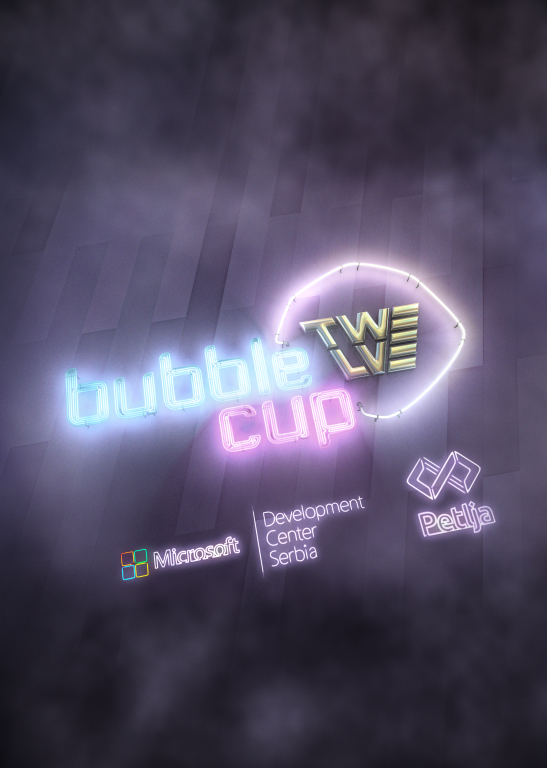

# Announcement_(en)

Hello, Codeforces!

It's our pleasure to announce the the finals of the 12th [Bubble Cup](https://codeforces.com/https://www.bubblecup.org/)! Bubble Cup is a programming competition organized by [Microsoft Development Center Serbia (MDCS)](https://codeforces.com/https://www.microsoft.com/sr-latn-rs/mdcs). The contest will take place on [Saturday, 14th of September at 10:00 UTC+2](https://codeforces.com/https://www.timeanddate.com/worldclock/fixedtime.html?msg=Bubble+Cup+12+Finals+-+%5BOnsite%5D&iso=20190914T10&p1=35&ah=5) in Belgrade, and will last for 5 hours. Live results will be available on the [official Bubble Cup website](https://codeforces.com/https://www.bubblecup.org/CompetitorsCorner/Finals/1775). Results will be frozen during the last hour of the competition. The winners will be announced at the closing ceremony.

The format of the competition is very similar to ACM-ICPC — teams consisting of up to three people are allowed, and they have one computer and five hours to solve problems without partial scoring. Ties are broken using the usual time penalty rules.

Just like in the previous years, there will be an online mirror of the finals here at Codeforces, starting on [Sunday, 15th of September at 15:35 UTC+2](https://codeforces.com/https://www.timeanddate.com/worldclock/fixedtime.html?msg=Bubble+Cup+12+Finals+-+%5BOnline+Mirror%5D&iso=20190915T1535&p1=35&ah=5).

Just like last year, the onsite competition is divided in two "divisions", called Premier League and Rising Stars. The two contests will have most of their problems in common, but the Rising Stars competition will feature some easier tasks targeted at high school contestants. We do not guarantee that every problems unique to Div2 is easier than every problem that is not.

Both of the contests will be mirrored here on Codeforces, with Premier League mapping to the Div1 contest and Rising Stars mapping to the Div2 contest. The mirror will use native Codeforces ACM-ICPC team contest rules.

Both contests will be **unrated**, due to the format and the length of the mirror being dissimilar to the standard Codeforces rated rounds. Note that this is a **team contest**, i.e. competing in teams up to three people is allowed. (Of course, you can also compete in a 1-person team.) There will be at least 8 problems in each division.

*As of now, Codeforces does not support rating-based divisions in team contests, so we came with the following ad-hoc rule: teams with the maximum rated member having rating less than 1900 should enter the Div2 contest. Teams with the maximum rated member having rating at least 2100 should definitely enter the Div1 contest. The teams not covered by the previous two criteria are free to choose.*

Here are the past Bubble Cup mirrors on Codeforces:

[Bubble Cup 8 — Finals [Online Mirror]](https://codeforces.com/contest/575)

[Bubble Cup 9 — Finals [Online Mirror]](https://codeforces.com/contest/717)

[Bubble Cup X — Finals [Online Mirror]](https://codeforces.com/contest/852)

[Bubble Cup 11 — Finals [Online Mirror, Div. 1]](https://codeforces.com/contest/1045)

[Bubble Cup 11 — Finals [Online Mirror, Div. 2]](https://codeforces.com/contest/1046)

The problems and their solutions were created by employees and interns of [Microsoft Development Center Serbia (MDCS)](https://codeforces.com/https://www.microsoft.com/sr-latn-rs/mdcs).

We are very grateful to [MikeMirzayanov](https://codeforces.com/profile/MikeMirzayanov "Headquarters, MikeMirzayanov") and the rest of the Codeforces team for their support and the wonderful [Polygon platform](https://polygon.codeforces.com). Special thanks to [knightL](https://codeforces.com/profile/knightL "Grandmaster knightL") for big help with problem testing.

The full editorial, together with the statements and solutions of the tasks from the qualification rounds, will be available in the [booklet section](https://codeforces.com/https://www.bubblecup.org/Archive/Booklets) of the Bubble Cup website on Sunday.

We wish good luck to all participants!

EDIT:

Congratulations to everyone who participated!

Top three teams in Div1 who were also the only teams who solved all 9 problems:

 1. ITMO University: Standard deviation: [budalnik](https://codeforces.com/profile/budalnik "Grandmaster budalnik"), [craborac](https://codeforces.com/profile/craborac "International Grandmaster craborac"), [cdkrot](https://codeforces.com/profile/cdkrot "International Grandmaster cdkrot")
2. Almost Retired: [KAN](https://codeforces.com/profile/KAN "Grandmaster KAN"), [Um_nik](https://codeforces.com/profile/Um_nik "Legendary Grandmaster Um_nik")
3. denglaoshi fans: [300iq](https://codeforces.com/profile/300iq "Legendary Grandmaster 300iq"), [jqdai0815](https://codeforces.com/profile/jqdai0815 "Legendary Grandmaster jqdai0815")

Winners of Div2 are:

 1. Omar^3: [OmarHashim](https://codeforces.com/profile/OmarHashim "International Master OmarHashim"), [Momentum](https://codeforces.com/profile/Momentum "Candidate Master Momentum"), [omarosama96](https://codeforces.com/profile/omarosama96 "Expert omarosama96") with 5 problems solved
2. WNTN: [Diashka](https://codeforces.com/profile/Diashka "Expert Diashka"), [DeD_TihoN](https://codeforces.com/profile/DeD_TihoN "Expert DeD_TihoN"), [ZloyHR](https://codeforces.com/profile/ZloyHR "Candidate Master ZloyHR") with 4 problems solved
3. Reversal Destiny: [SorahISA](https://codeforces.com/profile/SorahISA "Candidate Master SorahISA"), [Nkl5RDZZZVq1N2F0](https://codeforces.com/profile/Nkl5RDZZZVq1N2F0 "Expert Nkl5RDZZZVq1N2F0") with 4 problems solved

You can now find the solutions to the problems in the [booklet section](https://codeforces.com/https://www.bubblecup.org/Archive/Booklets) of the Bubble Cup website.

Thanks to everyone who took part in the competition!

