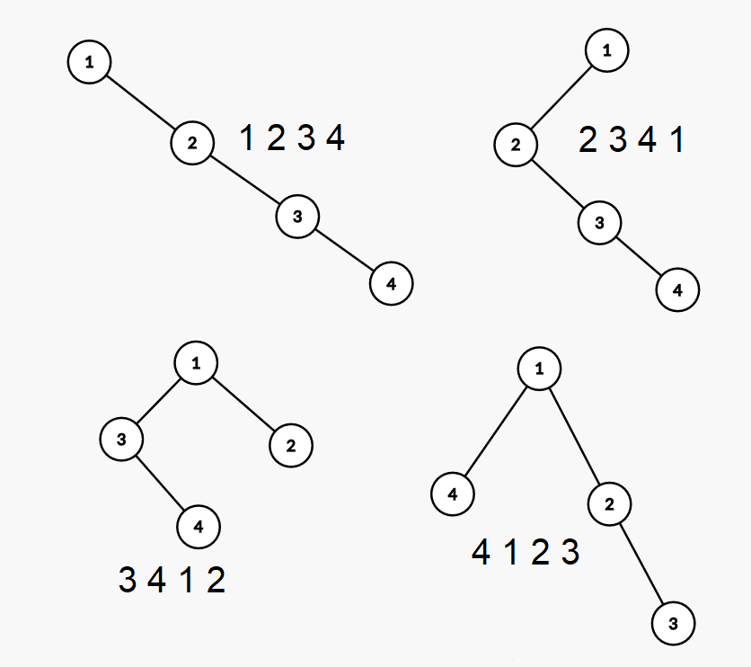

<h1 style='text-align: center;'> F. Gardener Alex</h1>

<h5 style='text-align: center;'>time limit per test: 2 seconds</h5>
<h5 style='text-align: center;'>memory limit per test: 256 megabytes</h5>

Gardener Alex loves to grow trees. We remind that tree is a connected acyclic graph on $n$ vertices. 

Today he decided to grow a rooted binary tree. A binary tree is a tree where any vertex has no more than two sons. Luckily, Alex has a permutation of numbers from $1$ to $n$ which he was presented at his last birthday, so he decided to grow a tree according to this permutation. To do so he does the following process: he finds a minimum element and makes it a root of the tree. After that permutation is divided into two parts: everything that is to the left of the minimum element, and everything that is to the right. The minimum element on the left part becomes the left son of the root, and the minimum element on the right part becomes the right son of the root. After that, this process is repeated recursively on both parts.

Now Alex wants to grow a forest of trees: one tree for each cyclic shift of the permutation. He is interested in what cyclic shift gives the tree of minimum depth. Unfortunately, growing a forest is a hard and long process, but Alex wants the answer right now. Will you help him?

We remind that cyclic shift of permutation $a_1, a_2, \ldots, a_k, \ldots, a_n$ for $k$ elements to the left is the permutation $a_{k + 1}, a_{k + 2}, \ldots, a_n, a_1, a_2, \ldots, a_k$.

### Input

First line contains an integer number $n ~ (1 \leqslant n \leqslant 200\,000)$ — length of the permutation.

Second line contains $n$ integer numbers $a_1, a_2, \ldots, a_n ~ (1 \leqslant a_i \leqslant n)$, and it is guaranteed that all numbers occur exactly one time.

### Output

Print two numbers separated with space: minimum possible depth of a tree and how many elements we need to shift left to achieve this depth. The number of elements should be a number from $0$ to $n - 1$. If there are several possible answers, print any of them.

## Example

### Input


```text
4
1 2 3 4
```
### Output


```text
3 3
```
## Note

The following picture depicts all possible trees for sample test and cyclic shifts on which they are achieved. 




#### Tags 

#2700 #NOT OK #binary_search #data_structures 

## Blogs
- [All Contest Problems](../Codeforces_Round_586_(Div._1_+_Div._2).md)
- [Announcement](../blogs/Announcement.md)
- [Tutorial](../blogs/Tutorial.md)
