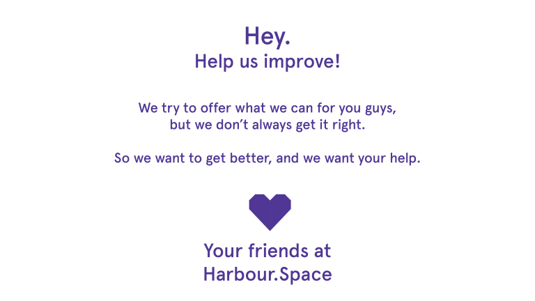

# Announcement

Hello Codeforces!

On [Thursday, September 19, 2019 at 20:35UTC+6](https://codeforces.com/https://www.timeanddate.com/worldclock/fixedtime.html?day=19&month=9&year=2019&hour=17&min=35&sec=0&p1=166) [Educational Codeforces Round 73 (Rated for Div. 2)](https://codeforces.com/contest/1221 "Educational Codeforces Round 73 (Rated for Div. 2)") will start.

Series of Educational Rounds continue being held as [Harbour.Space University](https://codeforces.com/https://harbour.space/) initiative! You can read the details about the cooperation between [Harbour.Space University](https://codeforces.com/https://harbour.space/) and Codeforces in the [blog post](//codeforces.com/blog/entry/51208).

This round will be **rated for the participants with rating lower than 2100**. It will be held on extended ICPC rules. The penalty for each incorrect submission until the submission with a full solution is 10 minutes. After the end of the contest you will have 12 hours to hack any solution you want. You will have access to copy any solution and test it locally.

You will be given **6 or 7 problems** and **2 hours** to solve them.

The problems were invented and prepared by Roman [Roms](https://codeforces.com/profile/Roms "Master Roms") Glazov, Adilbek [adedalic](https://codeforces.com/profile/adedalic "International Master adedalic") Dalabaev, Vladimir [vovuh](https://codeforces.com/profile/vovuh "Candidate Master vovuh") Petrov, Ivan [BledDest](https://codeforces.com/profile/BledDest "International Grandmaster BledDest") Androsov, Maksim [Neon](https://codeforces.com/profile/Neon "Candidate Master Neon") Mescheryakov and me. Also huge thanks to Mike [MikeMirzayanov](https://codeforces.com/profile/MikeMirzayanov "Headquarters, MikeMirzayanov") Mirzayanov for great systems Polygon and Codeforces.

Good luck to all the participants!

Our friends at Harbour.Space also have a message for you:

*Hello Codeforces,* 

***We want to know what you think about Harbour.Space’s involvement in the Codeforces community**, and how you believe we can improve.* 

*So we created this short, **5 question survey** to hear your thoughts about how we can provide you with more stuff that you’re interested in, so that we can improve your experience on Codeforces.*

***We really value your feedback**, so it would mean a lot if you could take a minute and fill out the survey. Thanks in advance!*

  [GO TO SURVEY→](https://codeforces.com/https://harbourspace.typeform.com/to/jaJ7jR) Congratulations to the winners: 

| Rank | Competitor | Problems Solved | Penalty |
| --- | --- | --- | --- |
| 1 | [244mhq](https://codeforces.com/profile/244mhq "International Grandmaster 244mhq") | 7 | 192 |
| 2 | [jiangly](https://codeforces.com/profile/jiangly "Grandmaster jiangly") | 6 | 152 |
| 3 | [betrue12](https://codeforces.com/profile/betrue12 "Grandmaster betrue12") | 6 | 187 |
| 4 | [I_love_Tanya_Romanova](https://codeforces.com/profile/I_love_Tanya_Romanova "International Grandmaster I_love_Tanya_Romanova") | 6 | 196 |
| 5 | [pekempey](https://codeforces.com/profile/pekempey "International Master pekempey") | 6 | 198 |

Congratulations to the best hackers: 

| Rank | Competitor | Hack Count |
| --- | --- | --- |
| 1 | [achi_basadzishvili](https://codeforces.com/profile/achi_basadzishvili "Master achi_basadzishvili") | **129****:-46** |
| 2 | [apoorv024](https://codeforces.com/profile/apoorv024 "Expert apoorv024") | **87****:-4** |
| 3 | [Abdelrahman_Elhawary](https://codeforces.com/profile/Abdelrahman_Elhawary "Expert Abdelrahman_Elhawary") | **73****:-31** |
| 4 | [phyzzmat](https://codeforces.com/profile/phyzzmat "Candidate Master phyzzmat") | **52****:-7** |
| 5 | [Sherrrkhann](https://codeforces.com/profile/Sherrrkhann "Pupil Sherrrkhann") | **15****:-1** |

 544 successful hacks and 568 unsuccessful hacks were made in total!And finally people who were the first to solve each problem: 

| Problem | Competitor | Penalty |
| --- | --- | --- |
| A | [talant](https://codeforces.com/profile/talant "Candidate Master talant") | 0:01 |
| B | [talant](https://codeforces.com/profile/talant "Candidate Master talant") | 0:02 |
| C | [YahiaAglan74](https://codeforces.com/profile/YahiaAglan74 "Specialist YahiaAglan74") | 0:04 |
| D | [sys.](https://codeforces.com/profile/sys. "Master sys.") | 0:08 |
| E | [244mhq](https://codeforces.com/profile/244mhq "International Grandmaster 244mhq") | 0:31 |
| F | [Benq](https://codeforces.com/profile/Benq "Legendary Grandmaster Benq") | 0:35 |
| G | [Benq](https://codeforces.com/profile/Benq "Legendary Grandmaster Benq") | 1:02 |

**UPD:** [Post about the issue](https://codeforces.com/blog/entry/69897)

**UPD2:** [Editorial is out](Tutorial.md)

