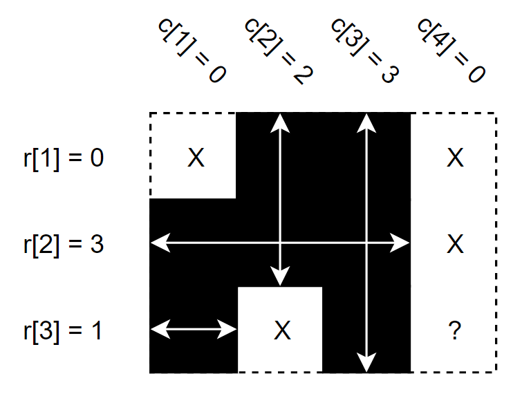
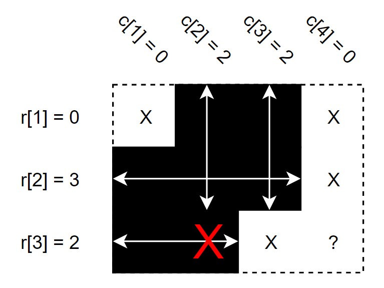
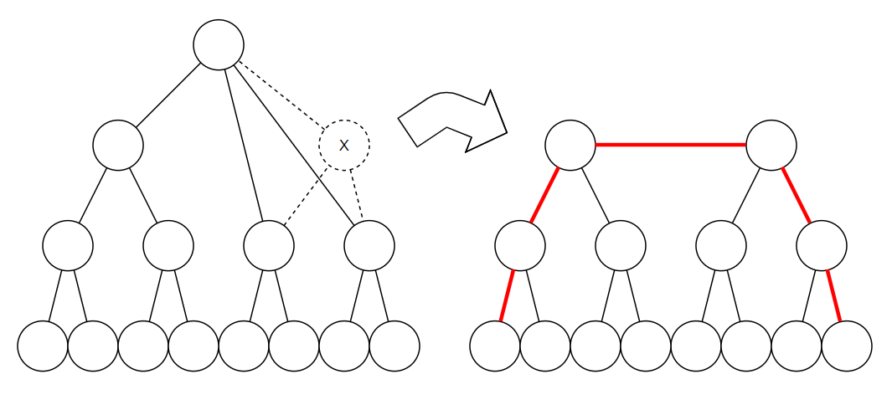
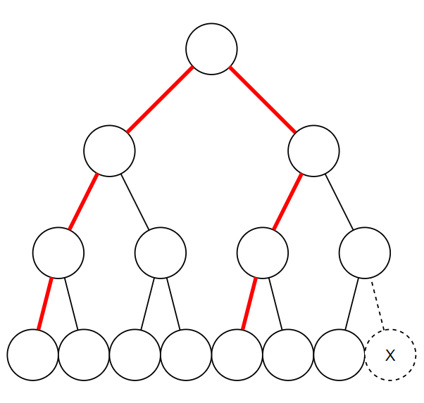
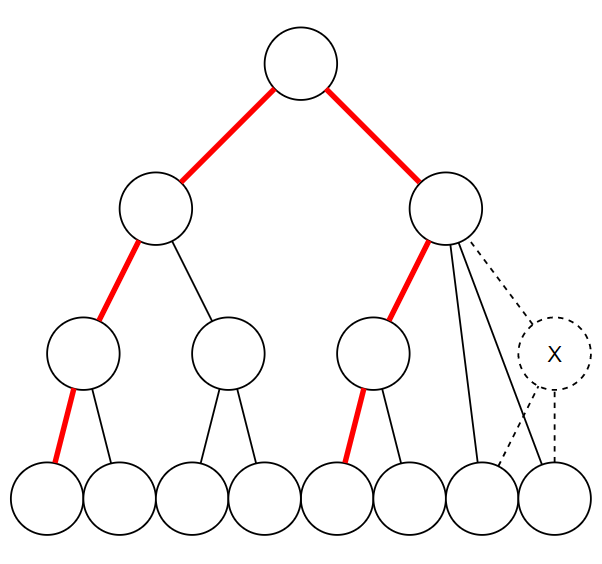

# Tutorial_(en)

Hello, I hope all of you enjoyed my contest!

 
### [1228A - Distinct Digits](../problems/A._Distinct_Digits.md "Codeforces Round 589 (Div. 2)")

Let's see how to check if all digits of $x$ are different. Since there can be only $10$ different numbers($0$ to $9$) in single digit, you can count the occurrences of $10$ numbers by looking all digits of $x$. You can count all digits by using modulo $10$ or changing whole number to string. 

For example, if $x = 1217$, then occurrence of each number will be $[0, 2, 1, 0, 0, 0, 0, 1, 0, 0]$, because there are two $1$s, single $2$ and single $7$ in $x$. So $1217$ is invalid number.

Now do the same thing for all $x$ where $l \le x \le r$. If you find any valid number then print it. Otherwise print $-1$.

Time complexity is $O((r-l) \log r)$.

**[Behind story of A]** 

 * There is a successful hack for A. I am really surprised.
* My code: <https://codeforces.com/contest/1228/submission/61578842>

 
### [1228B - Filling the Grid](../problems/B._Filling_the_Grid.md "Codeforces Round 589 (Div. 2)")

You can see some observations below;

* $r$ and $c$ values reserves some cells to be full, and some cells to be empty. Because they have to satisfy number of consecutive full cells in their row/column.
* If some cell is reserved to be full by some values and reserved to be empty by some other values, then it is impossible to fill grid. Let's call this kind of cell as invalid cell.
* If there is no invalid cell, then the answer is $2^{unreserved}$ where $unreserved$ means the number of unreserved cells, because setting state of unreserved cells doesn't affect validity of grid.

For easier understanding, please look at the pictures below.

* Black cells are reserved to be full by some $r$ or $c$ value.
* White X cells are reserved to be empty by some $r$ or $c$ value.
* White ? cells are unreserved cells.
* Red X cells are invalid cells.

  This is the explanation of the first example. There is $1$ unreserved cell, so the answer is $2$.   This is one of the impossible cases. That red X cell is reserved to be full by $r_{3}$, but reserved to be empty by $c_{2}$. So this is impossible. Time complexity is $O(wh)$.

**[Behind story of B]** 

 * There is no behind story.
* My code: <https://codeforces.com/contest/1228/submission/61578841>

 
### [1228C - Primes and Multiplication](../problems/C._Primes_and_Multiplication.md "Codeforces Round 589 (Div. 2)")

Let's say $h(x, p) = \log_{p} g(x, p)$, then $h(x, p) + h(y, p) = h(x y, p)$. Because if we describe $x = p^{h(x, p)} q_{x}$ and $y = p^{h(y, p)} q_{y}$, then $x y = p^{h(x, p) + h(y, p)} q_{x} q_{y}$.

Now let's go to the main step;

$$ \begin{aligned} \prod_{i=1}^{n} f(x, i) &= \prod_{i=1}^{n} \prod_{p \in prime(x)} g(i, p) \\\ &= \prod_{i=1}^{n} \prod_{p \in prime(x)} p^{h(i,p)} \\\ &= \prod_{p \in prime(x)} \prod_{i=1}^{n} p^{h(i,p)} \\\ &= \prod_{p \in prime(x)} p^{\sum_{i=1}^{n} h(i, p)} \\\ &= \prod_{p \in prime(x)} p^{h(n!, p)} \end{aligned} $$

So we have to count $h(n!, p)$ for each $p$ in $prime(x)$, and calculate exponents. You can count $h(n!, p)$ by following formula;

$$h(n!, p) = \sum_{k=1}^{\infty} \Bigl \lfloor \frac{n}{p^k} \Bigr \rfloor$$

Fortunately, since $h(n!, p)$ never exceeds $n$, we don't have to apply Euler's theorem here. You just have to be careful about overflow issue.

Roughly calculated time complexity is $O( \sqrt{x} + \log \log x \cdot \log n)$, because you use $O(\sqrt{x})$ to get prime divisors of $x$, and the number of distinct prime divisors of $x$ is approximately $\log \log x$.

**[Behind story of C]** 

 * Initial version of C statement consists of tons of mathematical formula. CF team and testers requested me to reduce amount of mathematical formula.
* This problem was added before a week to the round. If there was no such C, the balance would be bad.
* Thanks for [dorijanlendvaj](https://codeforces.com/profile/dorijanlendvaj "Гроссмейстер dorijanlendvaj") , he improved test data for C a lot!
* My code: <https://codeforces.com/contest/1228/submission/61578856>

 
### [1228D - Complete Tripartite](../problems/D._Complete_Tripartite.md "Codeforces Round 589 (Div. 2)")

You can make answer by following these steps;

1. If two vertices $u_{1}$ and $u_{2}$ are in same vertex set, there should be no edge between them. Otherwise, there should be edge between them.
2. If you choose any $u$ as first vertex of specific vertex set, then you can simply add all vertices which are not directly connected to $u$ in that vertex set.
3. Make $3$ vertex sets by doing second step multiple times. If you can't make $3$ sets or there is any vertex which is not in any vertex set, then answer is impossible.
4. If $m \ne \lvert v_{1} \rvert \cdot \lvert v_{2} \rvert + \lvert v_{2} \rvert \cdot \lvert v_{3} \rvert + \lvert v_{3} \rvert \cdot \lvert v_{1} \rvert$, then answer is impossible. $\lvert v_{i} \rvert$ means size of $i$-th vertex set.
5. For all vertices $u_{1}$ and $u_{2}$ from different vertex sets, if there is no direct connection between $u_{1}$ and $u_{2}$, then answer is impossible.
6. If you validated all steps, then current vertex set assignment is answer.

Make sure you are doing all steps. If you forget any of these steps, your solution will print wrong answer.

Time complexity is $O((n+m) \log n)$.

**[Behind story of D]** 

 * Same as C, I wrote tons of mathematical formula in D. After CF team's request, I reduced the amount of formula.
* This is my personal favorite problem among ABCDEF.
* My code: <https://codeforces.com/contest/1228/submission/61578861>

 
### [1228E - Another Filling the Grid](../problems/E._Another_Filling_the_Grid.md "Codeforces Round 589 (Div. 2)")

* $O(n^{3})$ solution:Let $f(r, c)$ to be the number of filling grids of $r$ rows, $c$ incomplete columns, and $n-c$ complete columns. Incomplete columns means which doesn't contain $1$ in already filled part, and complete columns means opposite. Now you can see that the formula can be described as below;

	+ $f(r, 0) = (k^{n} - (k-1)^{n})^{r}$ ($1 \le r$), because we don't have to care about minimum value of columns. However, there should be at least one cell which has $1$.
	+ $f(1, c) = k^{n-c}$ ($1 \le c$), because we have to fill $1$ in all incomplete columns in that row. But, other cells are free.
	+ $f(r, c) = (k^{n-c} - (k-1)^{n-c}) \cdot (k-1)^{c} \cdot f(r-1, c) + k^{n-c} \cdot \sum_{c_{0}=1}^{c} \binom{c}{c_{0}} \cdot (k-1)^{c-c0} \cdot f(r-1, c-c_{0})$ ($2 \le r$, $1 \le c$). Each part means number of cases when you select $c_{0}$ incomplete columns to be complete column in this row.The answer is $f(n, n)$.
* $O(n^{2})$ and $O(n \log n)$ solution:Let $R[i]$ be the restriction of the i-th row having some value <= 1 and $C[i]$ the same but for columns. We want $\bigcap^n_{i=1}R[i] \cap C[i]$.

Negate that expression twice, and we'll get $U - \bigcup^n_{i=1}\neg R[i] \cup \neg C[i]$. Using inclusion-exclusion this is:

$$ \sum_{i=0}^{n} \sum_{j=0}^{n} (-1)^{i+j} \cdot {n\choose j} \cdot {n\choose i} \cdot k^{n^2 - n \cdot (i+j) + i \cdot j} \cdot (k-1)^{n \cdot (i+j) - i \cdot j} $$

This is enough for $O(n^{2} \log n)$ with fast exponentiation or $O(n^{2})$ precomputing the needed powers. To get $O(n \log n)$ note that we the second sum is a binomial expansion so the answer can be simplified to:

$$ \sum_{i=0}^{n} (-1)^i \cdot {n\choose i} \cdot (k^{n-i} \cdot (k-1)^{i} - (k-1)^{n})^n$$
**[Behind story of E]**

 * [MikeMirzayanov](https://codeforces.com/profile/MikeMirzayanov "Штаб, MikeMirzayanov") changed the name of problem before 10~20 minutes to the contest. It was "Minimum One" before.
* This problem was the easiest to prepare data. Just pure random and k=1k=1 is strong enough.
* I managed to create O(n3)O(n3) [pypy3 solution](https://codeforces.com/contest/1228/submission/61578876) for E in 1 second lol.
* Thanks [tfg](https://codeforces.com/profile/tfg "Гроссмейстер tfg") for providing O(nlogn)O(nlogn) solution.
* My code: <https://codeforces.com/contest/1228/submission/61578868>

 
### [1228F - One Node is Gone](../problems/F._One_Node_is_Gone.md "Codeforces Round 589 (Div. 2)")

Let me suggest this observation;

* Root of generated tree should be one of middle of diameter. Because only $1$ node is deleted from complete full binary tree.

So there are $3$ valid cases;

* The removed node is child of root. In this case, there are $2$ answers($2$ center nodes), diameter is decreased by $1$ (odd), and tree looks like two complete full binary trees' roots are connected. You have to check if two center's subtrees are complete full binary tree.   In this case, there are $2$ answers, which are $2$ centers of diameter.
* The removed node is leaf($n \gt 2$) or normal node. In this case, there is only $1$ answer and $1$ root node. Check if whole tree is complete full binary tree with $1$ node error toleration. You can do case-handling by degree of nodes.
	+ If non-root has degree $3$, then this node is normal.
	+ If non-root has degree $2$ (error), then this node should be parent of removed leaf. You should check if this node's child node is leaf.
	+ If non-root has degree $1$, then this node should be leaf.
	+ If non-root has degree $4$ (error), then this node should be parent of removed normal node. This is the hardest case. I did this by checking depth of each child's subtree using DFS, then consider each tree to be complete and binary tree with no error, but with different depths.If you encountered multiple error nodes, then this tree is invalid. To check my exact approach, please look at my code. 

   In these cases, we can fix the center of whole tree by center of diameter.

To check if specific subtree is complete and full binary tree, you can use top-down recursive approach. Maybe you can use bottom-up approach by collapsing leaf nodes too, but it's very hard(at least I think) to check all conditions strictly.

Time complexity is $O(2^{n})$. But you can solve this in like $O(n \cdot 2^{n})$ or something bigger one.

**[Behind story of F]**

 * This problem was the hardest to prepare data. We considered more than 10 types of trees to block various kind of WA solutions.
* I intended top-down error-toleration based case handling approach for this contest, but seems other approaches are also ok.
* Also thanks for [dorijanlendvaj](https://codeforces.com/profile/dorijanlendvaj "Гроссмейстер dorijanlendvaj") here, he is real MVP tester.
* My code: <https://codeforces.com/contest/1228/submission/61578884>

**[Behind story of G (removed problem)]**

 * Nobody(including red testers) solved this problem for a week. This problem is saved as spare problem for another Div.1 contest.
* I love this beautiful problem than any other problems I ever made.

Thanks in advance!

