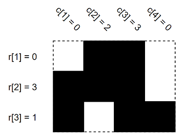
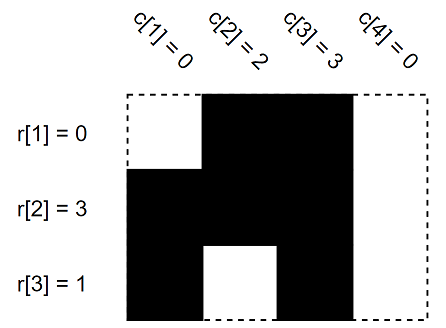

<h1 style='text-align: center;'> B. Filling the Grid</h1>

<h5 style='text-align: center;'>time limit per test: 1 second</h5>
<h5 style='text-align: center;'>memory limit per test: 256 megabytes</h5>

Suppose there is a $h \times w$ grid consisting of empty or full cells. Let's make some definitions:

* $r_{i}$ is the number of consecutive full cells connected to the left side in the $i$-th row ($1 \le i \le h$). In particular, $r_i=0$ if the leftmost cell of the $i$-th row is empty.
* $c_{j}$ is the number of consecutive full cells connected to the top end in the $j$-th column ($1 \le j \le w$). In particular, $c_j=0$ if the topmost cell of the $j$-th column is empty.

In other words, the $i$-th row starts exactly with $r_i$ full cells. Similarly, the $j$-th column starts exactly with $c_j$ full cells.

  These are the $r$ and $c$ values of some $3 \times 4$ grid. Black cells are full and white cells are empty. You have values of $r$ and $c$. Initially, all cells are empty. Find the number of ways to fill grid cells to satisfy values of $r$ and $c$. Since the answer can be very large, find the answer modulo $1000000007\,(10^{9} + 7)$. In other words, find the remainder after division of the answer by $1000000007\,(10^{9} + 7)$.

##### Input

The first line contains two integers $h$ and $w$ ($1 \le h, w \le 10^{3}$) — the height and width of the grid.

The second line contains $h$ integers $r_{1}, r_{2}, \ldots, r_{h}$ ($0 \le r_{i} \le w$) — the values of $r$.

The third line contains $w$ integers $c_{1}, c_{2}, \ldots, c_{w}$ ($0 \le c_{j} \le h$) — the values of $c$.

##### Output

Print the answer modulo $1000000007\,(10^{9} + 7)$.

## Examples

##### Input


```text
3 4
0 3 1
0 2 3 0
```
##### Output


```text
2
```
##### Input


```text
1 1
0
1
```
##### Output


```text
0
```
##### Input


```text
19 16
16 16 16 16 15 15 0 5 0 4 9 9 1 4 4 0 8 16 12
6 12 19 15 8 6 19 19 14 6 9 16 10 11 15 4
```
##### Output


```text
797922655
```
## Note

In the first example, this is the other possible case.

  In the second example, it's impossible to make a grid to satisfy such $r$, $c$ values.

In the third example, make sure to print answer modulo $(10^9 + 7)$.


#### Tags 

#1400 #NOT OK #implementation #math 

## Blogs
- [All Contest Problems](../Codeforces_Round_589_(Div._2).md)
- [Announcement (en)](../blogs/Announcement_(en).md)
- [Tutorial (en)](../blogs/Tutorial_(en).md)
