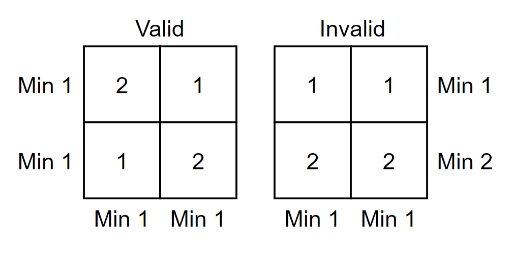
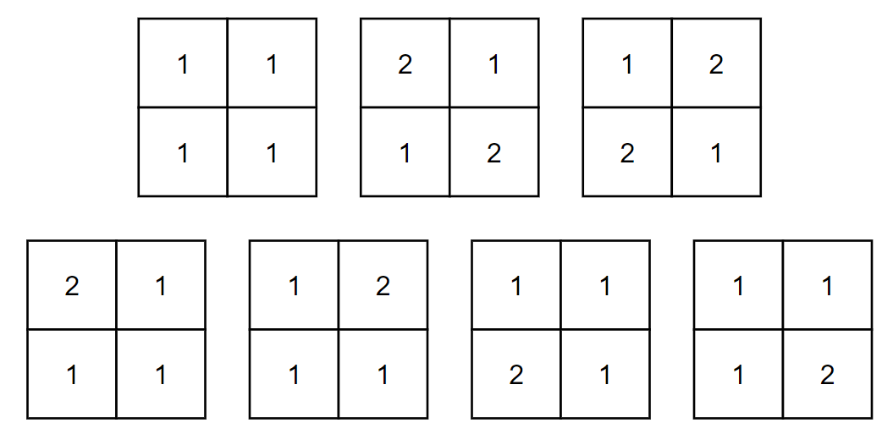

<h1 style='text-align: center;'> E. Another Filling the Grid</h1>

<h5 style='text-align: center;'>time limit per test: 1 second</h5>
<h5 style='text-align: center;'>memory limit per test: 256 megabytes</h5>

You have $n \times n$ square grid and an integer $k$. Put an integer in each cell while satisfying the conditions below.

* All numbers in the grid should be between $1$ and $k$ inclusive.
* Minimum number of the $i$-th row is $1$ ($1 \le i \le n$).
* Minimum number of the $j$-th column is $1$ ($1 \le j \le n$).

Find the number of ways to put integers in the grid. Since the answer can be very large, find the answer modulo $(10^{9} + 7)$.

  These are the examples of valid and invalid grid when $n=k=2$. 
#### Input

The only line contains two integers $n$ and $k$ ($1 \le n \le 250$, $1 \le k \le 10^{9}$).

#### Output

Print the answer modulo $(10^{9} + 7)$.

## Examples

#### Input


```text
2 2
```
#### Output


```text
7
```
#### Input


```text
123 456789
```
#### Output


```text
689974806
```
## Note

In the first example, following $7$ cases are possible.

  In the second example, make sure you print the answer modulo $(10^{9} + 7)$.


#### Tags 

#2300 #NOT OK #combinatorics #dp #math 

## Blogs
- [All Contest Problems](../Codeforces_Round_589_(Div._2).md)
- [Announcement (en)](../blogs/Announcement_(en).md)
- [Tutorial (en)](../blogs/Tutorial_(en).md)
