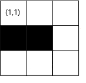

<h1 style='text-align: center;'> D. Alice and the Doll</h1>

<h5 style='text-align: center;'>time limit per test: 1 second</h5>
<h5 style='text-align: center;'>memory limit per test: 256 megabytes</h5>

Alice got a new doll these days. It can even walk!

Alice has built a maze for the doll and wants to test it. The maze is a grid with $n$ rows and $m$ columns. There are $k$ obstacles, the $i$-th of them is on the cell $(x_i, y_i)$, which means the cell in the intersection of the $x_i$-th row and the $y_i$-th column.

However, the doll is clumsy in some ways. It can only walk straight or turn right at most once in the same cell (including the start cell). It cannot get into a cell with an obstacle or get out of the maze.

More formally, there exist $4$ directions, in which the doll can look:

1. The doll looks in the direction along the row from the first cell to the last. While moving looking in this direction the doll will move from the cell $(x, y)$ into the cell $(x, y + 1)$;
2. The doll looks in the direction along the column from the first cell to the last. While moving looking in this direction the doll will move from the cell $(x, y)$ into the cell $(x + 1, y)$;
3. The doll looks in the direction along the row from the last cell to first. While moving looking in this direction the doll will move from the cell $(x, y)$ into the cell $(x, y - 1)$;
4. The doll looks in the direction along the column from the last cell to the first. While moving looking in this direction the doll will move from the cell $(x, y)$ into the cell $(x - 1, y)$.

.Standing in some cell the doll can move into the cell in the direction it looks or it can turn right once. Turning right once, the doll switches it's direction by the following rules: $1 \to 2$, $2 \to 3$, $3 \to 4$, $4 \to 1$. Standing in one cell, the doll can make at most one turn right.

Now Alice is controlling the doll's moves. She puts the doll in of the cell $(1, 1)$ (the upper-left cell of the maze). Initially, the doll looks to the direction $1$, so along the row from the first cell to the last. She wants to let the doll walk across all the cells without obstacles exactly once and end in any place. Can it be achieved?

##### Input

The first line contains three integers $n$, $m$ and $k$, separated by spaces ($1 \leq n,m \leq 10^5, 0 \leq k \leq 10^5$) — the size of the maze and the number of obstacles.

Next $k$ lines describes the obstacles, the $i$-th line contains two integer numbers $x_i$ and $y_i$, separated by spaces ($1 \leq x_i \leq n,1 \leq y_i \leq m$), which describes the position of the $i$-th obstacle.

It is guaranteed that no two obstacles are in the same cell and no obstacle is in cell $(1, 1)$.

##### Output

Print 'Yes' (without quotes) if the doll can walk across all the cells without obstacles exactly once by the rules, described in the statement.

If it is impossible to walk across the maze by these rules print 'No' (without quotes).

## Examples

##### Input


```text
3 3 2
2 2
2 1
```
##### Output


```text
Yes
```
##### Input

```text

3 3 2
3 1
2 2

```
##### Output


```text
No
```
##### Input

```text

3 3 8
1 2
1 3
2 1
2 2
2 3
3 1
3 2
3 3

```
##### Output


```text

Yes
```
## Note

Here is the picture of maze described in the first example:

  In the first example, the doll can walk in this way:

* The doll is in the cell $(1, 1)$, looks to the direction $1$. Move straight;
* The doll is in the cell $(1, 2)$, looks to the direction $1$. Move straight;
* The doll is in the cell $(1, 3)$, looks to the direction $1$. Turn right;
* The doll is in the cell $(1, 3)$, looks to the direction $2$. Move straight;
* The doll is in the cell $(2, 3)$, looks to the direction $2$. Move straight;
* The doll is in the cell $(3, 3)$, looks to the direction $2$. Turn right;
* The doll is in the cell $(3, 3)$, looks to the direction $3$. Move straight;
* The doll is in the cell $(3, 2)$, looks to the direction $3$. Move straight;
* The doll is in the cell $(3, 1)$, looks to the direction $3$. The goal is achieved, all cells of the maze without obstacles passed exactly once.


#### Tags 

#2300 #NOT OK #brute_force #data_structures #greedy #implementation 

## Blogs
- [All Contest Problems](../Codeforces_Round_593_(Div._2).md)
- [Announcement (en)](../blogs/Announcement_(en).md)
- [Tutorial (en)](../blogs/Tutorial_(en).md)
