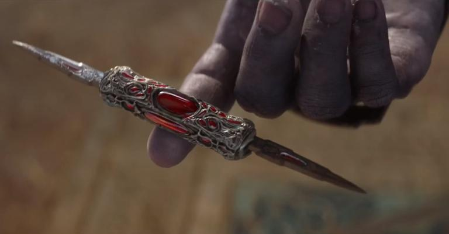

# Announcement

Hey!

On [Wednesday, October 16, 2019 at 20:35UTC+6](https://codeforces.com/https://www.timeanddate.com/worldclock/fixedtime.html?day=16&month=10&year=2019&hour=17&min=35&sec=0&p1=166) we will host [Codeforces Global Round 5](https://codeforces.com/contest/1237 "Codeforces Global Round 5").

It is the fifth round of a new series of [Codeforces Global Rounds](https://codeforces.com/blog/entry/65002) supported by XTX Markets. The rounds are open for everybody, the rating will be updated for everybody.

The round will last for 2 hours 30 minutes, 8 problems are waiting for you, and one of them will be proposed in two versions.

Scoring distribution: **500 — 750 — (750 + 750) — 2000 — 2500 — 3000 — 3750 — 4000**

The prizes for this round:

 * 30 best participants get a t-shirt.
* 20 t-shirts are randomly distributed among those with ranks between 31 and 500, inclusive.

The prizes for the 6-round series in 2019:

 * In each round top-100 participants get points according to the [table](https://codeforces.com/https://pastebin.com/QT5sXEaT).
* The final result for each participant is equal to the sum of points he gets in the four rounds he placed the highest.
* The best 20 participants over the whole series get sweatshirts and place certificates.

The problems of this round were developed by me, and here is the list of people who can't take part in the round as they know the problems beforehand:

[KAN](https://codeforces.com/profile/KAN "Grandmaster KAN"), [Endagorion](https://codeforces.com/profile/Endagorion "Legendary Grandmaster Endagorion"), [arsijo](https://codeforces.com/profile/arsijo "International Grandmaster arsijo"), [Rox](https://codeforces.com/profile/Rox "Candidate Master Rox"), [lperovskaya](https://codeforces.com/profile/lperovskaya "Specialist lperovskaya"), [Aleks5d](https://codeforces.com/profile/Aleks5d "Master Aleks5d"), [Learner99](https://codeforces.com/profile/Learner99 "Master Learner99"), [MikeMirzayanov](https://codeforces.com/profile/MikeMirzayanov "Headquarters, MikeMirzayanov").

Coincidentally, this is also the list of people I'm thankful to for making this round what it is.

The round will be perfectly balanced. As all things should be.

Welcome!

**UPD:** The round is over! [Editorial](T_(en).md) is here. Congratulations to the winners:

 1. [Radewoosh](https://codeforces.com/profile/Radewoosh "Legendary Grandmaster Radewoosh")
2. [Petr](https://codeforces.com/profile/Petr "Legendary Grandmaster Petr")
3. [300iq](https://codeforces.com/profile/300iq "Legendary Grandmaster 300iq")
4. [ecnerwala](https://codeforces.com/profile/ecnerwala "Legendary Grandmaster ecnerwala")
5. [RomaWhite](https://codeforces.com/profile/RomaWhite "International Grandmaster RomaWhite")
