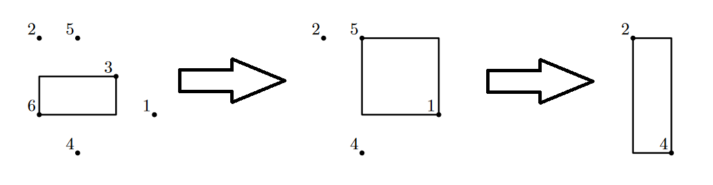

<h1 style='text-align: center;'> C2. Balanced Removals (Harder)</h1>

<h5 style='text-align: center;'>time limit per test: 1 second</h5>
<h5 style='text-align: center;'>memory limit per test: 512 megabytes</h5>

This is a harder version of the problem. In this version, $n \le 50\,000$.

There are $n$ distinct points in three-dimensional space numbered from $1$ to $n$. The $i$-th point has coordinates $(x_i, y_i, z_i)$. The number of points $n$ is even.

You'd like to remove all $n$ points using a sequence of $\frac{n}{2}$ snaps. In one snap, you can remove any two points $a$ and $b$ that have not been removed yet and form a perfectly balanced pair. A pair of points $a$ and $b$ is perfectly balanced if no other point $c$ (that has not been removed yet) lies within the axis-aligned minimum bounding box of points $a$ and $b$.

Formally, point $c$ lies within the axis-aligned minimum bounding box of points $a$ and $b$ if and only if $\min(x_a, x_b) \le x_c \le \max(x_a, x_b)$, $\min(y_a, y_b) \le y_c \le \max(y_a, y_b)$, and $\min(z_a, z_b) \le z_c \le \max(z_a, z_b)$. 
## Note

 that the bounding box might be degenerate. 

Find a way to remove all points in $\frac{n}{2}$ snaps.

#### Input

The first line contains a single integer $n$ ($2 \le n \le 50\,000$; $n$ is even), denoting the number of points.

Each of the next $n$ lines contains three integers $x_i$, $y_i$, $z_i$ ($-10^8 \le x_i, y_i, z_i \le 10^8$), denoting the coordinates of the $i$-th point.

No two points coincide.

#### Output

#### Output

 $\frac{n}{2}$ pairs of integers $a_i, b_i$ ($1 \le a_i, b_i \le n$), denoting the indices of points removed on snap $i$. Every integer between $1$ and $n$, inclusive, must appear in your output exactly once.

We can show that it is always possible to remove all points. If there are many solutions, output any of them.

## Examples

#### Input


```text
6
3 1 0
0 3 0
2 2 0
1 0 0
1 3 0
0 1 0
```
#### Output


```text
3 6
5 1
2 4
```
#### Input


```text
8
0 1 1
1 0 1
1 1 0
1 1 1
2 2 2
3 2 2
2 3 2
2 2 3
```
#### Output


```text
4 5
1 6
2 7
3 8
```
## Note

In the first example, here is what points and their corresponding bounding boxes look like (drawn in two dimensions for simplicity, as all points lie on $z = 0$ plane). 
## Note

 that order of removing matters: for example, points $5$ and $1$ don't form a perfectly balanced pair initially, but they do after point $3$ is removed. 

  

#### Tags 

#1900 #NOT OK #binary_search #constructive_algorithms #divide_and_conquer #greedy #implementation #sortings 

## Blogs
- [All Contest Problems](../Codeforces_Global_Round_5.md)
- [Announcement](../blogs/Announcement.md)
- [T (en)](../blogs/T_(en).md)
