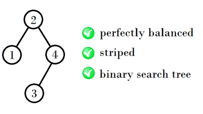
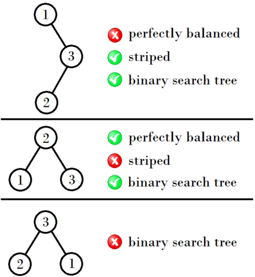

<h1 style='text-align: center;'> E. Balanced Binary Search Trees</h1>

<h5 style='text-align: center;'>time limit per test: 3 seconds</h5>
<h5 style='text-align: center;'>memory limit per test: 512 megabytes</h5>

Recall that a binary search tree is a rooted binary tree, whose nodes each store a key and each have at most two distinguished subtrees, left and right. The key in each node must be greater than any key stored in the left subtree, and less than any key stored in the right subtree.

The depth of a vertex is the number of edges on the simple path from the vertex to the root. In particular, the depth of the root is $0$.

Let's call a binary search tree perfectly balanced if there doesn't exist a binary search tree with the same number of vertices that has a strictly smaller sum of depths of its vertices.

Let's call a binary search tree with integer keys striped if both of the following conditions are satisfied for every vertex $v$: 

* If $v$ has a left subtree whose root is $u$, then the parity of the key of $v$ is different from the parity of the key of $u$.
* If $v$ has a right subtree whose root is $w$, then the parity of the key of $v$ is the same as the parity of the key of $w$.

You are given a single integer $n$. Find the number of perfectly balanced striped binary search trees with $n$ vertices that have distinct integer keys between $1$ and $n$, inclusive. 
#### Output

 this number modulo $998\,244\,353$.

#### Input

The only line contains a single integer $n$ ($1 \le n \le 10^6$), denoting the required number of vertices.

#### Output

#### Output

 the number of perfectly balanced striped binary search trees with $n$ vertices and distinct integer keys between $1$ and $n$, inclusive, modulo $998\,244\,353$.

## Examples

#### Input


```text
4
```
#### Output


```text
1
```
#### Input


```text
3
```
#### Output


```text
0
```
## Note

In the first example, this is the only tree that satisfies the conditions: 

In the second example, here are various trees that don't satisfy some condition: 


#### Tags 

#2400 #NOT OK #dp #math 

## Blogs
- [All Contest Problems](../Codeforces_Global_Round_5.md)
- [Announcement](../blogs/Announcement.md)
- [T (en)](../blogs/T_(en).md)
