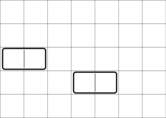
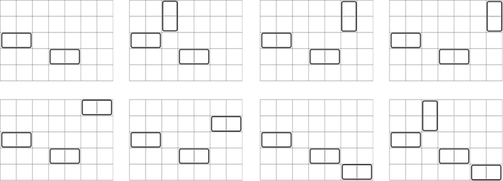
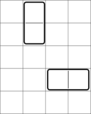

<h1 style='text-align: center;'> F. Balanced Domino Placements</h1>

<h5 style='text-align: center;'>time limit per test: 2 seconds</h5>
<h5 style='text-align: center;'>memory limit per test: 512 megabytes</h5>

Consider a square grid with $h$ rows and $w$ columns with some dominoes on it. Each domino covers exactly two cells of the grid that share a common side. Every cell is covered by at most one domino.

Let's call a placement of dominoes on the grid perfectly balanced if no row and no column contains a pair of cells covered by two different dominoes. In other words, every row and column may contain no covered cells, one covered cell, or two covered cells that belong to the same domino.

You are given a perfectly balanced placement of dominoes on a grid. Find the number of ways to place zero or more extra dominoes on this grid to keep the placement perfectly balanced. 
##### Output

 this number modulo $998\,244\,353$.

##### Input

The first line contains three integers $h$, $w$, and $n$ ($1 \le h, w \le 3600$; $0 \le n \le 2400$), denoting the dimensions of the grid and the number of already placed dominoes. The rows are numbered from $1$ to $h$, and the columns are numbered from $1$ to $w$.

Each of the next $n$ lines contains four integers $r_{i, 1}, c_{i, 1}, r_{i, 2}, c_{i, 2}$ ($1 \le r_{i, 1} \le r_{i, 2} \le h$; $1 \le c_{i, 1} \le c_{i, 2} \le w$), denoting the row id and the column id of the cells covered by the $i$-th domino. Cells $(r_{i, 1}, c_{i, 1})$ and $(r_{i, 2}, c_{i, 2})$ are distinct and share a common side.

The given domino placement is perfectly balanced.

##### Output

##### Output

 the number of ways to place zero or more extra dominoes on the grid to keep the placement perfectly balanced, modulo $998\,244\,353$.

## Examples

##### Input


```text
5 7 2
3 1 3 2
4 4 4 5
```
##### Output


```text
8
```
##### Input


```text
5 4 2
1 2 2 2
4 3 4 4
```
##### Output


```text
1
```
##### Input


```text
23 42 0
```
##### Output


```text
102848351
```
## Note

In the first example, the initial grid looks like this:



Here are $8$ ways to place zero or more extra dominoes to keep the placement perfectly balanced:



In the second example, the initial grid looks like this:



No extra dominoes can be placed here.


#### Tags 

#2600 #NOT OK #combinatorics #dp 

## Blogs
- [All Contest Problems](../Codeforces_Global_Round_5.md)
- [Announcement](../blogs/Announcement.md)
- [T (en)](../blogs/T_(en).md)
