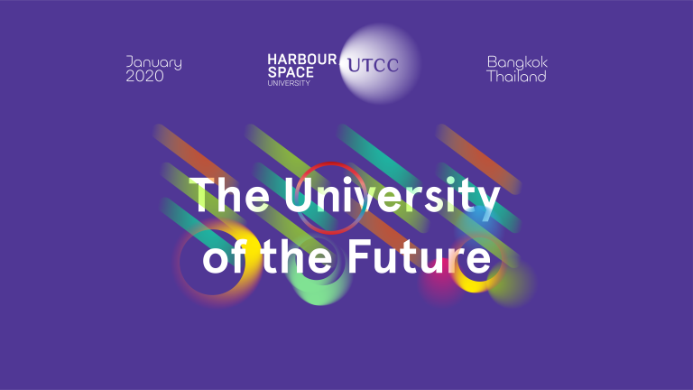

# Announcement

Hello Codeforces!

On [Tuesday, October 8, 2019 at 20:35UTC+6](https://codeforces.com/https://www.timeanddate.com/worldclock/fixedtime.html?day=8&month=10&year=2019&hour=17&min=35&sec=0&p1=166) [Educational Codeforces Round 74 (Rated for Div. 2)](https://codeforces.com/contest/1238 "Educational Codeforces Round 74 (Rated for Div. 2)") will start.

Series of Educational Rounds continue being held as [Harbour.Space University](https://codeforces.com/https://harbour.space/) initiative! You can read the details about the cooperation between [Harbour.Space University](https://codeforces.com/https://harbour.space/) and Codeforces in the [blog post](//codeforces.com/blog/entry/51208).

This round will be **rated for the participants with rating lower than 2100**. It will be held on extended ICPC rules. The penalty for each incorrect submission until the submission with a full solution is 10 minutes. After the end of the contest you will have 12 hours to hack any solution you want. You will have access to copy any solution and test it locally.

You will be given **7 problems** and **2 hours** to solve them.

The problems were invented and prepared by Roman [Roms](https://codeforces.com/profile/Roms "Master Roms") Glazov, Adilbek [adedalic](https://codeforces.com/profile/adedalic "International Master adedalic") Dalabaev, Vladimir [vovuh](https://codeforces.com/profile/vovuh "Candidate Master vovuh") Petrov, Ivan [BledDest](https://codeforces.com/profile/BledDest "International Grandmaster BledDest") Androsov, Maksim [Neon](https://codeforces.com/profile/Neon "Candidate Master Neon") Mescheryakov and me. Also huge thanks to Mike [MikeMirzayanov](https://codeforces.com/profile/MikeMirzayanov "Headquarters, MikeMirzayanov") Mirzayanov for great systems Polygon and Codeforces.

Good luck to all the participants!

Our friends at Harbour.Space also have a message for you:

*Hello Codeforces,* 

*First of all, thank you for the great feedback on our survey from the last Educational Round. Over 300 people participated, and we hope to start implementing some of your suggestions really soon.* 

*We also wanted to let you know that we have extended the deadline for our* **fully-funded scholarships** *for Masters programs in Bangkok.* 

*Remember,* **they cover the entire tuition fee as well as the cost of living expenses**, *so If you or someone you know are interested in technology, entrepreneurship, or design, and believe you have what it takes, we want to hear from you!*

  [APPLY HERE→](https://in.harbour.space/bangkok-scholarships/?utm_source=codeforces&utm_medium=partners&utm_campaign=ed_round_71) Last, but not least, we would like to recommend an article published in our blog last week about the “[Top 5 Soft Skills Every Developer Has to Have](https://harbour.space/computer-science/articles/top-5-skills?utm_source=codeforces&utm_medium=partners&utm_campaign=ed_round_74)”. What do you think, do you agree with this list? 

Congratulations to the winners: 

| Rank | Competitor | Problems Solved | Penalty |
| --- | --- | --- | --- |
| 1 | [HIR180](https://codeforces.com/profile/HIR180 "International Grandmaster HIR180") | 7 | 296 |
| 2 | [Hoxilo](https://codeforces.com/profile/Hoxilo "Unrated, Hoxilo") | 7 | 317 |
| 3 | [stasio6](https://codeforces.com/profile/stasio6 "International Master stasio6") | 7 | 350 |
| 4 | [sigma425](https://codeforces.com/profile/sigma425 "International Grandmaster sigma425") | 7 | 400 |
| 5 | [jiangly](https://codeforces.com/profile/jiangly "Grandmaster jiangly") | 7 | 405 |

Congratulations to the best hackers: 

| Rank | Competitor | Hack Count |
| --- | --- | --- |
| 1 | [kimbj0709](https://codeforces.com/profile/kimbj0709 "Expert kimbj0709") | **120****:-19** |
| 2 | [Retired_NarutoElMatria](https://codeforces.com/profile/Retired_NarutoElMatria "Pupil Retired_NarutoElMatria") | **107****:-111** |
| 3 | [baluteshih](https://codeforces.com/profile/baluteshih "International Master baluteshih") | **48****:-9** |
| 4 | [galen_colin](https://codeforces.com/profile/galen_colin "Candidate Master galen_colin") | **40****:-3** |
| 5 | [Rian_5900](https://codeforces.com/profile/Rian_5900 "Pupil Rian_5900") | **34****:-13** |

 571 successful hacks and 641 unsuccessful hacks were made in total!And finally people who were the first to solve each problem: 

| Problem | Competitor | Penalty |
| --- | --- | --- |
| A | [algo.code](https://codeforces.com/profile/algo.code "Candidate Master algo.code") | 0:00 |
| B | [Surge](https://codeforces.com/profile/Surge "Expert Surge") | 0:04 |
| C | [otbitiy_serb](https://codeforces.com/profile/otbitiy_serb "Candidate Master otbitiy_serb") | 0:17 |
| D | [MarcosK](https://codeforces.com/profile/MarcosK "Master MarcosK") | 0:08 |
| E | [GyojunYoun](https://codeforces.com/profile/GyojunYoun "Grandmaster GyojunYoun") | 0:09 |
| F | [ksun48](https://codeforces.com/profile/ksun48 "Legendary Grandmaster ksun48") | 0:29 |
| G | [NotNight](https://codeforces.com/profile/NotNight "Master NotNight") | 0:51 |

**UPD:** [Editorial is out](Tutorial.md)

