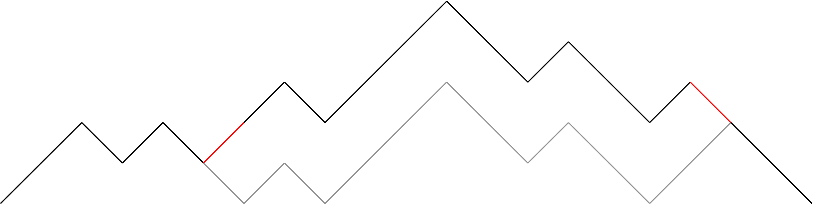
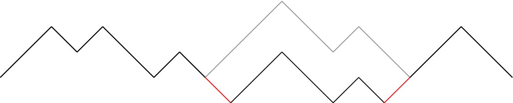
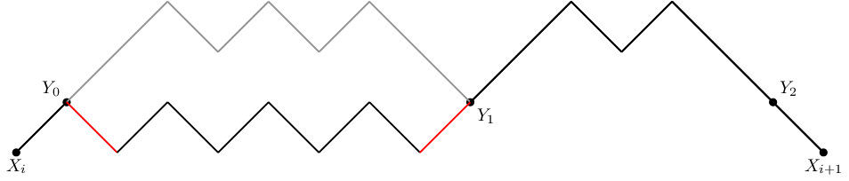

# Editorial_(en)

Thanks for the participation!

[1248A - Integer Points](https://codeforces.com/contest/1248/problem/A "Codeforces Round 594 (Div. 2)") was authored by [voidmax](https://codeforces.com/profile/voidmax "Grandmaster voidmax") and prepared by [vintage_Vlad_Makeev](https://codeforces.com/profile/vintage_Vlad_Makeev "International Grandmaster vintage_Vlad_Makeev").

[1248B - Grow The Tree](https://codeforces.com/contest/1248/problem/B "Codeforces Round 594 (Div. 2)") was authored by [voidmax](https://codeforces.com/profile/voidmax "Grandmaster voidmax"), [cdkrot](https://codeforces.com/profile/cdkrot "Grandmaster cdkrot") and prepared by [wrg0ababd](https://codeforces.com/profile/wrg0ababd "Expert wrg0ababd").

[1239A - Ivan the Fool and the Probability Theory](../problems/A._Ivan_the_Fool_and_the_Probability_Theory.md "Codeforces Round 594 (Div. 1)") was authored and prepared by [voidmax](https://codeforces.com/profile/voidmax "Grandmaster voidmax").

[1239B - The World Is Just a Programming Task (Hard Version)](../problems/B._The_World_Is_Just_a_Programming_Task_(Hard_Version).md "Codeforces Round 594 (Div. 1)") was authored by [vintage_Vlad_Makeev](https://codeforces.com/profile/vintage_Vlad_Makeev "International Grandmaster vintage_Vlad_Makeev") and prepared by [DebNatkh](https://codeforces.com/profile/DebNatkh "Master DebNatkh").

[1239C - Queue in the Train](../problems/C._Queue_in_the_Train.md "Codeforces Round 594 (Div. 1)") was authored by [meshanya](https://codeforces.com/profile/meshanya "Grandmaster meshanya") and prepared by [Sehnsucht](https://codeforces.com/profile/Sehnsucht "Candidate Master Sehnsucht").

[1239D - Catowice City](../problems/D._Catowice_City.md "Codeforces Round 594 (Div. 1)") was authored by [platypus179](https://codeforces.com/profile/platypus179 "International Master platypus179") and prepared by [budalnik](https://codeforces.com/profile/budalnik "International Grandmaster budalnik").

[1239E - Turtle](../problems/E._Turtle.md "Codeforces Round 594 (Div. 1)") was authored by [voidmax](https://codeforces.com/profile/voidmax "Grandmaster voidmax") and prepared by [cdkrot](https://codeforces.com/profile/cdkrot "Grandmaster cdkrot").

[1239F - Swiper, no swiping!](../problems/F._Swiper,_no_swiping!.md "Codeforces Round 594 (Div. 1)") was authored and prepared by [voidmax](https://codeforces.com/profile/voidmax "Grandmaster voidmax").

 
### [1248A - Integer Points](https://codeforces.com/contest/1248/problem/A "Codeforces Round 594 (Div. 2)")

Consider two lines y=x+py=x+p и y=−x+qy=−x+q:

{y=x+py=−x+q⇒{2y=p+qy=−x+q⇒{y=p+q2y=−x+q⇒{y=p+q2x=q−p2

It's clear that they will have integral intersection point iff p and q have the same parity. Let's find p0 и p1 — number of even and odd pi respectively. Moreover let's find q0 and q1 for qi. Now answer is p0⋅q0+p1⋅q1. Complexity: O(n+m).

Pay attention that answer does not fit in 32-bit data type.

 
### [1248B - Grow The Tree](https://codeforces.com/contest/1248/problem/B "Codeforces Round 594 (Div. 2)")

At first, let's do some maths. Consider having an expression a2+b2 which we have to maximize, while a+b=C, where C is some constant. Let's proof that the maximum is achieved when a or b is maximum possible.

At first let a or b be about the same, while a≥b. Let's see what happens when we add 1 to a and subtract 1 from b. (a+1)2+(b−1)2=a2+2a+1+b2−2b+1=a2+b2+2(a−b+1). Since a≥b, this expression is greater than a2+b2. It means that we should maximize a (or b, doing the same steps) in order to achieve the maximum of a2+b2.

Notice that we should always grow the tree in one direction. For definiteness, let horizontal sticks go from left to right and vertical from down to top. Now, answer equals to square of the sum of lengths of horizontal sticks plus square of the sum of lengths of vertical sticks. As we proved earlier, to maximize this expression, we should maximize one of the numbers under the squares.

Let's sort sticks by order and orient the half (and medium element if there's an odd amount of sticks) with the greater length vertically, and the other half horizontally.

Work time: O(nlogn)

Bonus: can you solve this problem in O(n)?

 
### [1239A - Ivan the Fool and the Probability Theory](../problems/A._Ivan_the_Fool_and_the_Probability_Theory.md "Codeforces Round 594 (Div. 1)")

If there is no adjecent cells with same color coloring is chess coloring.

Otherwise there is exist two adjecent cells with same color. Let's decide for which cells we already know their color.

  It turns out that color rows or columns alternates. It means that this problem equal to the same problem about strip. Answer for the strip is 2Fn.

In this way the final answer is 2(Fn+Fm−1).

 
### [1248D1 - The World Is Just a Programming Task (Easy Version)](https://codeforces.com/contest/1248/problem/D1 "Codeforces Round 594 (Div. 2)")

Note first that the number of opening brackets must be equal to the number of closing brackets, otherwise the answer is always 0. Note that the answer to the question about the number of cyclic shifts, which are correct bracket sequences, equals the number of minimal prefix balances. For example, for string )(()))()((, the array of prefix balances is [-1, 0, 1, 0, -1, -2, -1, -2, -1, 0], and the number of cyclic shifts, 2 – the number of minimums in it (−2). Now we have a solution of complexuty O(n3): let's iterate over all pairs of symbols that can be swapped. Let's do this and find the number of cyclic shifts that are correct bracket sequences according to the algorithm described above.

 
### [1239B - The World Is Just a Programming Task (Hard Version)](../problems/B._The_World_Is_Just_a_Programming_Task_(Hard_Version).md "Codeforces Round 594 (Div. 1)")

Note first that the number of opening brackets must be equal to the number of closing brackets, otherwise the answer is always 0. The answer for a bracket sequence is the same as the answer for any of its cyclic shifts. Then find i— index of the minimum balance and perform a cyclic shift of the string by i to the left. The resulting line never has a balance below zero, which means it is a correct bracket sequence. Further we will work only with it

Let us draw on the plane the prefix balances (the difference between the number of opening and closing brackets) of our correct bracket sequence in the form of a polyline. It will have a beginning at (0,0), an end — at (2n,0) and its points will be in the upper half-plane. It can easily be shown that the answer to the question of the number of cyclic shifts being correct bracket sequence is the number of times how much minimum balance is achieved in the array of prefix balances. For example, for string )(()))()((, the array of prefix balances is [-1, 0, 1, 0, -1, -2, -1, -2, -1, 0], and the number of cyclic shifts, 2 – the number of minimums in it (−2). 

After swapping two different brackets (')' and '('), either on some sub-segment in an array of balances 2 is added, or on some sub-segment −2 is added.

  In the first case (as you can see from the figure above), the minimum remains the same as it was — 0, and its number does not increase due to the addition of 2 to some sub-section of the array. So, there is no profit in swapping brackets in this case.

In the second case, there are three options: the minimum becomes equal to −2, −1 or 0. In the first case, the minimum reaches a value equal to −2 only at those points at which there was previously value equal to 0, so this answer will less or equal than the one that would have turned out, if no operations were applied to the array at all.

If the minimum becomes equal to −1, then on the segment in the balance array on which 2 was deducted as a result of this operation there could not be balances equal to 0, otherwise the new minimum would become equal to −2. So, if 0=X0<X1<⋯<Xk=2n — positions of minimums in the array of prefix balances, then the operation −2 was performed on the segment [L,R] (Xi<L≤R<Xi+1 for some i). After this operation, the number of local minimums will be equal to the number of elements of the array of balance on the segment [L;R], equal to 1. Since this number shall be maximized, the right border swall be maximised and the left border shall be minimised. So, for some fixed i it is optimal to swap Xi-th and Xi+1−1-th brackets (see following figure)

  If the minimum remains equal to 0, then using the reasoning similar to the reasoning above, it can be proven that for some i if we consider points Xi+1=Y0<Y1<⋯<Ym=Xi+1−1 — positions of 1 in the array of balances on the segment [Xi;Xi+1], it is optimal for some j to swap Yj and Yj+1−1 brackets (see following figure)

  Thus, we have the solution of O(n) complexity — we shall find all Xi, Yi and count on each of the segments of the form [Xi;Xi+1] or [Yi;Yi+1] the number of elements equal to 0, 1, 2, then according to reasonings above, maximal answer can be found.

 Tutorial is loading... 
### [1239D - Catowice City](../problems/D._Catowice_City.md "Codeforces Round 594 (Div. 1)")

You are given bipartite graph and a perfect matching in it. You have to find independent set of size n which doesn't coincide with either of two parts. 

Suppose such independent set exists, let's call it S. Also, let's call left part of graph as L and right part of graph as R. Then define A=S∩L, B=L∖A, A′ is set of all nodes which are connected by edges from matching with A, B′ — similarly for B. It's easy to see that S=A∪B′.

  Let's direct all edges in graph. Edges from matching will be directed from right to left, and all other edges will be directed from left to right. Now edges from matching will direct from A′ to A and from B′ to B. Other edges could direct from A to A′, from B to B′ and from B to A′. Observe that edges cannot direct from A to B′, cause it wouldn't be an independent set otherwise.

  It's easy to see that B′ isn't reachable from A. So, let's find all strongly connected components (SCC) in this graph. If there's only one such component, answer doesn't exist due to the fact that any node of B′ isn't reachable from any node of A. If SCC is only one, any node is reachable from any other node therefore in this case either A or B′ are empty. If there are at least two SCC, let's choose any source SCC and call it Q. Consider B′=Q∩R and define A as set of all nodes in left part which are not connected by edges from matching with B′. Let's proof that if some l∈L lies in B′, then r — pair of l in matching also lies in B′. That's obvious since there are no incoming edges in B′ and there's edge from r to l. So, none of nodes from A will lay in chosen SCC. Thus B′ won't be reachable from A and A∪B′ will be an independent set.

The only exception is n=1, in such case there are two SCC but answer doesn't exist (cause chosen A will be empty).

 
### [1239E - Turtle](../problems/E._Turtle.md "Codeforces Round 594 (Div. 1)")

Consider that we already fixed the set in the top line and fixed.

  If we perform a swap in this situation, the answer will clearly won't become worse (some paths are not changing, and some are decreasing).

So we can assume that the first line is sorted, and similarly the second line is sorted too (but descending).

Now let's think which path the turtle will choose. Observe the difference between to paths:

  Then cost of path i+1 minus cost of path i is equal to xi+1−yi. 

xi increases when i increases, yi decreases, xi+1−yi decreases, so the discrete derivative increases.

Such function looks like:

  So clearly the turtle will choose either the first or the last path.

So now we need to split our set into two of equal size, so that the maximum sum is smallest possible.

This is a knapsack problem. The states are the prefix of elements considered, the number of elements taken, the weight. It works in O(n3maxa)

EDIT: it turned out it was inobvious... The corner cells take two minimal elements and are not considered in knapsack since they are contained in all paths. It's easy to prove that it's optimal to put minimal elements in corners.

 
### [1239F - Swiper, no swiping!](../problems/F._Swiper,_no_swiping!.md "Codeforces Round 594 (Div. 1)")

We will look only on set of vertex, that will stay after deleting.

Let node-x — node with degree mod 3 equal x.

Let's consider some cases:

* Node-0 exists. It is the answer, except the case, when our graph consists of one node.
* Cycle on nodes-2 exists. So exists irreducible cycle on nodes-2. It is the answer, except the case, when our graph is cycle.
* Way between nodes-1 on nodes-2 exists. So exists irreducible way with same conditions. It is the answer, except the case, when our graph is way.
* Our graph contains one node-1 and nodes-2 form forest. Let's take two trees and delete all except two ways in this trees, such only endpoints are connected with node-1. Those ways and node-1 are the answer, except the case, when our graph is twho cycles with one common node.

That's all cases. Let's show it: 

* Nodes-2 form forest. Exists at least one leaf, that is connected with node-1. So in that case node-1 always exists.
* Degree of node-1 equals sum degree of nodes-2 minus doubled number of edges between nodes-2. Let k — number of nodes-2. So degree of node-1 mod 3 equals 2k−2(k−1)=2. Contradiction. So forest consist of at least two trees.
