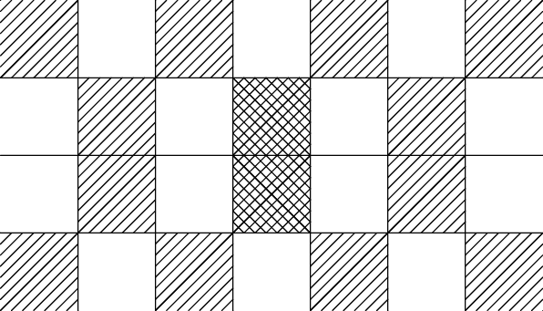
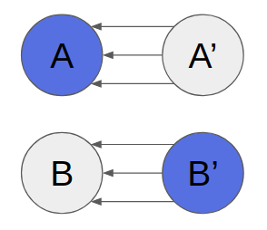
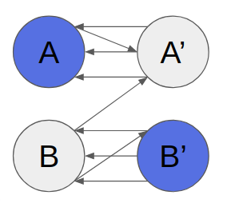
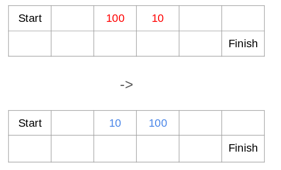
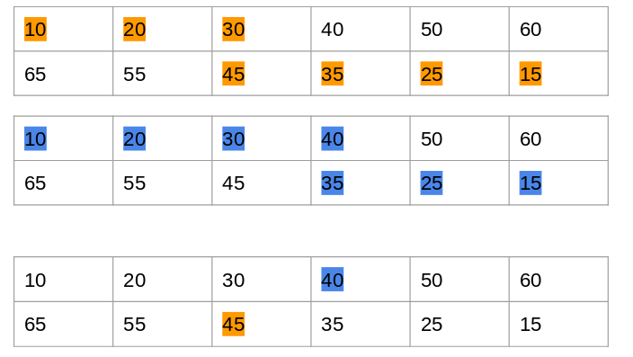
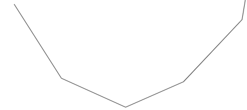

# Tutorial_2_(ru)

Thanks for the participation!

[1248A - Integer Points](https://codeforces.com/contest/1248/problem/A "Codeforces Round 594 (Div. 2)") was authored by [voidmax](https://codeforces.com/profile/voidmax "Grandmaster voidmax") and prepared by [vintage_Vlad_Makeev](https://codeforces.com/profile/vintage_Vlad_Makeev "International Grandmaster vintage_Vlad_Makeev").

[1248B - Grow The Tree](https://codeforces.com/contest/1248/problem/B "Codeforces Round 594 (Div. 2)") was authored by [voidmax](https://codeforces.com/profile/voidmax "Grandmaster voidmax"), [cdkrot](https://codeforces.com/profile/cdkrot "Grandmaster cdkrot") and prepared by [wrg0ababd](https://codeforces.com/profile/wrg0ababd "Expert wrg0ababd").

[1239A - Ivan the Fool and the Probability Theory](../problems/A._Ivan_the_Fool_and_the_Probability_Theory.md "Codeforces Round 594 (Div. 1)") was authored and prepared by [voidmax](https://codeforces.com/profile/voidmax "Grandmaster voidmax").

[1239B - The World Is Just a Programming Task (Hard Version)](../problems/B._The_World_Is_Just_a_Programming_Task_(Hard_Version).md "Codeforces Round 594 (Div. 1)") was authored by [vintage_Vlad_Makeev](https://codeforces.com/profile/vintage_Vlad_Makeev "International Grandmaster vintage_Vlad_Makeev") and prepared by [DebNatkh](https://codeforces.com/profile/DebNatkh "Master DebNatkh").

[1239C - Queue in the Train](../problems/C._Queue_in_the_Train.md "Codeforces Round 594 (Div. 1)") was authored by [meshanya](https://codeforces.com/profile/meshanya "Grandmaster meshanya") and prepared by [Sehnsucht](https://codeforces.com/profile/Sehnsucht "Candidate Master Sehnsucht").

[1239D - Catowice City](../problems/D._Catowice_City.md "Codeforces Round 594 (Div. 1)") was authored by [platypus179](https://codeforces.com/profile/platypus179 "International Master platypus179") and prepared by [budalnik](https://codeforces.com/profile/budalnik "International Grandmaster budalnik").

[1239E - Turtle](../problems/E._Turtle.md "Codeforces Round 594 (Div. 1)") was authored by [voidmax](https://codeforces.com/profile/voidmax "Grandmaster voidmax") and prepared by [cdkrot](https://codeforces.com/profile/cdkrot "Grandmaster cdkrot").

[1239F - Swiper, no swiping!](../problems/F._Swiper,_no_swiping!.md "Codeforces Round 594 (Div. 1)") was authored and prepared by [voidmax](https://codeforces.com/profile/voidmax "Grandmaster voidmax").

 
### [1248A - Integer Points](https://codeforces.com/contest/1248/problem/A "Codeforces Round 594 (Div. 2)")

Consider two lines $y = x + p$ и $y = -x + q$:

$\begin{cases} y = x + p \\\ y = -x + q \end{cases} \Rightarrow \begin{cases} 2y = p + q \\\ y = -x + q \end{cases} \Rightarrow \begin{cases} y = \frac{p + q}{2} \\\ y = -x + q \end{cases} \Rightarrow \begin{cases} y = \frac{p + q}{2} \\\ x = \frac{q - p}{2} \end{cases}$

It's clear that they will have integral intersection point iff $p$ and $q$ have the same parity. Let's find $p_0$ и $p_1$ — number of even and odd $p_i$ respectively. Moreover let's find $q_0$ and $q_1$ for $q_i$. Now answer is $p_0 \cdot q_0 + p_1 \cdot q_1$. Complexity: $O(n + m)$.

Pay attention that answer does not fit in 32-bit data type.

 
### [1248B - Grow The Tree](https://codeforces.com/contest/1248/problem/B "Codeforces Round 594 (Div. 2)")

At first, let's do some maths. Consider having an expression $a^2 + b^2$ which we have to maximize, while $a + b = C$, where $C$ is some constant. Let's proof that the maximum is achieved when $a$ or $b$ is maximum possible.

At first let $a$ or $b$ be about the same, while $a \geq b$. Let's see what happens when we add $1$ to $a$ and subtract $1$ from $b$. $(a + 1)^2 + (b - 1)^2 = a^2 + 2a + 1 + b^2 - 2b + 1 = a^2 + b^2 + 2(a - b + 1)$. Since $a \geq b$, this expression is greater than $a^2 + b^2$. It means that we should maximize $a$ (or $b$, doing the same steps) in order to achieve the maximum of $a^2 + b^2$.

Notice that we should always grow the tree in one direction. For definiteness, let horizontal sticks go from left to right and vertical from down to top. Now, answer equals to square of the sum of lengths of horizontal sticks plus square of the sum of lengths of vertical sticks. As we proved earlier, to maximize this expression, we should maximize one of the numbers under the squares.

Let's sort sticks by order and orient the half (and medium element if there's an odd amount of sticks) with the greater length vertically, and the other half horizontally.

Work time: $O(n \log n)$

Bonus: can you solve this problem in $O(n)$?

 
### [1239A - Ivan the Fool and the Probability Theory](../problems/A._Ivan_the_Fool_and_the_Probability_Theory.md "Codeforces Round 594 (Div. 1)")

If there is no adjecent cells with same color coloring is chess coloring.

Otherwise there is exist two adjecent cells with same color. Let's decide for which cells we already know their color.

  It turns out that color rows or columns alternates. It means that this problem equal to the same problem about strip. Answer for the strip is $2F_n$.

In this way the final answer is $2(F_n + F_m - 1)$.

 
### [1248D1 - The World Is Just a Programming Task (Easy Version)](https://codeforces.com/contest/1248/problem/D1 "Codeforces Round 594 (Div. 2)")

Note first that the number of opening brackets must be equal to the number of closing brackets, otherwise the answer is always $0$. Note that the answer to the question about the number of cyclic shifts, which are correct bracket sequences, equals the number of minimal prefix balances. For example, for string )(()))()((, the array of prefix balances is [-1, 0, 1, 0, -1, -2, -1, -2, -1, 0], and the number of cyclic shifts, $2$ – the number of minimums in it ($-2$). Now we have a solution of complexuty $\mathcal{O}(n^3)$: let's iterate over all pairs of symbols that can be swapped. Let's do this and find the number of cyclic shifts that are correct bracket sequences according to the algorithm described above.

 Tutorial is loading... 
### [1239C - Queue in the Train](../problems/C._Queue_in_the_Train.md "Codeforces Round 594 (Div. 1)")

The problem can be solved easily with an abstraction of "events". Let's define an "event" as a tuple of variables $(time, type, index)$, where $index$ is the index of the passenger $(1 \leq index \leq n)$, $time$ is the time when the event will happen, $type$ is either $0$ (the passenger exits the queue) or $1$ (the passenger wants to enter the queue).

To simulate the activity described in the problem it's necessary to handle events in sorted order. At the start there are $n$ events $(t_i, 1, i)$, where $1 \leq i \leq n$. While there are any unprocessed events, we take the "smallest" event and process it. Event $(a, b, c)$ is "smaller" than event $(d, e, f)$ either if $(a < d)$ or $(a = d\ and\ b < e)$ or $(a = d\ and\ b = e\ and\ c < f)$.

Let's define a few sets: $want$ (the set of passengers who want to enter the queue), $in\\_queue$ (the set of passengers who are in the queue); and a few integer variables: $queue\\_time$ (the time when the queue becomes empty, to help calculate the time when a new passenger will exit the queue if he enters now), $cur\\_time$ (time of the last processed event).

Suppose that we're processing an event. If the $type$ of the event is $1$, then we add $index$ to $want$, otherwise we remove $index$ from $in\\_queue$. After processing an event we ought to check if there is a passenger who can enter the queue. Let $x$ be the smallest element of $want$, and if $in\\_queue$ either is empty or $x$ is smaller than the smallest element of $in\\_queue$, then $x$ immediately enters the queue, therefore creating a new event $(max(cur\\_time, queue\\_time) + p, 0, x)$.

The complexity of the solution is $O(n log n)$, because we need to use sorted data structures (for example, std::set of std::priority_queue).

 
### [1239D - Catowice City](../problems/D._Catowice_City.md "Codeforces Round 594 (Div. 1)")

You are given bipartite graph and a perfect matching in it. You have to find independent set of size $n$ which doesn't coincide with either of two parts. 

Suppose such independent set exists, let's call it $S$. Also, let's call left part of graph as $L$ and right part of graph as $R$. Then define $A = S \cap L$, $B = L \setminus A$, $A'$ is set of all nodes which are connected by edges from matching with $A$, $B'$ — similarly for $B$. It's easy to see that $S = A \cup B'$.

  Let's direct all edges in graph. Edges from matching will be directed from right to left, and all other edges will be directed from left to right. Now edges from matching will direct from $A'$ to $A$ and from $B'$ to $B$. Other edges could direct from $A$ to $A'$, from $B$ to $B'$ and from $B$ to $A'$. Observe that edges cannot direct from $A$ to $B'$, cause it wouldn't be an independent set otherwise.

  It's easy to see that $B'$ isn't reachable from $A$. So, let's find all strongly connected components (SCC) in this graph. If there's only one such component, answer doesn't exist due to the fact that any node of $B'$ isn't reachable from any node of $A$. If SCC is only one, any node is reachable from any other node therefore in this case either $A$ or $B'$ are empty. If there are at least two SCC, let's choose any source SCC and call it $Q$. Consider $B' = Q \cap R$ and define $A$ as set of all nodes in left part which are not connected by edges from matching with $B'$. Let's proof that if some $l \in L$ lies in $B'$, then $r$ — pair of $l$ in matching also lies in $B'$. That's obvious since there are no incoming edges in $B'$ and there's edge from $r$ to $l$. So, none of nodes from $A$ will lay in chosen SCC. Thus $B'$ won't be reachable from $A$ and $A \cup B'$ will be an independent set.

The only exception is $n = 1$, in such case there are two SCC but answer doesn't exist (cause chosen $A$ will be empty).

 
### [1239E - Turtle](../problems/E._Turtle.md "Codeforces Round 594 (Div. 1)")

Consider that we already fixed the set in the top line and fixed.

  If we perform a swap in this situation, the answer will clearly won't become worse (some paths are not changing, and some are decreasing).

So we can assume that the first line is sorted, and similarly the second line is sorted too (but descending).

Now let's think which path the turtle will choose. Observe the difference between to paths:

  Then cost of path $i+1$ minus cost of path $i$ is equal to $x_{i+1} - y_{i}$. 

$x_i$ increases when $i$ increases, $y_i$ decreases, $x_{i+1} - y_{i}$ decreases, so the discrete derivative increases.

Such function looks like:

  So clearly the turtle will choose either the first or the last path.

So now we need to split our set into two of equal size, so that the maximum sum is smallest possible.

This is a knapsack problem. The states are the prefix of elements considered, the number of elements taken, the weight. It works in $\mathcal{O}(n^3 maxa)$

EDIT: it turned out it was inobvious... The corner cells take two minimal elements and are not considered in knapsack since they are contained in all paths. It's easy to prove that it's optimal to put minimal elements in corners.

 
### [1239F - Swiper, no swiping!](../problems/F._Swiper,_no_swiping!.md "Codeforces Round 594 (Div. 1)")

We will look only on set of vertex, that will stay after deleting.

Let node-$x$ — node with degree $mod\ 3$ equal $x$.

Let's consider some cases:

* Node-$0$ exists. It is the answer, except the case, when our graph consists of one node.
* Cycle on nodes-$2$ exists. So exists irreducible cycle on nodes-$2$. It is the answer, except the case, when our graph is cycle.
* Way between nodes-$1$ on nodes-$2$ exists. So exists irreducible way with same conditions. It is the answer, except the case, when our graph is way.
* Our graph contains one node-$1$ and nodes-$2$ form forest. Let's take two trees and delete all except two ways in this trees, such only endpoints are connected with node-$1$. Those ways and node-$1$ are the answer, except the case, when our graph is twho cycles with one common node.

That's all cases. Let's show it: 

* Nodes-$2$ form forest. Exists at least one leaf, that is connected with node-$1$. So in that case node-$1$ always exists.
* Degree of node-$1$ equals sum degree of nodes-$2$ minus doubled number of edges between nodes-$2$. Let $k$ — number of nodes-$2$. So degree of node-$1$ $mod\ 3$ equals $2k - 2(k - 1) = 2$. Contradiction. So forest consist of at least two trees.
