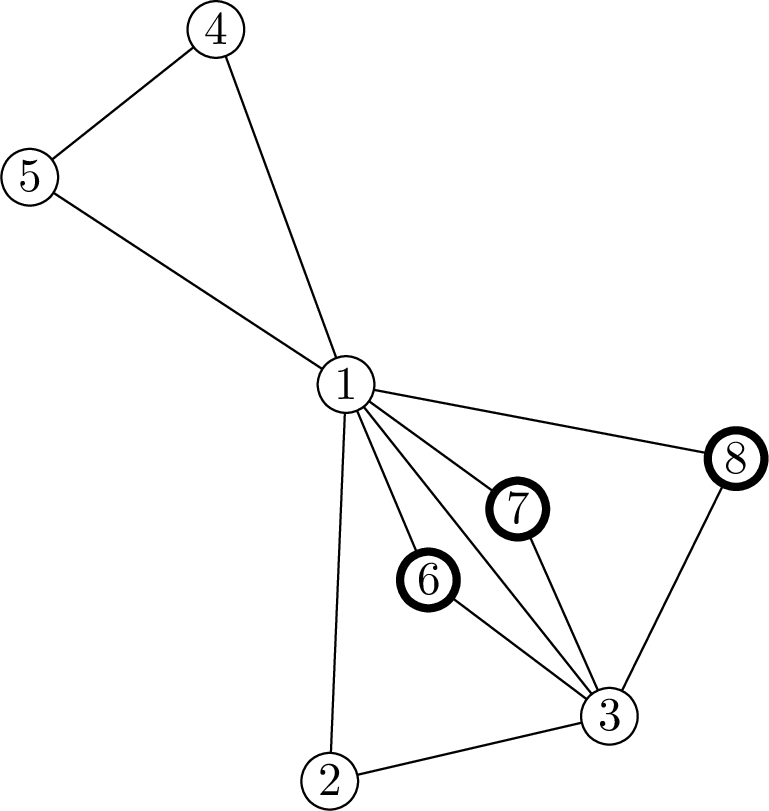

<h1 style='text-align: center;'> F. Swiper, no swiping!</h1>

<h5 style='text-align: center;'>time limit per test: 2 seconds</h5>
<h5 style='text-align: center;'>memory limit per test: 512 megabytes</h5>

I'm the Map, I'm the Map! I'm the MAP!!!MapIn anticipation of new adventures Boots wanted to do a good deed. After discussion with the Map and Backpack, they decided to gift Dora a connected graph. After a long search, Boots chose $t$ graph's variants, which Dora might like. However fox Swiper wants to spoil his plan.

The Swiper knows, that Dora now is only able to count up to $3$, so he has came up with a following idea. He wants to steal some non-empty set of vertices, so that the Dora won't notice the loss. He has decided to steal some non-empty set of vertices, so that after deletion of the stolen vertices and edges adjacent to them, every remaining vertex wouldn't change it's degree modulo $3$. The degree of a vertex is the number of edges it is adjacent to. It would've been suspicious to steal all the vertices, so Swiper needs another plan.

Boots are sure, that the crime can not be allowed. However they are afraid, that they won't be able to handle this alone. So Boots decided to ask for your help. Please determine for every graph's variant whether the Swiper can perform the theft or not.

### Input

The first line contains a single integer $t$ ($1 \le t \le 100\,000$) — the number of graph variants.

The first line of each variant contains integers $n$, $m$ ($1 \le n \le 500\,000$, $0 \le m \le 500\,000$), the number of vertexes and edges in the graph.

Then $m$ lines follow, each containing integers $a_i$, $b_i$ ($1 \le a_i, b_i \le n$), the indices of the vertices connected with a corresponding edge.

It's guaranteed, that the graph is connected and doesn't contain multiple edges or self-loops.

It's guaranteed, that the sum of $n$ over all variants is at most $500\,000$ and that the sum of $m$ over all variants is at most $500\,000$.

Descriptions of graph's variants are separated with an empty line.

### Output

For each variant:

* In case the answer exists, print "Yes" and then the answer itself.The first line should contain an integer $c$ ($1 < c < n$), the number of vertices the Crook can steal, without Dora noticing the loss. On the next line print $c$ distinct integers, the indices of the graph's vertices in arbitrary order.
* Otherwise print "No".

In case there are several correct ways to steal the vertices, print any of them.

Please note, that it's not required to maximize the number of stolen vertices.

## Example

### Input


```text
3
3 3
1 2
2 3
3 1

6 6
1 2
1 3
2 3
2 5
2 6
2 4

8 12
1 2
1 3
2 3
1 4
4 5
5 1
3 6
3 7
3 8
6 1
7 1
8 1
```
### Output


```text
No
Yes
3
4 5 6
Yes
3
6 7 8
```
## Note

The picture below shows the third variant from the example test. The set of the vertices the Crook can steal is denoted with bold. 

  

#### Tags 

#3400 #NOT OK #graphs #implementation 

## Blogs
- [All Contest Problems](../Codeforces_Round_594_(Div._1).md)
- [Announcement](../blogs/Announcement.md)
- [Editorial (en)](../blogs/Editorial_(en).md)
- [Tutorial #2 (ru)](../blogs/Tutorial_2_(ru).md)
