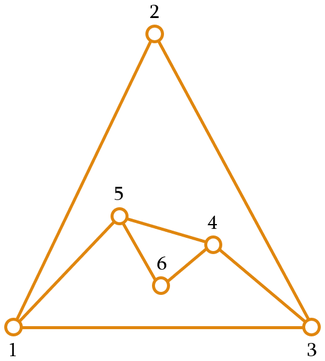

<h1 style='text-align: center;'> E. Planar Perimeter</h1>

<h5 style='text-align: center;'>time limit per test: 1 second</h5>
<h5 style='text-align: center;'>memory limit per test: 256 megabytes</h5>

Ujan has finally cleaned up his house and now wants to decorate the interior. He decided to place a beautiful carpet that would really tie the guest room together.

He is interested in carpets that are made up of polygonal patches such that each side of a patch is either a side of another (different) patch, or is an exterior side of the whole carpet. In other words, the carpet can be represented as a planar graph, where each patch corresponds to a face of the graph, each face is a simple polygon. The perimeter of the carpet is the number of the exterior sides. 

Ujan considers a carpet beautiful if it consists of $f$ patches, where the $i$-th patch has exactly $a_i$ sides, and the perimeter is the smallest possible. Find an example of such a carpet, so that Ujan can order it!

#### Input

The first line of input contains a single integer $f$ ($1 \leq f \leq 10^5$), the number of patches in the carpet. 

The next line contains $f$ integers $a_1, \ldots, a_f$ ($3 \leq a_i \leq 3\cdot 10^5$), the number of sides of the patches. The total number of the sides of the patches $a_1 + \ldots + a_f$ does not exceed $3\cdot10^5$.

#### Output

#### Output

 the description of the carpet as a graph. 

First, output a single integer $n$ ($3 \leq n \leq 3 \cdot 10^5$), the total number of vertices in your graph (the vertices must be numbered from $1$ to $n$). 

Then output $f$ lines containing the description of the faces. The $i$-th line should describe the $i$-th face and contain $a_i$ distinct integers $v_{i,1}, \ldots, v_{i,a_i}$ ($1 \leq v_{i,j} \leq n$), which means that the vertices $v_{i,j}$ and $v_{i,(j \bmod{a_i})+1}$ are connected by an edge for any $1 \leq j \leq a_i$.

The graph should be planar and satisfy the restrictions described in the problem statement. Its perimeter should be the smallest possible. There should be no double edges or self-loops in the graph. The graph should be connected. 
## Note

 that a solution always exists; if there are multiple solutions, output any of them.

## Examples

#### Input


```text
2
3 3
```
#### Output


```text
4
2 1 4 
1 2 3 
```
#### Input


```text
3
5 3 5
```
#### Output


```text
6
1 2 3 4 5
4 5 6
1 3 4 6 5
```
## Note

In the first sample, the two triangular faces are connected by a single edge, which results in the minimum perimeter $4$.

The figure shows one possible configuration for the second sample. The minimum perimeter in this case is $3$. 

  

#### Tags 

#3200 #NOT OK #constructive_algorithms #graphs 

## Blogs
- [All Contest Problems](../Codeforces_Round_599_(Div._1).md)
- [Announcement (en) (en)](../blogs/Announcement_(en)_(en).md)
- [Tutorial (en)](../blogs/Tutorial_(en).md)
