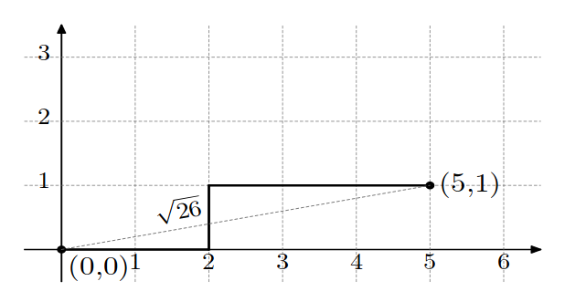
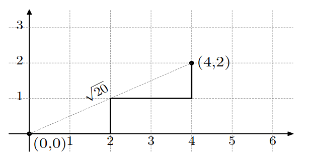

<h1 style='text-align: center;'> B. Grow The Tree</h1>

<h5 style='text-align: center;'>time limit per test: 2 seconds</h5>
<h5 style='text-align: center;'>memory limit per test: 512 megabytes</h5>

Gardener Alexey teaches competitive programming to high school students. To congratulate Alexey on the Teacher's Day, the students have gifted him a collection of wooden sticks, where every stick has an integer length. Now Alexey wants to grow a tree from them.

The tree looks like a polyline on the plane, consisting of all sticks. The polyline starts at the point $(0, 0)$. While constructing the polyline, Alexey will attach sticks to it one by one in arbitrary order. Each stick must be either vertical or horizontal (that is, parallel to $OX$ or $OY$ axis). It is not allowed for two consecutive sticks to be aligned simultaneously horizontally or simultaneously vertically. See the images below for clarification.

Alexey wants to make a polyline in such a way that its end is as far as possible from $(0, 0)$. Please help him to grow the tree this way.

## Note

 that the polyline defining the form of the tree may have self-intersections and self-touches, but it can be proved that the optimal answer does not contain any self-intersections or self-touches.

#### Input

The first line contains an integer $n$ ($1 \le n \le 100\,000$) — the number of sticks Alexey got as a present.

The second line contains $n$ integers $a_1, \ldots, a_n$ ($1 \le a_i \le 10\,000$) — the lengths of the sticks.

#### Output

Print one integer — the square of the largest possible distance from $(0, 0)$ to the tree end.

## Examples

#### Input


```text
3
1 2 3
```
#### Output


```text
26
```
#### Input

```text

4
1 1 2 2

```
#### Output


```text

20
```
## Note

The following pictures show optimal trees for example tests. The squared distance in the first example equals $5 \cdot 5 + 1 \cdot 1 = 26$, and in the second example $4 \cdot 4 + 2 \cdot 2 = 20$.

    

#### Tags 

#900 #NOT OK #greedy #math #sortings 

## Blogs
- [All Contest Problems](../Codeforces_Round_594_(Div._2).md)
- [Announcement](../blogs/Announcement.md)
- [Tutorial (ru)](../blogs/Tutorial_(ru).md)
