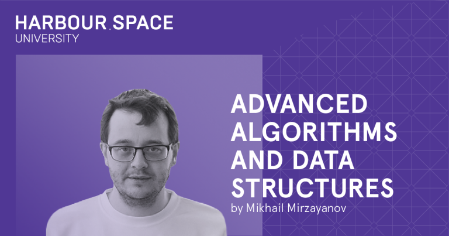

# Announcement

Hello Codeforces!

On [Thursday, October 24, 2019 at 21:05UTC+6](https://codeforces.com/https://www.timeanddate.com/worldclock/fixedtime.html?day=24&month=10&year=2019&hour=18&min=5&sec=0&p1=166) [Educational Codeforces Round 75 (Rated for Div. 2)](https://codeforces.com/contest/1251 "Educational Codeforces Round 75 (Rated for Div. 2)") will start.

Series of Educational Rounds continue being held as [Harbour.Space University](https://codeforces.com/https://harbour.space/) initiative! You can read the details about the cooperation between [Harbour.Space University](https://codeforces.com/https://harbour.space/) and Codeforces in the [blog post](//codeforces.com/blog/entry/51208).

This round will be **rated for the participants with rating lower than 2100**. It will be held on extended ICPC rules. The penalty for each incorrect submission until the submission with a full solution is 10 minutes. After the end of the contest you will have 12 hours to hack any solution you want. You will have access to copy any solution and test it locally.

You will be given **7 problems** and **2 hours** to solve them.

The problems were invented and prepared by Roman [Roms](https://codeforces.com/profile/Roms "Master Roms") Glazov, Adilbek [adedalic](https://codeforces.com/profile/adedalic "International Master adedalic") Dalabaev, Vladimir [vovuh](https://codeforces.com/profile/vovuh "Candidate Master vovuh") Petrov, Ivan [BledDest](https://codeforces.com/profile/BledDest "International Grandmaster BledDest") Androsov, Maksim [Neon](https://codeforces.com/profile/Neon "Candidate Master Neon") Mescheryakov and me. Also huge thanks to Mike [MikeMirzayanov](https://codeforces.com/profile/MikeMirzayanov "Headquarters, MikeMirzayanov") Mirzayanov for great systems Polygon and Codeforces.

Good luck to all the participants!

Our friends at Harbour.Space also have a message for you:

*Hello Codeforces,* 

*We would like to invite all of you to **Mike Mirzayanov's course Advanced Algorithms and Data Structures**, which will take place in Barcelona, from the **6th to 24th of January, 2020**.* 

*The course will consist of three weeks of training, 5 training days each week. The program includes daily lectures and practical exercises. It will be quite educational, insightful and entertaining!*

*And you will have the opportunity to meet and talk with Mike, who will be happy to share his knowledge and stories about the history of Codeforces.* 

*We are happy to offer a special price of **1,000 EUR*** for all Codeforces users.* 

*Register on the page below and we will contact you for the next steps. Hurry up! **Only 10 spots available**.*

** The cost does not include travel or accommodation.*

  [REGISTER HERE→](https://in.harbour.space/data-science/advanced-algorithms-and-data-structures-mikhail-mirzayanov-2020/?utm_source=codeforces&utm_medium=partners) *We would also like to recommend you an article published on our blog last week about the [5 reasons why traditional universities can’t keep up with humanity](https://harbour.space/about/five-reasons-traditional-education-is-not-keeping-up-with-humanity?utm_source=codeforces&utm_medium=partners).* 

**UPD: The start of the round is postponed by 30 minutes.**

Congratulations to the winners: 

| Rank | Competitor | Problems Solved | Penalty |
| --- | --- | --- | --- |
| 1 | [neal](https://codeforces.com/profile/neal "International Grandmaster neal") | 7 | 199 |
| 2 | [Anadi](https://codeforces.com/profile/Anadi "International Grandmaster Anadi") | 7 | 205 |
| 3 | [risujiroh](https://codeforces.com/profile/risujiroh "Grandmaster risujiroh") | 7 | 208 |
| 4 | [imeimi](https://codeforces.com/profile/imeimi "International Grandmaster imeimi") | 7 | 229 |
| 5 | [jiangly](https://codeforces.com/profile/jiangly "Grandmaster jiangly") | 7 | 273 |

96 successful hacks and 196 unsuccessful hacks were made in total!

And finally people who were the first to solve each problem: 

| Problem | Competitor | Penalty |
| --- | --- | --- |
| A | [cxk0707](https://codeforces.com/profile/cxk0707 "Candidate Master cxk0707") | 0:02 |
| B | [wangziji](https://codeforces.com/profile/wangziji "Candidate Master wangziji") | 0:05 |
| C | [Bohun](https://codeforces.com/profile/Bohun "Master Bohun") | 0:06 |
| D | [guyan](https://codeforces.com/profile/guyan "Candidate Master guyan") | 0:16 |
| E1 | [TwentyOneHundredOrBust](https://codeforces.com/profile/TwentyOneHundredOrBust "Master TwentyOneHundredOrBust") | 0:15 |
| E2 | [TwentyOneHundredOrBust](https://codeforces.com/profile/TwentyOneHundredOrBust "Master TwentyOneHundredOrBust") | 0:14 |
| F | [Radewoosh](https://codeforces.com/profile/Radewoosh "Legendary Grandmaster Radewoosh") | 0:19 |

**UPD:** [Editorial is out](Tutorial.md)

