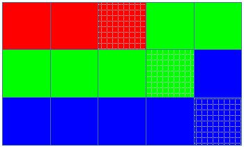
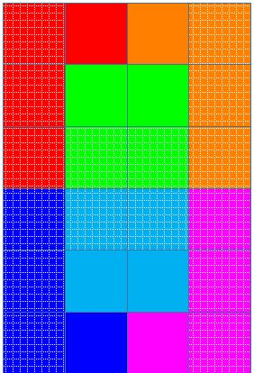
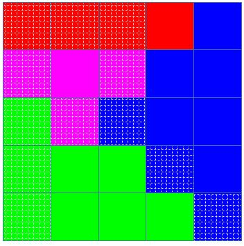

<h1 style='text-align: center;'> A. Feeding Chicken</h1>

<h5 style='text-align: center;'>time limit per test: 1.5 seconds</h5>
<h5 style='text-align: center;'>memory limit per test: 256 megabytes</h5>

Long is a huge fan of CFC (Codeforces Fried Chicken). But the price of CFC is increasing, so he decides to breed the chicken on his own farm.

His farm is presented by a rectangle grid with $r$ rows and $c$ columns. Some of these cells contain rice, others are empty. $k$ chickens are living on his farm. The number of chickens is not greater than the number of cells with rice on the farm.

Long wants to give his chicken playgrounds by assigning these farm cells to his chickens. He would like to satisfy the following requirements:

* Each cell of the farm is assigned to exactly one chicken.
* Each chicken is assigned at least one cell.
* The set of cells assigned to every chicken forms a connected area. More precisely, if two cells $(x, y)$ and $(u, v)$ are assigned to the same chicken, this chicken is able to walk from $(x, y)$ to $(u, v)$ by passing only its cells and moving from each cell to another cell sharing a side.

Long also wants to prevent his chickens from fighting for food. Hence he wants the difference between the maximum and the minimum number of cells with rice assigned to a chicken to be as small as possible. Please help him.

### Input

Each test contains multiple test cases. The first line contains the number of test cases $T$ ($1 \le T \le 2 \cdot 10^4$). Description of the test cases follows.

The first line of each test case contains three integers $r$, $c$ and $k$ ($1 \leq r, c \leq 100, 1 \leq k \leq 62$), representing the size of Long's farm and the number of chickens Long has. 

Each of the next $r$ lines contains $c$ characters, each is either "." or "R", representing an empty cell or a cell with rice. It is guaranteed that the number of chickens is not greater than the number of cells with rice on the farm.

It is guaranteed that the sum of $r \cdot c$ over all test cases does not exceed $2 \cdot 10^4$.

### Output

For each test case, print $r$ lines with $c$ characters on each line. Each character should be either a lowercase English character, an uppercase English character, or a digit. Two characters should be equal if and only if the two corresponding cells are assigned to the same chicken. Uppercase and lowercase characters are considered different, so "A" and "a" belong to two different chickens.

If there are multiple optimal answers, print any.

## Example

### Input


```text
4
3 5 3
..R..
...R.
....R
6 4 6
R..R
R..R
RRRR
RRRR
R..R
R..R
5 5 4
RRR..
R.R..
RRR..
R..R.
R...R
2 31 62
RRRRRRRRRRRRRRRRRRRRRRRRRRRRRRR
RRRRRRRRRRRRRRRRRRRRRRRRRRRRRRR
```
### Output


```text

11122
22223
33333
aacc
aBBc
aBBc
CbbA
CbbA
CCAA
11114
22244
32444
33344
33334
abcdefghijklmnopqrstuvwxyzABCDE
FGHIJKLMNOPQRSTUVWXYZ0123456789
```
## Note

These pictures explain the sample output. Each color represents one chicken. Cells filled with patterns (not solid colors) contain rice.

In the first test case, each chicken has one cell with rice. Hence, the difference between the maximum and the minimum number of cells with rice assigned to a chicken is $0$.



In the second test case, there are $4$ chickens with $3$ cells of rice, and $2$ chickens with $2$ cells of rice. Hence, the difference between the maximum and the minimum number of cells with rice assigned to a chicken is $3 - 2 = 1$.



In the third test case, each chicken has $3$ cells with rice. 

In the last test case, since there are $62$ chicken with exactly $62$ cells of rice, each chicken must be assigned to exactly one cell. The sample output is one of the possible way.


#### Tags 

#1700 #NOT OK #constructive_algorithms #greedy #implementation 

## Blogs
- [All Contest Problems](../Codeforces_Round_601_(Div._1).md)
- [Codeforces Round #601 (en)](../blogs/Codeforces_Round_601_(en).md)
- [Tutorial (en)](../blogs/Tutorial_(en).md)
