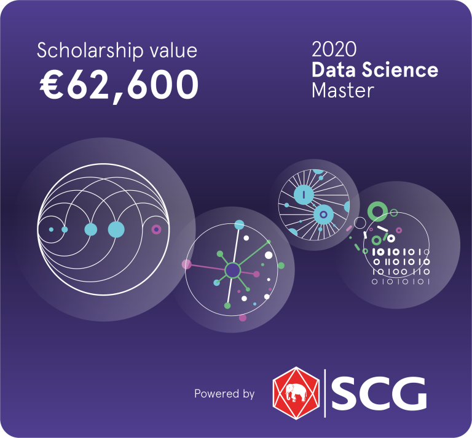

# Announcement

Hello Codeforces!

On [Wednesday, November 13, 2019 at 20:35UTC+6](https://codeforces.com/https://www.timeanddate.com/worldclock/fixedtime.html?day=13&month=11&year=2019&hour=17&min=35&sec=0&p1=166) [Educational Codeforces Round 76 (Rated for Div. 2)](https://codeforces.com/contest/1257 "Educational Codeforces Round 76 (Rated for Div. 2)") will start.

Series of Educational Rounds continue being held as [Harbour.Space University](https://codeforces.com/https://harbour.space/) initiative! You can read the details about the cooperation between [Harbour.Space University](https://codeforces.com/https://harbour.space/) and Codeforces in the [blog post](//codeforces.com/blog/entry/51208).

This round will be **rated for the participants with rating lower than 2100**. It will be held on extended ICPC rules. The penalty for each incorrect submission until the submission with a full solution is 10 minutes. After the end of the contest you will have 12 hours to hack any solution you want. You will have access to copy any solution and test it locally.

You will be given **7 problems** and **2 hours** to solve them.

The problems were invented and prepared by Roman [Roms](https://codeforces.com/profile/Roms "Master Roms") Glazov, Adilbek [adedalic](https://codeforces.com/profile/adedalic "International Master adedalic") Dalabaev, Vladimir [vovuh](https://codeforces.com/profile/vovuh "Candidate Master vovuh") Petrov, Ivan [BledDest](https://codeforces.com/profile/BledDest "International Grandmaster BledDest") Androsov, Maksim [Neon](https://codeforces.com/profile/Neon "Candidate Master Neon") Mescheryakov and me. Also huge thanks to Mike [MikeMirzayanov](https://codeforces.com/profile/MikeMirzayanov "Headquarters, MikeMirzayanov") Mirzayanov for great systems Polygon and Codeforces.

Good luck to all the participants!

Our friends at Harbour.Space also have a message for you:

**Attention Codeforces!** 

*Calling on all tech disruptors, data specialists and computer science pioneers.  
We are offering **fully-funded international scholarships** for exceptional tech specialists from around the world. Accelerate your career by becoming an industry expert capable of making key data-driven decisions that add value and drive innovation within tech industries.* 

***Harbour.Space University** has partnered with **SCG**, a leading business conglomerate in the ASEAN region, to offer exceptional tech specialists the opportunity to work and study in two of the most dynamic and vibrant cities in the world. **Join our progressive two-year program based in Bangkok, with 6 of the 24 months in Barcelona**, to develop the international mindset needed to accelerate your career and redefine how data drives the businesses of the future.*

**Tuition fee:**

*2 years | €45,800*

**Education:**

*3 hours of study per day | 15h per week* 

**Work Experience:**

*4 hours of internship per day at SCG | 20h per week*

**Living Allowance:**

*€16,800 euros | €700 per month living allowance*

  

  [APPLY HERE→](https://in.harbour.space/bangkok-data-science-scholarship/?utm_source=codeforces&utm_medium=partners) Congratulations to the winners: 

| Rank | Competitor | Problems Solved | Penalty |
| --- | --- | --- | --- |
| 1 | [neal](https://codeforces.com/profile/neal "International Grandmaster neal") | 7 | 182 |
| 2 | [kmjp](https://codeforces.com/profile/kmjp "International Grandmaster kmjp") | 7 | 216 |
| 3 | [saketh](https://codeforces.com/profile/saketh "Grandmaster saketh") | 7 | 218 |
| 4 | [KrK](https://codeforces.com/profile/KrK "International Grandmaster KrK") | 7 | 225 |
| 5 | [ivan100sic](https://codeforces.com/profile/ivan100sic "Grandmaster ivan100sic") | 7 | 244 |
| 5 | [pwild](https://codeforces.com/profile/pwild "Grandmaster pwild") | 7 | 244 |

Congratulations to the best hackers: 

| Rank | Competitor | Hack Count |
| --- | --- | --- |
| 1 | [Decayed](https://codeforces.com/profile/Decayed "Specialist Decayed") | **39****:-10** |
| 2 | [liouzhou_101](https://codeforces.com/profile/liouzhou_101 "Grandmaster liouzhou_101") | **59****:-58** |
| 3 | [dzhiblavi](https://codeforces.com/profile/dzhiblavi "Expert dzhiblavi") | **15** |
| 4 | [Rian_5900](https://codeforces.com/profile/Rian_5900 "Specialist Rian_5900") | **31****:-40** |
| 5 | [Fyodor](https://codeforces.com/profile/Fyodor "Specialist Fyodor") | **10****:-2** |

 278 successful hacks and 501 unsuccessful hacks were made in total!And finally people who were the first to solve each problem: 

| Problem | Competitor | Penalty |
| --- | --- | --- |
| A | [amnesiac_dusk](https://codeforces.com/profile/amnesiac_dusk "Grandmaster amnesiac_dusk") | 0:00 |
| B | [Siberian](https://codeforces.com/profile/Siberian "Master Siberian") | 0:02 |
| C | [Bohun](https://codeforces.com/profile/Bohun "Master Bohun") | 0:03 |
| D | [LJC00118](https://codeforces.com/profile/LJC00118 "International Grandmaster LJC00118") | 0:16 |
| E | [jjang36524](https://codeforces.com/profile/jjang36524 "Expert jjang36524") | 0:23 |
| F | [TripleM5da](https://codeforces.com/profile/TripleM5da "Grandmaster TripleM5da") | 0:19 |
| G | [black_horse2014](https://codeforces.com/profile/black_horse2014 "International Grandmaster black_horse2014") | 0:19 |

**UPD:** [Editorial is out](//codeforces.comTutorial.md)

