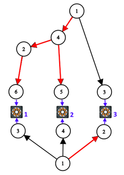
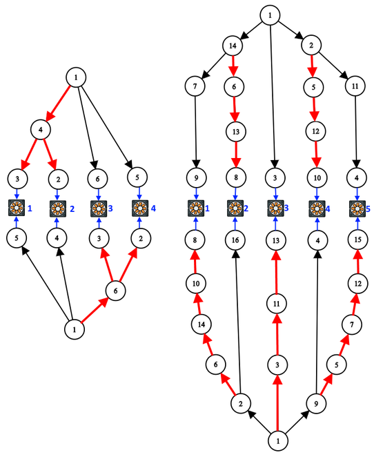

<h1 style='text-align: center;'> F. Economic Difficulties</h1>

<h5 style='text-align: center;'>time limit per test: 3 seconds</h5>
<h5 style='text-align: center;'>memory limit per test: 256 megabytes</h5>

An electrical grid in Berland palaces consists of 2 grids: main and reserve. Wires in palaces are made of expensive material, so selling some of them would be a good idea!

Each grid (main and reserve) has a head node (its number is $1$). Every other node gets electricity from the head node. Each node can be reached from the head node by a unique path. Also, both grids have exactly $n$ nodes, which do not spread electricity further.

In other words, every grid is a rooted directed tree on $n$ leaves with a root in the node, which number is $1$. Each tree has independent enumeration and nodes from one grid are not connected with nodes of another grid.

Also, the palace has $n$ electrical devices. Each device is connected with one node of the main grid and with one node of the reserve grid. Devices connect only with nodes, from which electricity is not spread further (these nodes are the tree's leaves). Each grid's leaf is connected with exactly one device.

  In this example the main grid contains $6$ nodes (the top tree) and the reserve grid contains $4$ nodes (the lower tree). There are $3$ devices with numbers colored in blue. It is guaranteed that the whole grid (two grids and $n$ devices) can be shown in this way (like in the picture above):

* main grid is a top tree, whose wires are directed 'from the top to the down',
* reserve grid is a lower tree, whose wires are directed 'from the down to the top',
* devices — horizontal row between two grids, which are numbered from $1$ to $n$ from the left to the right,
* wires between nodes do not intersect.

Formally, for each tree exists a depth-first search from the node with number $1$, that visits leaves in order of connection to devices $1, 2, \dots, n$ (firstly, the node, that is connected to the device $1$, then the node, that is connected to the device $2$, etc.).

Businessman wants to sell (remove) maximal amount of wires so that each device will be powered from at least one grid (main or reserve). In other words, for each device should exist at least one path to the head node (in the main grid or the reserve grid), which contains only nodes from one grid.

##### Input

The first line contains an integer $n$ ($1 \le n \le 1000$) — the number of devices in the palace.

The next line contains an integer $a$ ($1 + n \le a \le 1000 + n$) — the amount of nodes in the main grid.

Next line contains $a - 1$ integers $p_i$ ($1 \le p_i \le a$). Each integer $p_i$ means that the main grid contains a wire from $p_i$-th node to $(i + 1)$-th.

The next line contains $n$ integers $x_i$ ($1 \le x_i \le a$) — the number of a node in the main grid that is connected to the $i$-th device.

The next line contains an integer $b$ ($1 + n \le b \le 1000 + n$) — the amount of nodes in the reserve grid.

Next line contains $b - 1$ integers $q_i$ ($1 \le q_i \le b$). Each integer $q_i$ means that the reserve grid contains a wire from $q_i$-th node to $(i + 1)$-th.

The next line contains $n$ integers $y_i$ ($1 \le y_i \le b$) — the number of a node in the reserve grid that is connected to the $i$-th device.

It is guaranteed that each grid is a tree, which has exactly $n$ leaves and each leaf is connected with one device. Also, it is guaranteed, that for each tree exists a depth-first search from the node $1$, that visits leaves in order of connection to devices.

##### Output

Print a single integer — the maximal amount of wires that can be cut so that each device is powered.

## Examples

##### Input


```text
3
6
4 1 1 4 2
6 5 3
4
1 1 1
3 4 2
```
##### Output


```text
5
```
##### Input


```text
4
6
4 4 1 1 1
3 2 6 5
6
6 6 1 1 1
5 4 3 2
```
##### Output


```text
6
```
##### Input


```text
5
14
1 1 11 2 14 14 13 7 12 2 5 6 1
9 8 3 10 4
16
1 1 9 9 2 5 10 1 14 3 7 11 6 12 2
8 16 13 4 15
```
##### Output


```text
17
```
## Note

For the first example, the picture below shows one of the possible solutions (wires that can be removed are marked in red):

  The second and the third examples can be seen below:

  

#### Tags 

#2400 #NOT OK #data_structures #dfs_and_similar #dp #flows #graphs #trees 

## Blogs
- [All Contest Problems](../Codeforces_Round_603_(Div._2).md)
- [Announcement](../blogs/Announcement.md)
- [Tutorial #1 (en)](../blogs/Tutorial_1_(en).md)
- [Tutorial #2 (ru)](../blogs/Tutorial_2_(ru).md)
