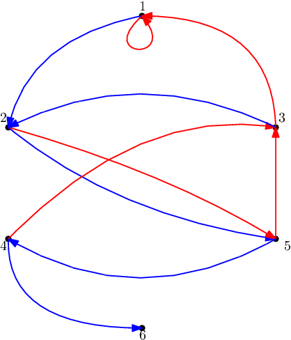

<h1 style='text-align: center;'> H. Red-Blue Graph</h1>

<h5 style='text-align: center;'>time limit per test: 4 seconds</h5>
<h5 style='text-align: center;'>memory limit per test: 512 megabytes</h5>

There is a directed graph on $n$ vertices numbered $1$ through $n$ where each vertex (except $n$) has two outgoing arcs, red and blue. At any point in time, exactly one of the arcs is active for each vertex. Initially, all blue arcs are active and there is a token located at vertex $1$. In one second, the vertex with token first switches its active arcs — the inactive arc becomes active and vice versa. Then, the token is moved along the active arc. When the token reaches the vertex $n$, it stops. It is guaranteed that $n$ is reachable via arcs from every vertex.

You are given $q$ queries. Each query contains a state of the graph — a pair $(v, s)$ of the following form: 

* $v$ is the vertex where the token is currently located;
* $s$ is a string consisting of $n - 1$ characters. The $i$-th character corresponds to the color of the active edge leading from the $i$-th vertex (the character is 'R' if red arc is active, otherwise the character is 'B').

For each query, determine whether the given state is reachable from the initial state and the first time this configuration appears. 
## Note

 that the two operations (change active arc and traverse it) are atomic — a state is not considered reached if it appears after changing the active arc but before traversing it.

### Input

The first line contains a single integer $n$ ($2 \leq n \leq 58$) — the number of vertices.

$n-1$ lines follow, $i$-th of contains two space separated integers $b_i$ and $r_i$ ($1 \leq b_i, r_i \leq n$) representing a blue arc $(i, b_i)$ and red arc $(i, r_i)$, respectively. It is guaranteed that vertex $n$ is reachable from every vertex.

The next line contains a single integer $q$ ($1 \leq q \leq 5000$) — the number of queries.

Then $q$ lines with queries follow. The $j$-th of these lines contains an integer $v$ ($1 \leq v < n$) and a string $s$ of length $n-1$ consiting only of characters 'R' and 'B'. The $i$-th of these characters is 'R' if the red arc going from $i$ is active and 'B' otherwise.

### Output

### Output

 $q$ lines, each containing answer to a single query.

If the state in the $i$-th query is unreachable, output the integer $-1$. Otherwise, output $t_i$ — the first time when the state appears (measured in seconds, starting from the initial state of the graph which appears in time $0$).

## Example

### Input


```text
6
2 1
5 5
2 1
6 3
4 3
21
1 BBBBB
1 RBBBB
2 BBBBB
5 BRBBB
3 BRBBR
1 BRRBR
1 RRRBR
2 BRRBR
5 BBRBR
4 BBRBB
3 BBRRB
2 BBBRB
5 BRBRB
3 BRBRR
1 BRRRR
1 RRRRR
2 BRRRR
5 BBRRR
4 BBRRB
2 BRBBB
4 BRBBR
```
### Output


```text
0
1
2
3
4
5
6
7
8
9
10
11
12
13
14
15
16
17
18
-1
-1
```
## Note

The graph in the first example is depticed in the figure below.



The first $19$ queries denote the journey of the token. On the $19$-th move the token would reach the vertex $6$. The last two queries show states that are unreachable.


#### Tags 

#3400 #NOT OK #dp #graphs #math #matrices #meet-in-the-middle 

## Blogs
- [All Contest Problems](../Codeforces_Global_Round_6.md)
- [A (en)](../blogs/A_(en).md)
- [Tutorial (en)](../blogs/Tutorial_(en).md)
