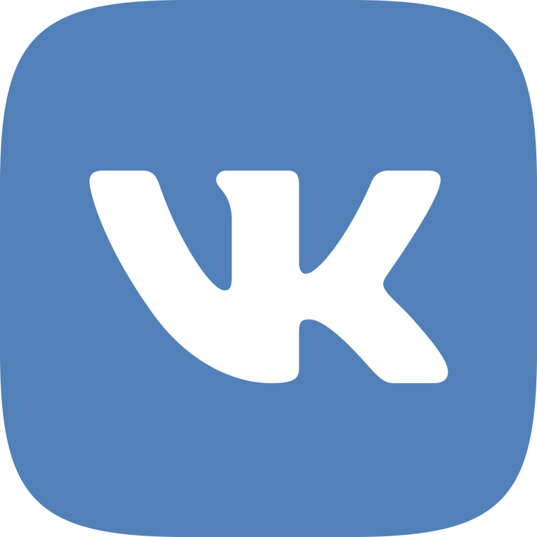

# Announcement_(en)

Hello friends!

[ICPCLive broadcast](https://codeforces.com/https://youtu.be/ZuzBPpBy-sE)

[Standings](https://codeforces.com/http://nerc.itmo.ru/archive/2019/standings.html)

[Problems](https://codeforces.com/http://nerc.itmo.ru/archive/2019/nerc-2019-statement.pdf)

This weekend we'll hold two large-scale final stages of important Championships in the region: ICPC Northern Eurasia Finals 2019 and Russia Open High School Team Programming Contest.

Competitions are traditionally held at several places: in St. Petersburg, Barnaul, Almaty, Tbilisi and Kremenchuk. School teams will fight for the "Champions of Russia" Cup. Student teams will meet in a serious intellectual fight for places to the ICPC 2020 World Finals, which will be held on June 25 in Moscow. This is going to be the third final organized in our region.

Of course, join [ICPCLive](https://codeforces.com/http://twitch.tv/icpclive_ru) broadcasts for live-streaming from both events. Live streams are expected from the opening of the championship, both contests, and closing ceremonies.

**UPD:** Congratulations to teams of ICPC 2020 finalists!

 * SPb SU: 25 (Belichenko, Bykov, Petrov)
* Nizhny Novgorod SU: Almost Retired (Daniliuk, Kalinin, Ryabchikova)
* MIPT: Godnotent (Belykh, Golovanov, Sergunin)
* SPb ITMO: 1 Standard deviation (Budin, Kirillov, Sayutin)
* Innopolis: 1 (Gaivoronskiy, Khakimiyon, Yalalov)
* HSE: Logarifmya4ka (Anoprenko, Romanov, Safonov)
* Belarusian SU: #1 (Dubovik, Karabeinikau, Kernazhytski)
* Latvia: 2 (Civkulis, Zajakins, Zajakins)
* Moscow SU: NoNames (Chunaev, Kalendarov, Koshelev)
* SPb HSE: Last Hope (Bogomolov, Labutin, Podguzov)
* Saratov SU: 1 (Meshcheryakov, Petrov, Piklyaev)
* Belarusian NTU: #1: Great team (Sheftelevich, Vasileuski, Zdanovich)
* Kazan FU: 2 (Ilikayev, Kapralov, Yagafarov)
* Yerevan SU: One Last Dance (Galstyan, Muradyan, Mikaelyan)
* International IT University: 2 (Kuanyshbay, Niyazbekov, Khlinovskiy)
* Belarusian SUIR: #2 (Shavel, Udovin, Vishneuski)

ROHSTPC
-------

269 teams were invited to participate in the final stage of the competition. 128 of them will meet in Saint Petersburg in the historical park "Russia — is my history". 49 teams will compete in Barnaul, 56 teams — in Almaty and 18 teams will take part in the competition in Tbilisi and Kremenchuk.

The main round of the championship will begin this Saturday (30 November) at 10:00. As the tour starts, we'll add links for you to monitor results.

Some teams that have high chances of becoming Cup winners are listed in the table below: 

 

| Team | City | Participant 1 | Participant 2 | Participant 3 | Rating |
| --- | --- | --- | --- | --- | --- |
| Power of Three | St.Petersburg | Ефремов Андрей[receed](https://codeforces.com/profile/receed "International Grandmaster receed") | Гайнуллин Ильдар[300iq](https://codeforces.com/profile/300iq "Legendary Grandmaster 300iq") | Одинцов Андрей[forestryks](https://codeforces.com/profile/forestryks "Master forestryks") | 8110 |
| Mex Foundation | Moscow | Лифарь Егор[Egor.Lifar](https://codeforces.com/profile/Egor.Lifar "Grandmaster Egor.Lifar") | Савкин Семён[cookiedoth](https://codeforces.com/profile/cookiedoth "International Grandmaster cookiedoth") | Шеховцов Александр[Jatana](https://codeforces.com/profile/Jatana "International Master Jatana") | 7657 |
| Graneli | Tbilisi | Birkadze Nika[saba2000](https://codeforces.com/profile/saba2000 "International Grandmaster saba2000") | Toloraia Teimuraz[Temotoloraia](https://codeforces.com/profile/Temotoloraia "Grandmaster Temotoloraia") | Basadzishvili Archil[achi_basadzishvili](https://codeforces.com/profile/achi_basadzishvili "Master achi_basadzishvili") | 7271 |
| а) | Moscow | Ушаков Фёдор[----------](https://codeforces.com/profile/---------- "Master ----------") | Федосеев Тимофей[fedoseev.timofey](https://codeforces.com/profile/fedoseev.timofey "International Grandmaster fedoseev.timofey") | Пискалов Дмитрий[TheWayISteppedOutTheCar](https://codeforces.com/profile/TheWayISteppedOutTheCar "Master TheWayISteppedOutTheCar") | 7189 |
| Ого! Кажетсья это $#@! | Moscow | Логинов Игорь[IgorI](https://codeforces.com/profile/IgorI "Master IgorI") | Шуклин Максим[xoxo](https://codeforces.com/profile/xoxo "Grandmaster xoxo") | Садовничий Антон[sadovan](https://codeforces.com/profile/sadovan "International Master sadovan") | 7092 |
| Преимущественно овощи | Kazan | Миннахметов Булат[Minnakhmetov](https://codeforces.com/profile/Minnakhmetov "International Master Minnakhmetov") | Харисов Булат[Nutella3000](https://codeforces.com/profile/Nutella3000 "Master Nutella3000") | Исмагилов Азат[ismagilov.code](https://codeforces.com/profile/ismagilov.code "International Master ismagilov.code") | 6912 |

More teams with their total ratings you can see in the [post](https://codeforces.com/blog/entry/71603). Thank you very much, [ismagilov.code](https://codeforces.com/profile/ismagilov.code "International Master ismagilov.code")!

Northern Eurasia Finals
-----------------------

Student competitions will start this Sunday, December 1 at 9:30(Moscow time) at four sites: the historical Park in St. Petersburg, the Altai state technical University in Barnaul, the Georgian University of Business and Technology in Tbilisi and the Kazakh-British Technical University in Almaty.

Links to the results table, as well as the tasks of the contest will be provided soon after the start of the main round of the competition.

If you don't plan to participate in the semifinals, you can try your hand at the challenges of the Northern Eurasia finals in the [mirror](https://codeforces.com/contests/1267). 

We're going to follow the teams and tell you about the news! Note that the results of this contest dictates which teams will be selected to represent the North Eurasia Region on World Finals ICPC 2020.

Some teams with their total ratings, which we're going to follow especially closely listed in a table below:

 

| Team | Participant 1 | Participant 2 | Participant 3 | Rating |
| --- | --- | --- | --- | --- |
| SPb ITMO: 1 Standard deviation | Николай Будин[budalnik](https://codeforces.com/profile/budalnik "International Grandmaster budalnik") | Дмитрий Саютин[cdkrot](https://codeforces.com/profile/cdkrot "International Grandmaster cdkrot") | Арсений Кириллов[craborac](https://codeforces.com/profile/craborac "International Grandmaster craborac") | 8122 |
| MIPT: Godnotent | Александр Голованов[Golovanov399](https://codeforces.com/profile/Golovanov399 "International Grandmaster Golovanov399") | Евгений Белых[WHITE2302](https://codeforces.com/profile/WHITE2302 "Grandmaster WHITE2302") | Андрей Сергунин[AndreySergunin](https://codeforces.com/profile/AndreySergunin "International Grandmaster AndreySergunin") | 8032 |
| Moscow IPT: Fennecs | Дмитрий Григорьев[gop2024](https://codeforces.com/profile/gop2024 "International Grandmaster gop2024") | Николай Третьяков[ShadowLight](https://codeforces.com/profile/ShadowLight "Grandmaster ShadowLight") | Денис Шпаковский[Denisson](https://codeforces.com/profile/Denisson "International Grandmaster Denisson") | 7938 |
|
| NN SU: Almost Retired | Алексей Данилюк[Um_nik](https://codeforces.com/profile/Um_nik "Legendary Grandmaster Um_nik") | Николай Калинин[KAN](https://codeforces.com/profile/KAN "Grandmaster KAN") | Валерия Рябчикова[Ekler](https://codeforces.com/profile/Ekler "Candidate Master Ekler") | 7759 |
| "Belarusian SU: Belarusian SU #1" | Егор Дубовик[244mhq](https://codeforces.com/profile/244mhq "International Grandmaster 244mhq") | Александр Керножицкий[gepardo](https://codeforces.com/profile/gepardo "International Grandmaster gepardo") | Федор Коробейников[Mediocrity](https://codeforces.com/profile/Mediocrity "Master Mediocrity") | 7607 |
| HSE: Logarifmya4ka | Владимир Романов[voidmax](https://codeforces.com/profile/voidmax "International Grandmaster voidmax") | Михаил Анопренко[manoprenko](https://codeforces.com/profile/manoprenko "Master manoprenko") | Иван Сафонов[isaf27](https://codeforces.com/profile/isaf27 "International Grandmaster isaf27") | 7562 |
| SPb SU: Havka — ne papstvo | Егор Горбачев[peltorator](https://codeforces.com/profile/peltorator "Grandmaster peltorator") | Михаил Иванов[orz](https://codeforces.com/profile/orz "Grandmaster orz") | Савелий Григорьев[sava-cska](https://codeforces.com/profile/sava-cska "Grandmaster sava-cska") | 7438 |
| SPb SU 25 | Дмитрий Беличенко[Dmitriy.Belichenko](https://codeforces.com/profile/Dmitriy.Belichenko "International Grandmaster Dmitriy.Belichenko") | Никита Быков[anta.baka](https://codeforces.com/profile/anta.baka "International Master anta.baka") | Семен Петров[Semenar](https://codeforces.com/profile/Semenar "International Master Semenar") | 7369 |
| SPb SU: LOUD Enough | Никита Гаевой[nikgaevoy](https://codeforces.com/profile/nikgaevoy "International Master nikgaevoy") | Иван Бочков[tranquility](https://codeforces.com/profile/tranquility "Master tranquility") | Владислав Макаров[Kaban-5](https://codeforces.com/profile/Kaban-5 "Grandmaster Kaban-5") | 7075 |

Share with us your news, impressions, and photos with hashtags #NEF and #ВКОШП.

    

