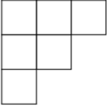

# Tutorial_(en)

### [1269A - Equation](../problems/A._Equation.md "Codeforces Round 609 (Div. 2)")

Print $9n$ and $8n$. 

 
### [1269B - Modulo Equality](../problems/B._Modulo_Equality.md "Codeforces Round 609 (Div. 2)")

There exists some $i$, such that $(a_i + x) \bmod m = b_1$. Let's enumerate it, then $x$ is $(b_1 - a_i) \bmod m$. Like that you can get $O(n)$ candidates, each of them can be checked in $O(n \log n)$ with sort or in $O(n)$ if you will note that the order is just cyclically shifting.

Also, this problem can be solved in $O(n)$ with some string matching algorithms, I will leave it as a bonus.

 
### [1269C - Long Beautiful Integer](https://codeforces.com/contest/1269/problem/C "Codeforces Round 609 (Div. 2)")

At first, let's set $a_i=a_{i-k}$ for all $i>k$.

If it is at least the initial $a$, then you can print it as the answer.

Otherwise, Let's find the last non-nine digit among the first $k$, increase it by one, and change all $9$'s on the segment from it to $k$-th character to $0$.

After that, again set $a_i = a_{i-k}$ for all $i>k$.

Then, you can print it as the answer.

 
### [1269D - Domino for Young](https://codeforces.com/contest/1269/problem/D "Codeforces Round 609 (Div. 2)")

Let's color diagram into two colors as a chessboard.

I claim that the Young diagram can be partitioned into domino if and only if the number of white cells inside it is equal to the number of black cells inside it.

If the Young diagram has two equal rows (or columns) you can delete one domino, and the diagram will still have an equal number of white and black cells. 

If all rows and columns are different, it means that the Young diagram is a "basic" diagram, i.e have lengths of columns $1, 2, \ldots, n$.

 

But in a "basic" diagram the number of white and black cells is different! So, we have a contradiction!

But what if the number of black and white cells are not the same?

 I claim that the answer is $\min($ the number of white cells, the number of black cells $)$.

Just because if you have more white cells (case with more black case is symmetrical), and there are no equal rows and columns, you can take the first column with more white cells than black cells and delete the last cell of this column, in the end, you will have a Young diagram with an equal number of black and white cells, so you can find the answer by algorithm described below.

 
### [1269E - K Integers](https://codeforces.com/contest/1269/problem/E "Codeforces Round 609 (Div. 2)")

At first, let's add to the answer number of inversions among numbers $1,2,\ldots,k$.

After that, let's say that $x \leq k$ is one, and $x > k$ is zero.

Then you need to calculate the smallest number of swaps to make segment $1,1,\ldots,1$ of length $k$ appear in the permutation. 

For this, let's call $p_i$ the number of ones on the prefix.

For all $s_i=0$ we need to add $\min{(p_i, k - p_i)}$ to the answer (it is an obvious lower bound, and it is simple to prove that we always can do one operation to reduce this total value by one).

How to calculate this for each $k$? 

Let's move $k$ from $1$ to $n$. You can maintain number of inversions with BIT. To calculate the second value, you can note that you just need to find $\frac{k}{2}$-th number $\leq k$ and add values at the left and add the right with different coefficients. To maintain them, you can recalculate everything when you are moving the median (in heap). But also it is possible to maintain the segment tree by $p_i$ and just take some sum.

 
### [1268D - Invertation in Tournament](https://codeforces.com/contest/1268/problem/D "Codeforces Round 609 (Div. 1)")

Lemma: for $n>6$ it is always possible to invert one vertex.

* Start by proving that for $n \geq 4$ in the strongly connected tournament it is possible to invert one vertex so it will remain strongly connected, it is possible by induction.
* If there is a big SCC (with at least four vertices), invert good vertex in it.
* If there are at least three strongly connected components, invert random vertex in the middle one.
* If there are two SCCs, then all of them have size $\leq 3$, so the number of vertices is $\leq 6$.

So you can check each vertex in $O(\frac{n^2}{32})$ with bitset. But also it is possible to check that tournament is strongly connected by degree sequence in $O(n)$. For this, you can note that the degree of each vertex in the rightest SCC is smaller than degrees of all other vertices. So in the sorted by degree order you can check for the prefix of length $k$, that the number of edges outgoing from them (sum of degrees) is $\frac{k(k-1)}{2}+k(n-k)$ if there exists $k<n$ which satisfy this constraint, then it is simple to prove that the graph is not strongly connected.

So, you can solve this problem in $O(n^2)$ or in $O(\frac{n^3}{32})$.

 
### [1268E - Happy Cactus](https://codeforces.com/contest/1268/problem/E "Codeforces Round 609 (Div. 1)")

At first, let's solve for the tree. Let $dp_v$ be the number of answer for vertex $v$.

Let's look at edges in the order of decreasing weight.

How $dp$ is changing when you are looking at edge $i$?

I claim that $dp'_v = dp_v$ for $v \neq a_i $and $v \neq b_i$.

And $dp'_{a_i} = dp'_{b_i} = dp_{a_i} + dp_{b_i}$.

Why? I like this thinking about this problem: in each vertex sitting a rat, initially $i$-th rat is infected by $i$-th type of infection. After that, rats $a_m$ and $b_m$, $a_{m-1}$ and $b_{m-1}$, ..., $a_1$ and $b_1$ bite each other. When two rats bite each other, they have a union of their infections.

I claim that the number of infections of $i$-th vertex, in the end, is equal to the required value.

So on the tree, it is easy to see that the infections are not intersecting when two rats bite each other, so they just change the number to sum.

But on the cactus, they may have some non-empty intersection.

Now, it is easy to see that:

* Let's say that $f_i$ is equal to the number of infections of $a_i$ (same as the number of infections of $b_i$) after the moment when you meet this edge.
* Similar to the tree case, when $i$-th edge connects different connected components, $f_i$ is just equal to the sum of the number of infections.
* When $i$-th edge connects same connected components, $f_i$ is equal to the sum of the number of infections (let's call this value $x$). Or $f_i$ is equal to $x - f_e$ where $e$ is some edge on the path between $a_i$ and $b_i$ (note that it is a cactus, so this path is unique).
* This $e$ is always the largest edge on the path, and it is subtracted if and only if the path from it to $a_i$ and from it to $b_i$ is decreasing.

So, we can solve the problem in $O(n+m)$.

