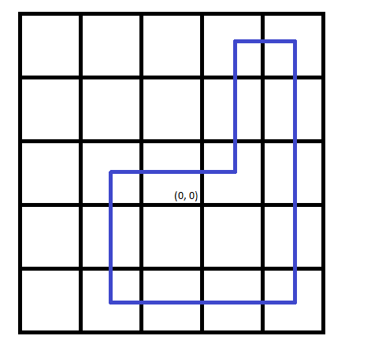

<h1 style='text-align: center;'> B. Snow Walking Robot</h1>

<h5 style='text-align: center;'>time limit per test: 2 seconds</h5>
<h5 style='text-align: center;'>memory limit per test: 256 megabytes</h5>

Recently you have bought a snow walking robot and brought it home. Suppose your home is a cell $(0, 0)$ on an infinite grid.

You also have the sequence of instructions of this robot. It is written as the string $s$ consisting of characters 'L', 'R', 'U' and 'D'. If the robot is in the cell $(x, y)$ right now, he can move to one of the adjacent cells (depending on the current instruction).

* If the current instruction is 'L', then the robot can move to the left to $(x - 1, y)$;
* if the current instruction is 'R', then the robot can move to the right to $(x + 1, y)$;
* if the current instruction is 'U', then the robot can move to the top to $(x, y + 1)$;
* if the current instruction is 'D', then the robot can move to the bottom to $(x, y - 1)$.

You've noticed the warning on the last page of the manual: if the robot visits some cell (except $(0, 0)$) twice then it breaks.

So the sequence of instructions is valid if the robot starts in the cell $(0, 0)$, performs the given instructions, visits no cell other than $(0, 0)$ two or more times and ends the path in the cell $(0, 0)$. Also cell $(0, 0)$ should be visited at most two times: at the beginning and at the end (if the path is empty then it is visited only once). For example, the following sequences of instructions are considered valid: "UD", "RL", "UUURULLDDDDLDDRRUU", and the following are considered invalid: "U" (the endpoint is not $(0, 0)$) and "UUDD" (the cell $(0, 1)$ is visited twice).

The initial sequence of instructions, however, might be not valid. You don't want your robot to break so you decided to reprogram it in the following way: you will remove some (possibly, all or none) instructions from the initial sequence of instructions, then rearrange the remaining instructions as you wish and turn on your robot to move. 

Your task is to remove as few instructions from the initial sequence as possible and rearrange the remaining ones so that the sequence is valid. Report the valid sequence of the maximum length you can obtain.

## Note

 that you can choose any order of remaining instructions (you don't need to minimize the number of swaps or any other similar metric).

You have to answer $q$ independent test cases.

### Input

The first line of the input contains one integer $q$ ($1 \le q \le 2 \cdot 10^4$) — the number of test cases.

The next $q$ lines contain test cases. The $i$-th test case is given as the string $s$ consisting of at least $1$ and no more than $10^5$ characters 'L', 'R', 'U' and 'D' — the initial sequence of instructions.

It is guaranteed that the sum of $|s|$ (where $|s|$ is the length of $s$) does not exceed $10^5$ over all test cases ($\sum |s| \le 10^5$).

### Output

For each test case print the answer on it. In the first line print the maximum number of remaining instructions. In the second line print the valid sequence of remaining instructions $t$ the robot has to perform. The moves are performed from left to right in the order of the printed sequence. If there are several answers, you can print any. If the answer is $0$, you are allowed to print an empty line (but you can don't print it).

## Example

### Input


```text
6
LRU
DURLDRUDRULRDURDDL
LRUDDLRUDRUL
LLLLRRRR
URDUR
LLL
```
### Output


```text
2
LR
14
RUURDDDDLLLUUR
12
ULDDDRRRUULL
2
LR
2
UD
0

```
## Note

There are only two possible answers in the first test case: "LR" and "RL".

The picture corresponding to the second test case:

  
## Note

 that the direction of traverse does not matter Another correct answer to the third test case: "URDDLLLUURDR".


#### Tags 

#1200 #NOT OK #constructive_algorithms #greedy #implementation 

## Blogs
- [All Contest Problems](../Codeforces_Round_605_(Div._3).md)
- [Announcement](../blogs/Announcement.md)
- [Tutorial](../blogs/Tutorial.md)
