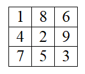
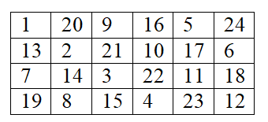

# Tutorial

Many thanks to [cannor147](https://codeforces.com/profile/cannor147 "Specialist cannor147") and [geranazavr555](https://codeforces.com/profile/geranazavr555 "Expert geranazavr555") for the help with the translation into English.

##### [1259A - Happy Birthday, Polycarp!](https://codeforces.com/contest/1259/problem/A "Technocup 2020 - Elimination Round 4")

Problem Writer: [MikeMirzayanov](https://codeforces.com/profile/MikeMirzayanov "Headquarters, MikeMirzayanov")

 **Editorial**
### [1259A - Happy Birthday, Polycarp!](https://codeforces.com/contest/1259/problem/A "Technocup 2020 - Elimination Round 4")

It seems that one of the easiest ways to solve this problem is to iterate over all beautiful numbers up to 109 and check each of the numbers to ensure that it does not exceed n. First of all, you can iterate over a length from 1 to 8, supporting a number of the form 11...1 of this length, and inside iterate over a factor for this number from 1 to 9. The main part of a solution might look like this:


```cpp
cin >> n;  
int b = 0, ans = 0;  
for (int len = 1; len <= 9; len++) {  
    b = b * 10 + 1;              
    for (int m = 1; m <= 9; m++)  
        if (b * m <= n)  
            ans++;  
}  
cout << ans << endl;  

```
##### [1259B - Make Them Odd](https://codeforces.com/contest/1259/problem/B "Technocup 2020 - Elimination Round 4")

Problem Writer: [MikeMirzayanov](https://codeforces.com/profile/MikeMirzayanov "Headquarters, MikeMirzayanov")

 **Editorial**
### [1259B - Make Them Odd](https://codeforces.com/contest/1259/problem/B "Technocup 2020 - Elimination Round 4")

Consider the greatest positive value in the set. Anyway, once we will divide it by two. It is always optimal to do it on the first move because the result of the division can be divided again (if needed) later.

So, the optimal way to solve this problem is: as long as there is at least one even value in the set, we need to choose the maximal even number in the set and divide all the numbers equal to it by 2.

For effective implementation, you can use features of the standard library to represent the set as std::set (for C++, in other languages there are alternatives of this data structure or you can modify the solution).

Below is an example of a possible implementation of the main part of the solution:


```cpp
cin >> n;  
set<int> a;  
for (int i = 0; i < n; i++) {  
    int elem;  
    cin >> elem;  
    a.insert(elem);  
}  
int result = 0;  
while (!a.empty()) {  
    int m = *a.rbegin();  
    a.erase(m);  
    if (m % 2 == 0) {  
        result++;  
        a.insert(m / 2);  
    }  
}  
cout << result << endl;  

```
##### [1259C - As Simple as One and Two](https://codeforces.com/contest/1259/problem/C "Technocup 2020 - Elimination Round 4")

Problem Writer: [MikeMirzayanov](https://codeforces.com/profile/MikeMirzayanov "Headquarters, MikeMirzayanov")

 **Editorial**
### [1259C - As Simple as One and Two](https://codeforces.com/contest/1259/problem/C "Technocup 2020 - Elimination Round 4")

Consider each occurrence of substrings one and two. Obviously, at least one character have to be deleted in such substrings. These substrings cannot intersect in any way, except for one case: twone. Thus, the answer is necessarily no less than the value c21+c1+c2, where c21 is the number of occurrences of the string twone and c1 is the number of occurrences of the string one (which are not part of twone) and c2 is the number of occurrences of the string two (which are not part of twone).

Let's propose a method that does exactly c21+c1+c2 removals and, thus, will be optimal.

* Delete character o in each occurrence of twone. This action will delete both substrings one and two at the same time.
* Next, delete character n in each occurrence of one. This action will delete all substrings one.
* Next, delete character w in each occurrence of two. This action will delete all substrings two.

Note that it is important to delete the middle letters in the last two paragraphs to avoid appearing a new occurrence after a line is collapsed.

The following is an example of a possible implementation of the main part of a solution:


```cpp
string s;  
cin >> s;  
vector<int> r;  
for (string t: {"twone", "one", "two"}) {  
    for (size_t pos = 0; (pos = s.find(t, pos)) != string::npos;) {  
        s[pos + t.length() / 2] = '?';  
        r.push_back(pos + t.length() / 2);  
    }  
}  
cout << r.size() << endl;  
for (auto rr: r)  
    cout << rr + 1 << " ";  
cout << endl;  

```
##### [1259D - Let's Play the Words?](https://codeforces.com/contest/1259/problem/D "Technocup 2020 - Elimination Round 4")

Problem Writer: [MikeMirzayanov](https://codeforces.com/profile/MikeMirzayanov "Headquarters, MikeMirzayanov")

 **Editorial**
### [1259D - Let's Play the Words?](https://codeforces.com/contest/1259/problem/D "Technocup 2020 - Elimination Round 4")

For a concrete set of words, it's not hard to find a criteria for checking if there is a correct order of arrangement of words for playing a game. Let's call such sets of words correct. Firstly the set of words is correct if the number of words like 0...1 and the number of words like 1...0 differ by no more than 1. Secondly it's correct if the number of words like 0...0 or like 1...1 is zero, because they have the same characters at the beginning and at the ending, and we can insert them in any position. And finally if words of both kinds 0...0 and 1...1 are present and there is at least one word like 0...1 or 1...0.

It can be easily proved if we note that this problem is equivalent to the Euler traversal of a directed graph with two nodes. But let's prove it without resorting to graph theory:

* if there are words of both kinds 0...0 and 1...1, but there is no words of kinds 0...1 and 1...0, starting from a word of one kind you can't go to a word of another kind. Consequently, if words of both kinds 0...0 and 1...1 are present, there should be at least one word like 0...1 or 1...0 — is a necessary condition of the problem;
* if the number of words like 0...1 and the number of words like 1...0 differ by no more than 1, we can call them alternately starting with a kind that is larger. If these numbers are equal, we can start with any kind. And we can insert words of kind 0...0 and 1...1 at any suitable moment.

Reversals only affect the mutual number of lines of the kind 0...1 and 1...0. Therefore, immediately while reading the input data, we can check the necessary condition (first item above).

Without loss of generality we may assume that the number of words like 0...1 equals n01 and like 1...0 equals n10. Also we assume that n01>n10+1. Remember that all words in the current set are unique. Let's prove that we can always choose some words of kind 0...1 and reverse them so that n01=n10+1 (and at the result all words would still be unique).

In fact, the set of words of kind n10 has no more than n10 such words that after the reversing, the word will turn into an existing one (because it will become of type 1...0 and there are only n10 such words). And it means that there is no less than n01−n10 words which we can reverse and get still unique word. So, we can choose any n01−n10−1 of them.

Thus, after checking of the necessary condition (first item above), we need to reverse just n01−n10−1 words of kind that is larger, which reversals aren't duplicates.

Below is an example of a possible implementation of the main part of the solution described above.


```cpp
int n;  
cin >> n;  
vector<string> s(n);  
set<string> s01;  
set<string> s10;  
vector<bool> u(2);  
forn(i, n) {  
    cin >> s[i];  
    if (s[i][0] == '0' && s[i].back() == '1')  
        s01.insert(s[i]);  
    if (s[i][0] == '1' && s[i].back() == '0')  
        s10.insert(s[i]);  
    u[s[i][0] - '0'] = u[s[i].back() - '0'] = true;  
}  
if (u[0] && u[1] && s01.size() == 0 && s10.size() == 0) {  
    cout << -1 << endl;  
    continue;  
}  
vector<int> rev;  
if (s01.size() > s10.size() + 1) {  
    forn(i, n)  
        if (s[i][0] == '0' && s[i].back() == '1') {  
            string ss(s[i]);  
            reverse(ss.begin(), ss.end());  
            if (s10.count(ss) == 0)  
                rev.push_back(i);  
        }  
} else if (s10.size() > s01.size() + 1) {  
    forn(i, n)  
        if (s[i][0] == '1' && s[i].back() == '0') {  
            string ss(s[i]);  
            reverse(ss.begin(), ss.end());  
            if (s01.count(ss) == 0)  
                rev.push_back(i);  
        }  
}  
int ans = max(0, (int(max(s01.size(), s10.size())) - int(min(s01.size(), s10.size()))) / 2);  
cout << ans << endl;  
forn(i, ans)  
    cout << rev[i] + 1 << " ";  
cout << endl;  

```
##### [1259E - Two Fairs](https://codeforces.com/contest/1259/problem/E "Technocup 2020 - Elimination Round 4")

Problem Writer: [MikeMirzayanov](https://codeforces.com/profile/MikeMirzayanov "Headquarters, MikeMirzayanov")

 **Editorial**
### [1259E - Two Fairs](https://codeforces.com/contest/1259/problem/E "Technocup 2020 - Elimination Round 4")

This problem has a simple linear solution (just two depth-first searches) without involving cut points, biconnected components, and other advanced techniques.

Let's reformulate this problem in the language of graph theory: you are given an undirected graph and two vertices a and b, you need to find the number of pairs of vertices (x,y) such that any path from x to y contains both vertices a and b.

In other words, we are interested in pairs of vertices (x,y) such that deleting the vertex a (while going from b) breaks the connection from x to y and deleting the vertex b (while going from a) breaks the connection from x to y.

Let's remove the vertex a and select the connected components in the resulting graph. Similarly, we remove the vertex b and select the connected components in the resulting graph. Then the pair (x,y) interests us if x and y belong to different components both when removing a and when removing b.

Thus, let's find a pair of (αu,βu) for each vertex u. It will be numbers of the connected components when a and b are removed, respectively. The pair (x,y) interests us if (αx,βx)≠(αy,βy).

The total number of vertex pairs is n⋅(n−1)/2. Let's subtract the number of uninteresting pairs from it.

Firstly, these are pairs such that (αx,βx) and (αy,βy) partially equals (in exactly one component). For example, let the equality be on the first component in the common value of α. Let the total number of pairs (αu,βu) such that αu=α be equal to c, then subtract c⋅(c−1)/2 from the current answer. We will do this with all α and β.

Note that some uninteresting pairs were counted twice. These are pairs of vertices such that (αx,βx) and (αy,βy) equals in both components. We can count the number of corresponding vertices c and add c⋅(c−1)/2 to the current answer for each pair.

In the following code, let p be an array of pairs of component numbers for all vertices except a and b. Each pair is the number of the connected component of this vertex if a is removed, and the number of the connected component of this vertex if b is removed. Then the main part of the solution can be like this:


```cpp
long long ans = (long long)(p.size()) * (p.size() - 1) / 2;  
{  
    map<int,int> pp;  
    forn(i, n - 2)  
        pp[p[i].first]++;  
    for (auto kv: pp)  
        ans -= ((long long) kv.second * (kv.second - 1)) / 2;  
}  
{  
    map<int,int> pp;  
    forn(i, n - 2)  
        pp[p[i].second]++;  
    for (auto kv: pp)  
        ans -= ((long long) kv.second * (kv.second - 1)) / 2;  
}  
map<pair<int,int>,int> pp;  
forn(i, n - 2)  
    pp[p[i]]++;  
for (auto kv: pp)  
    ans += ((long long) kv.second * (kv.second - 1)) / 2;  
  
cout << ans << endl;      

```
To build the array p we could use the code below:


```cpp
void dfs(int u, int c) {  
    if (color[u] == 0) {  
        color[u] = c;  
        for (int v: g[u])  
            dfs(v, c);  
    }  
}  
  
vector<int> groups(int f) {  
    color = vector<int>(n);  
    color[f] = -1;  
    int c = 0;  
    forn(i, n)  
        if (i != f && color[i] == 0)  
            dfs(i, ++c);  
    return color;  
}  
  
// begin of read input and construct graph g  
// some code ...  
// end of read input and construct graph g  
  
vector<pair<int,int>> p(n - 2);  
{  
    int index = 0;  
    auto g = groups(a);  
    forn(i, n)  
        if (i != a && i != b)  
            p[index++].first = g[i];  
}  
{  
    int index = 0;  
    auto g = groups(b);  
    forn(i, n)  
        if (i != a && i != b)  
            p[index++].second = g[i];  
}  

```
##### [1259F - Beautiful Rectangle](https://codeforces.com/contest/1259/problem/F "Technocup 2020 - Elimination Round 4")

Problem Writer: [MikeMirzayanov](https://codeforces.com/profile/MikeMirzayanov "Headquarters, MikeMirzayanov")

 **Editorial**
### [1259F - Beautiful Rectangle](https://codeforces.com/contest/1259/problem/F "Technocup 2020 - Elimination Round 4")

First, let's formulate the criteria that from the given set of numbers x1,x2,…,xk we can create a beautiful rectangle a×b (where a⋅b=k,a≤b). Obviously, if some number occurs more than a times, then among a rows there will be such row that will contain two or more occurrences of the number (pigeonhole principle).

Let's prove that if all numbers in x[1…k] occur no more than a times, we can create a beautiful rectangle a×b (where a⋅b=k,a≤b).

We will numerate cells from the upper left corner in the order from one, moving diagonally each time. Assume rows are numerated from 0 to a−1 and columns are numerated from 0 to b−1. Let's begin from the cell (0,0) and move right-down each time. If we face to a border, we will move cyclically. Thus, from the cell (i,j) we will move to the cell ((i+1)moda,(j+1)modb) each time (where pmodq is the remainder when divided p by q). If we are going to move to a visited cell, before moving let's assign i:=(i+1)moda.

   Example of the numeration for rectangles 3×3 and 4×6. We can also prove that while such numeration each row and each column contain numbers that differ by no less than a−1 (if we are on a row/column, we will make a turn before we will be on the row/column again). Moreover, the difference reaches a−1 (not a) when we move to the previously visited cell and assign i:=(i+1)moda. So, we can prove that the lengths of such orbits are equal lcm(a,b) (lcm is a least common multiple). Consequently, they are divided by a. It means that if we will arrange the numbers from x in the order from the most common (at worst case those that meet a times) to the least common, each row and each column will always contain different numbers.

Thus, we have a plan of the solution: find optimal a and b so that the answer is the largest rectangle a×b (a≤b). For this we will iterate over all possible candidates in a and for each candidate each number v from x we will use it no more than min(cv,a) times where cv is a number of occurrences v in the given sequence. So, if we choose a, the upper bound of a rectangle area is ∑min(cv,a) for all possible different numbers v from the given sequence. Consequently, the maximal value of b is ∑min(cv,a)/a. And let's update the answer if for current iteration a⋅b is larger than previously found answer (still consider that a≤b).

We can maintain the value ∑min(cv,a) while a is incremented by one. For doing this we should each time add geq[a] to this value, where geq[a] is a number of different numbers in the given sequence, which occurs at least a times (we can precalculate this array).

Below is a code which reads the input data and precalculates the array geq.


```cpp
int n;  
scanf("%d", &n);  
  
map<int,int> cnts;  
forn(i, n) {  
    int x;  
    scanf("%d", &x);  
    cnts[x]++;  
}  
  
vector<vector<int>> val_by_cnt(n + 1);  
for (auto val_cnt: cnts)  
    val_by_cnt[val_cnt.second].push_back(val_cnt.first);  
  
vector<int> geq(n + 1);  
geq[n] = val_by_cnt[n].size();  
for (int i = n - 1; i >= 1; i–)  
    geq[i] = geq[i + 1] + val_by_cnt[i].size();  

```
Below is a code which finds the optimal sizes of the rectangle by iterating its the smallest side a.


```cpp
int tot = 0, best = 0, best_a, best_b;  
for (int a = 1; a <= n; a++) {  
    tot += geq[a];  
    int b = tot / a;  
    if (a <= b && best < a * b) {  
        best = a * b;  
        best_a = a;  
        best_b = b;  
    }  
}  

```
And below is a code which prints the optimal rectangle sizes, generates the required beautiful rectangle and prints it.


```cpp
cout << best << endl << best_a << " " << best_b << endl;  
vector<vector<int>> r(best_a, vector<int>(best_b));  
  
int x = 0, y = 0;  
for (int i = n; i >= 1; i–)  
    for (auto val: val_by_cnt[i])  
        forn(j, min(i, best_a)) {  
            if (r[x][y] != 0)  
                x = (x + 1) % best_a;  
            if (r[x][y] == 0)  
                r[x][y] = val;  
            x = (x + 1) % best_a;  
            y = (y + 1) % best_b;  
        }  
  
forn(i, best_a) {  
    forn(j, best_b)  
        cout << r[i][j] << " ";  
    cout << endl;  
}  

```
Thus, the total complexity of the algorithm is O(nlogn), where logn appears only thanks for working with std::map (and we can easily get rid of it and make the linear algorithm).

##### [1259G - Tree Elimination](https://codeforces.com/contest/1259/problem/G "Technocup 2020 - Elimination Round 4")

Problem Writers: [Endagorion](https://codeforces.com/profile/Endagorion "International Grandmaster Endagorion")

 **Editorial**
### [1259G - Tree Elimination](https://codeforces.com/contest/1259/problem/G "Technocup 2020 - Elimination Round 4")

First of all, counting different sequences is the same as counting the number of different playbacks of the elimination process (that is, different combinations of which token was removed on each step). Indeed, if we consider any resulting sequence, we can simulate the process and unambiguously determine which endpoint got its token removed on any step, skipping steps when no tokens can be removed.

To count different playbacks, we will use subtree dynamic programming. Let us consider a vertex v, and forget about all edges not incident to any vertex that is not in a subtree of v; that is, we are only considering edges in the subtree of v, as well as the edge between v and its parent p (for convenience, assume that the root vertex has an edge with index n to a "virtual" parent). Note that we assume that p can not be eliminated by means other than considering its edge to v.

As a shorthand, we will say "v was compared with u" to mean "when the edge (v,u) was considered, both its endpoints had their token", and "v was killed by u" to mean "v was compared with u and lost its token on that step".

We will distinguish three types of playbacks in v's subtree:

* v was killed before comparing to p (situation 0);
* v was killed by p (situation 1);
* v killed p (situation 2).

We will write dpv,s the number of playbacks in the subtree of v that correspond to the situation s.

Let u1,…,uk be the list of children of v ordered by increasing of index(ui,v), and let d be the largest index such that index(ud,v)<index(v,p). If index(u1,v)>index(v,p), put d=0.

Let us work out the recurrence relations for dpv,s. For example, for s=0 we must have that v was killed by one of its children ui with i≤d. For a fixed i, the playback should have proceeded as follows:

* all children u1,…,ui were either killed before comparing to v, or killed by v (but they could not have survived comparing with v).
* v was killed by ui;
* all children ui+1,…,uk were either killed before comparing to v, or "survived" the non-existent comparison to v (but they could not have been killed by v).

Consequently, we have the formula dpv,0=d∑i=1(i=1∏j=1(dpuj,0+dpuj,1)×dpui,1×k∏j=i+1(dpuj,0+dpuj,2)).

Arguing in a similar way, we can further obtain

dpv,1=i=d∏j=1(dpuj,0+dpuj,1)×k∏j=d+1(dpuj,0+dpuj,2),

dpv,2=k∑i=d+1(i=1∏j=1(dpuj,0+dpuj,1)×dpui,1×k∏j=i+1(dpuj,0+dpuj,2))+k∏j=1(dpuj,0+dpuj,1).

In all these formulas we naturally assume that empty products are equal to 1.

To compute these formulas fast enough we can use prefix products of dpj,0+dpj,1 and suffix products of dpj,0+dpj,2. Finally, the answer is equal to dproot,0+dproot,1 (either the root was killed, or it wasn't and we assume that it was killed by its virtual parent).

This solution can implemented in O(n) since the edges are already given by increasing of their indices, but O(nlogn) should also be enough.

##### [1276E - Four Stones](../problems/E._Four_Stones.md "Codeforces Round 606 (Div. 1, based on Technocup 2020 Elimination Round 4)")

Problem Writers: [Endagorion](https://codeforces.com/profile/Endagorion "International Grandmaster Endagorion")

 **Editorial**
### [1276E - Four Stones](../problems/E._Four_Stones.md "Codeforces Round 606 (Div. 1, based on Technocup 2020 Elimination Round 4)")

First, when is the task impossible? If all ai have the same remainder d modulo an integer g, then it will always be true regardless of our moves. The largest g we can take is equal to GCD(a2−a1,a3−a1,a4−a1). Remark: case when all ai are equal is special. If the GCD's or the remainders do not match for ai and bi, then there is no answer. For convenience, let us apply the transformation x→(x−d)/g to all coordinates, and assume that g=1. We can observe further that parity of each coordinate is preserved under any operation, thus the number of even and odd numbers among ai and bi should also match.

Otherwise, we will divide the task into two subproblems:

1. Given four stones a1,…,a4, move them into a segment [x,x+1] for an arbitrary even x.
2. Given four stones in a segment [x,x+1], shift them into a segment [y,y+1].

Suppose we can gather ai and bi into segments [x,x+1] and [y,y+1]. Then we can solve the problem as follows:

* gather ai into [x,x+1];
* shift the stones from [x,x+1] to [y,y+1];
* undo gathering bi into [y,y+1] (all moves are reversible).

First subproblem. Throughout, let Δ denote the maximum distance between any two stones. Our goal is to make Δ=1. We will achieve this by repeatedly decreasing Δ by at least a quarter, then we will be done in O(logΔ) steps.

Suppose a1≤a2≤a3≤a4, and one of the stones ai is in the range [a1+Δ/4,a1+3Δ/4]. Consider two halves [a1,ai] and [ai,a4], and mirror all stones in the shorter half with respect to ai. Then, ai becomes either the leftmost or the rightmost stone, and the new maximum distance Δ′ is at most 3Δ/4, thus reaching our goal.

What if no stones are in this range? Denote di=min(ai−a1,a4−ai) — the distance from ai to the closest extreme (leftmost or rightmost) stone. We suppose that d2,d3<Δ/4, otherwise we can reduce Δ as shown above. Further at least one of d2,d3 is non-zero, since otherwise we would have GCD(a2−a1,a3−a1,a4−a1)=1=Δ, and the goal would be reached.

Observe that performing moves (ai,aj), (ai,ak) changes ai to ai+2(ak−aj). With this we are able to change di to di+2dj. Repeatedly do this with di≤dj (that is, we are adding twice the largest distance to the smallest). In O(logΔ) steps we will have max(d2,d3)≥Δ/4, allowing us to decrease Δ as shown above.

Finally, we have all ai∈[x,x+1]. To make things easier, if x is odd, move all ai=x to x+2.

Second subproblem. We now have all stones in a range [x,x+1], and we want to shift them by 2d (we will assume that 2d≥0). Observe that any arrangement of stones can be shifted by 2Δ by mirroring all stones with respect to the rightmost stone twice.

Consider an operation we will call Expand: when a1≤a2≤a3≤a4, make moves (a3,a1) and (a2,a4). We can see that if we apply Expand k times, the largest distance Δ will grow exponentially in k. We can then shift the stones by 2d as follows:

1. Apply Expand until Δ>d.
2. While Δ≤d, shift all stones by 2Δ as shown above, and decrease d by Δ.
3. If Δ=1, exit.
4. Perform Expand−1 — the inverse operation to Expand, and return to step 2.

In the end, we will have Δ=1 and d=0. Further, since Δ grows exponentially in the number of Expand's, for each value of Δ we will be making O(1) shifts, thus the total number of operations for this method O(logd).

##### [1276F - Asterisk Substrings](../problems/F._Asterisk_Substrings.md "Codeforces Round 606 (Div. 1, based on Technocup 2020 Elimination Round 4)")

Problem Writers: [voidmax](https://codeforces.com/profile/voidmax "International Grandmaster voidmax")

 **Editorial**
### [1276F - Asterisk Substrings](../problems/F._Asterisk_Substrings.md "Codeforces Round 606 (Div. 1, based on Technocup 2020 Elimination Round 4)")

There are two types of substrings we have to count: with and without the *. The substrings without * are just all substrings of the intial string s, which can be counted in O(n) or O(nlogn) using any standard suffix structure.

We now want to count the substrings containing *. Consider all such substrings of the form "u*v", where u and v are letter strings. For a fixed prefix u, how many ways are there to choose the suffix v? Consider the right context rc(u) — the set of positions i+|u| such that the suffix sisi+1… starts with u. Then, the number of valid v is the number of distinct prefixes of suffixes starting at positions in the set {i+1∣i∈rc(u)}.

For an arbitrary set X of suffixes of s (given by their positions), how do we count the number of their distinct prefixes? If X is ordered by lexicographic comparison of suffixes, the answer is 1+∑i∈X(|s|−i)−∑i,j are adjacent in X|LCP(i,j)|, where LCP(i,j) is the largest common prefix length of suffixes starting at i and j. Recall that LCP(i,j) queries can be answered online in O(1) by constructing the suffix array of s with adjacent LCPs, and using a sparse table to answer RMQ queries. With this, we can implement X as a sorted set with lexicographic comparison. With a bit more work we can also process updates to X and maintain ∑LCP(i,j) over adjacent pairs, thus always keeping the actual number of distinct prefixes.

Now to solve the actual problem. Construct the suffix tree of s in O(n) or O(nlogn). We will run a DFS on the suffix tree that considers all possible positions of u. When we finish processing a vertex corresponding to a string u, we want to have the structure keeping the ordered set X(u) of suffixes for rc(u). To do this, consider children w1,…,wk of u in the suffix tree. Then, X(u) can be obtained by merging ex(X(w1),|w1|−|u|),…,ex(X(wk),|wk|−|u|), where ex(X,l) is the structure obtained by prolonging all prefixes of X by l, provided that all extensions are equal substrings. Note that ex(X,l) does not require reordering of suffixes in X, and simply increases the answer by l, but we need to subtract l from all starting positions in X, which can be done lazily. Using smallest-to-largest merging trick, we can always have an up-to-date X(u) in O(nlog2n) total time.

We compute the answer by summing over all u. Suppose the position of u in the suffix tree is not a vertex, but is located on an edge l characters above a vertex u. Then we need to add l+ans(X(u)) to the answer. Since we know X(u) for all u, the total contribution of these positions can be accounted for in O(1) per edge. If u is a vertex, on the step of processing u we add ans(ex(X(w1),|w1|−|u|−1)∪…∪ex(X(wk),|wk|−|u|−1)), using smallest-to-largest again. Note that we still need to return X(u), thus after computing u's contribution we need to undo the merging and merge again with different shifts.

The total complexity is O(nlog2n). If we compute LCPs in O(logn) instead of O(1), we end up with O(nlog3n), which is pushing it, but can probably pass.

