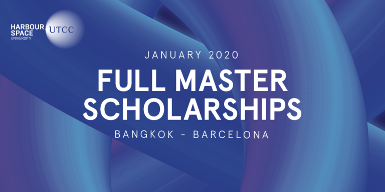

# Announcement

Hello Codeforces!

On [Thursday, December 19, 2019 at 20:35UTC+6](https://codeforces.com/https://www.timeanddate.com/worldclock/fixedtime.html?day=19&month=12&year=2019&hour=17&min=35&sec=0&p1=166) [Educational Codeforces Round 78 (Rated for Div. 2)](https://codeforces.com/contest/1278 "Educational Codeforces Round 78 (Rated for Div. 2)") will start.

Series of Educational Rounds continue being held as [Harbour.Space University](https://codeforces.com/https://harbour.space/) initiative! You can read the details about the cooperation between [Harbour.Space University](https://codeforces.com/https://harbour.space/) and Codeforces in the [blog post](//codeforces.com/blog/entry/51208).

This round will be **rated for the participants with rating lower than 2100**. It will be held on extended ICPC rules. The penalty for each incorrect submission until the submission with a full solution is 10 minutes. After the end of the contest you will have 12 hours to hack any solution you want. You will have access to copy any solution and test it locally.

You will be given **6 problems** and **2 hours** to solve them.

The problems were invented and prepared by Roman [Roms](https://codeforces.com/profile/Roms "Master Roms") Glazov, Adilbek [adedalic](https://codeforces.com/profile/adedalic "International Master adedalic") Dalabaev, Vladimir [vovuh](https://codeforces.com/profile/vovuh "Master vovuh") Petrov, Ivan [BledDest](https://codeforces.com/profile/BledDest "International Grandmaster BledDest") Androsov, Maksim [Neon](https://codeforces.com/profile/Neon "Candidate Master Neon") Mescheryakov and me. Also huge thanks to Mike [MikeMirzayanov](https://codeforces.com/profile/MikeMirzayanov "Headquarters, MikeMirzayanov") Mirzayanov for great systems Polygon and Codeforces.

Good luck to all the participants!

Our friends at Harbour.Space also have a message for you:

*Hi Codeforces!*

*The deadline to apply for our Master’s Scholarship in Bangkok is very soon!* 

*Don't miss your chance and apply for our progressive Master’s programs in **Data Science** and **Cyber Security** in just 3 steps:*

***1.** Submit your CV to see if you are an eligible candidate for the scholarship*   
 ***2.** If your profile matches the requirements, one of our admissions officers will get in touch with you*   
 ***3.** Apply for the program, pay the 125€ application fee, pass a series of interviews, and if you’re accepted, pack your bags to Bangkok!* 

*And if you know someone who might be interested in **Digital Marketing, High Tech Entrepreneurship, Interaction Design or FinTech**, send them our way!*

  [MORE INFO→](https://in.harbour.space/bangkok-scholarships/?utm_source=codeforces&utm_medium=partners) *Also, don’t forget to read our newest blogs!* 

 * [4 Types Of Data Biases (And How To Avoid Them)](https://harbour.space/fintech/data-bias?utm_source=codeforces&utm_medium=partners)
* [Creating Your Dream Job Has Never Been Easier](https://harbour.space/high-tech-entrepreneurship/dreamjob?utm_source=codeforces&utm_medium=partners)

Congratulations to the winners: 

| Rank | Competitor | Problems Solved | Penalty |
| --- | --- | --- | --- |
| 1 | [HIR180](https://codeforces.com/profile/HIR180 "International Grandmaster HIR180") | 6 | 106 |
| 2 | [neal](https://codeforces.com/profile/neal "Legendary Grandmaster neal") | 6 | 162 |
| 3 | [receed](https://codeforces.com/profile/receed "International Grandmaster receed") | 6 | 172 |
| 4 | [Geothermal](https://codeforces.com/profile/Geothermal "Grandmaster Geothermal") | 6 | 174 |
| 5 | [cerberus97](https://codeforces.com/profile/cerberus97 "International Grandmaster cerberus97") | 6 | 179 |

Congratulations to the best hackers: 

| Rank | Competitor | Hack Count |
| --- | --- | --- |
| 1 | [Akulyat](https://codeforces.com/profile/Akulyat "Grandmaster Akulyat") | **24** |
| 2 | [hoke_t](https://codeforces.com/profile/hoke_t "Expert hoke_t") | **20** |
| 3 | [dhxh](https://codeforces.com/profile/dhxh "Master dhxh") | **18****:-1** |
| 4 | [vovanstrr](https://codeforces.com/profile/vovanstrr "Expert vovanstrr") | **14** |
| 5 | [WNG](https://codeforces.com/profile/WNG "Candidate Master WNG") | **13****:-1** |

 255 successful hacks and 458 unsuccessful hacks were made in total!And finally people who were the first to solve each problem: 

| Problem | Competitor | Penalty |
| --- | --- | --- |
| A | [Dalgerok](https://codeforces.com/profile/Dalgerok "Candidate Master Dalgerok") | 0:01 |
| B | [neal](https://codeforces.com/profile/neal "Legendary Grandmaster neal") | 0:04 |
| C | [HIR180](https://codeforces.com/profile/HIR180 "International Grandmaster HIR180") | 0:08 |
| D | [Tutis](https://codeforces.com/profile/Tutis "International Master Tutis") | 0:17 |
| E | [gxnncrx1993](https://codeforces.com/profile/gxnncrx1993 "International Master gxnncrx1993") | 0:20 |
| F | [jqdai0815](https://codeforces.com/profile/jqdai0815 "Legendary Grandmaster jqdai0815") | 0:07 |

**UPD:** [Editorial is out](Tutorial.md)

