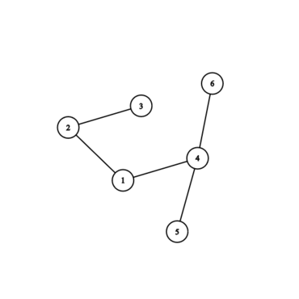
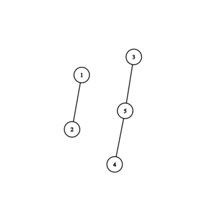
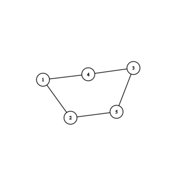

<h1 style='text-align: center;'> D. Segment Tree</h1>

<h5 style='text-align: center;'>time limit per test: 2 seconds</h5>
<h5 style='text-align: center;'>memory limit per test: 256 megabytes</h5>

As the name of the task implies, you are asked to do some work with segments and trees.

Recall that a tree is a connected undirected graph such that there is exactly one simple path between every pair of its vertices.

You are given $n$ segments $[l_1, r_1], [l_2, r_2], \dots, [l_n, r_n]$, $l_i < r_i$ for every $i$. It is guaranteed that all segments' endpoints are integers, and all endpoints are unique — there is no pair of segments such that they start in the same point, end in the same point or one starts in the same point the other one ends.

Let's generate a graph with $n$ vertices from these segments. Vertices $v$ and $u$ are connected by an edge if and only if segments $[l_v, r_v]$ and $[l_u, r_u]$ intersect and neither of it lies fully inside the other one.

For example, pairs $([1, 3], [2, 4])$ and $([5, 10], [3, 7])$ will induce the edges but pairs $([1, 2], [3, 4])$ and $([5, 7], [3, 10])$ will not.

Determine if the resulting graph is a tree or not.

##### Input

The first line contains a single integer $n$ ($1 \le n \le 5 \cdot 10^5$) — the number of segments.

The $i$-th of the next $n$ lines contain the description of the $i$-th segment — two integers $l_i$ and $r_i$ ($1 \le l_i < r_i \le 2n$).

It is guaranteed that all segments borders are pairwise distinct. 

##### Output

Print "YES" if the resulting graph is a tree and "NO" otherwise.

## Examples

##### Input


```text
6
9 12
2 11
1 3
6 10
5 7
4 8
```
##### Output


```text
YES
```
##### Input


```text
5
1 3
2 4
5 9
6 8
7 10
```
##### Output


```text
NO
```
##### Input


```text
5
5 8
3 6
2 9
7 10
1 4
```
##### Output


```text
NO
```
## Note

The graph corresponding to the first example:



The graph corresponding to the second example:



The graph corresponding to the third example:




#### Tags 

#2100 #NOT OK #data_structures #dsu #graphs #trees 

## Blogs
- [All Contest Problems](../Educational_Codeforces_Round_78_(Rated_for_Div._2).md)
- [Announcement](../blogs/Announcement.md)
- [Tutorial](../blogs/Tutorial.md)
