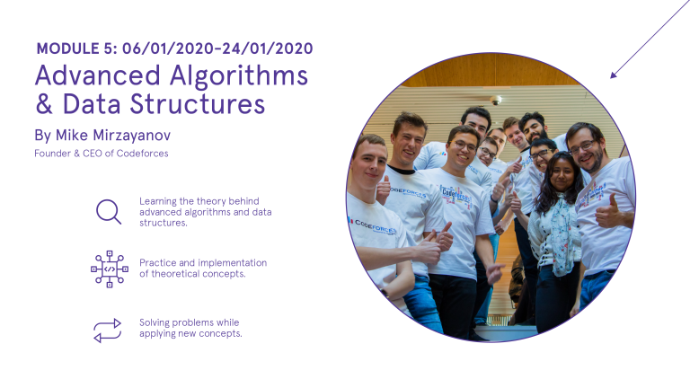

# Announcement

Hello Codeforces!

On [Friday, December 27, 2019 at 20:40UTC+6](https://codeforces.com/https://www.timeanddate.com/worldclock/fixedtime.html?day=27&month=12&year=2019&hour=17&min=40&sec=0&p1=166) [Educational Codeforces Round 79 (Rated for Div. 2)](https://codeforces.com/contest/1279 "Educational Codeforces Round 79 (Rated for Div. 2)") will start.

Series of Educational Rounds continue being held as [Harbour.Space University](https://codeforces.com/https://harbour.space/) initiative! You can read the details about the cooperation between [Harbour.Space University](https://codeforces.com/https://harbour.space/) and Codeforces in the [blog post](//codeforces.com/blog/entry/51208).

This round will be **rated for the participants with rating lower than 2100**. It will be held on extended ICPC rules. The penalty for each incorrect submission until the submission with a full solution is 10 minutes. After the end of the contest you will have 12 hours to hack any solution you want. You will have access to copy any solution and test it locally.

You will be given **6 problems** and **2 hours** to solve them.

The problems were invented and prepared by Roman [Roms](https://codeforces.com/profile/Roms "Master Roms") Glazov, Adilbek [adedalic](https://codeforces.com/profile/adedalic "International Master adedalic") Dalabaev, Vladimir [vovuh](https://codeforces.com/profile/vovuh "Master vovuh") Petrov, Ivan [BledDest](https://codeforces.com/profile/BledDest "International Grandmaster BledDest") Androsov, Maksim [Neon](https://codeforces.com/profile/Neon "Candidate Master Neon") Mescheryakov and me. Also huge thanks to Mike [MikeMirzayanov](https://codeforces.com/profile/MikeMirzayanov "Headquarters, MikeMirzayanov") Mirzayanov for great systems Polygon and Codeforces.

Good luck to all the participants!

Our friends at Harbour.Space also have a message for you:

*Hi Codeforces!* 

*Last spots available for **Mike Mirzayanov's course Advanced Algorithms and Data Structures**, which will take place in Barcelona, from the **6th to 24th of January, 2020**.*

*The course will consist of three weeks of training, 5 training days each week. The program includes daily lectures and practical exercises. It will be quite educational, insightful and entertaining!*

*Remember, there’s a special price of **1,000 EUR*** for all Codeforces users.*

** The cost does not include travel or accommodation.*

***If you’re interested, send us a message at [hello@harbour.space](https://codeforces.com/mailto:hello@harbour.space) and we will guide you through the next steps.*** 

**UPD:** [Editorial is out](Tutorial.md)

